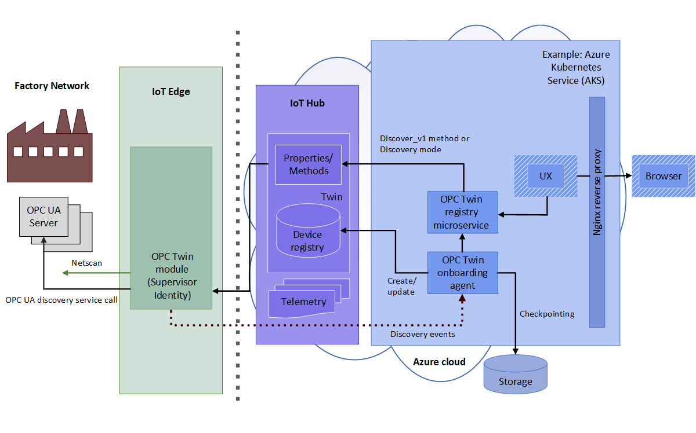
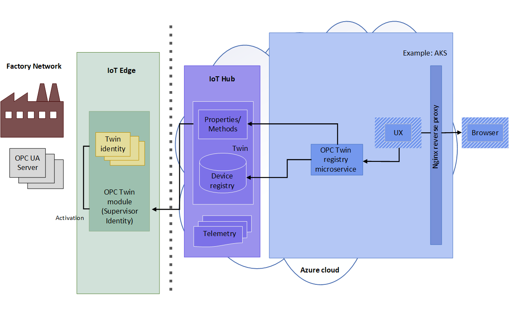
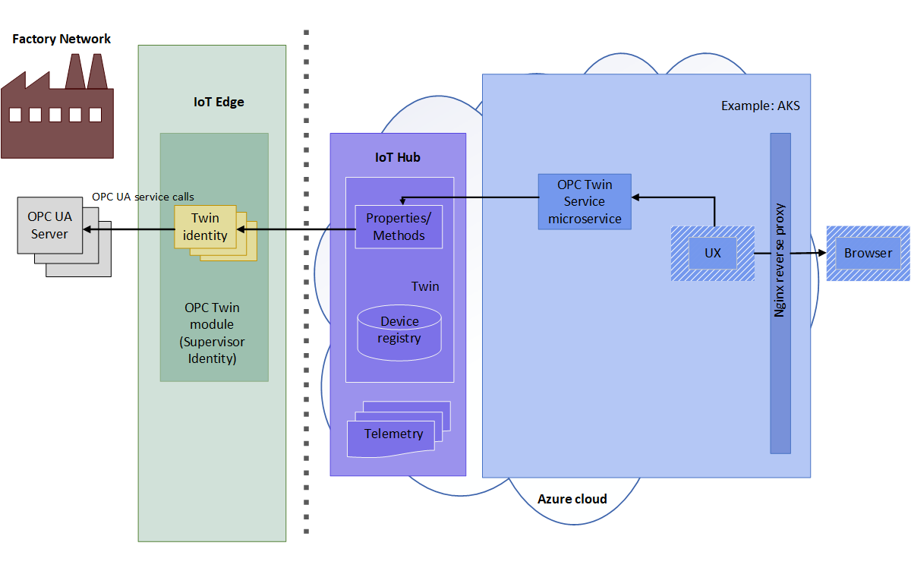
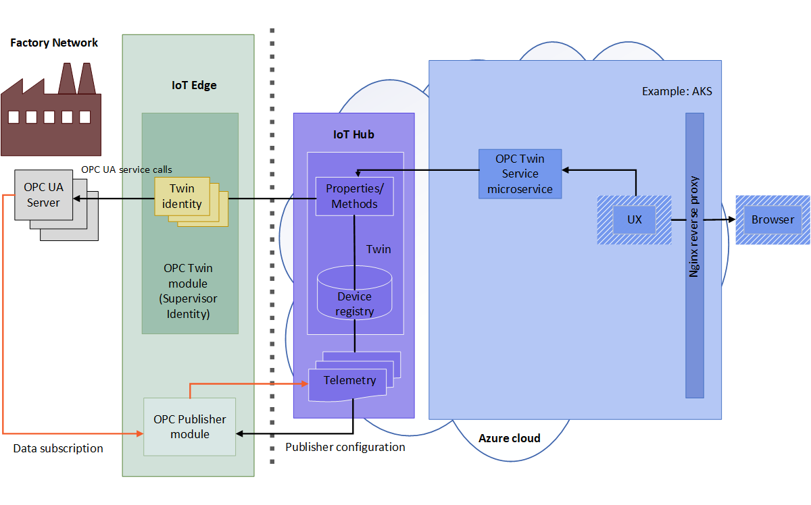

# OPC Twin Architecture

The following diagrams illustrate the OPC Twin architecture and how its components interact.

## Discovery and Activation

1. The operator enables network scanning on the [OPC Twin module](modules/twin.md) or sends a one-time discovery using a discovery URL. The discovered endpoints and server application information is sent via telemetry to the onboarding agent for processing.  The [OPC UA onboarding agent](services/onboarding.md) processes these discovery events sent. The discovery events result in application registration and updates in Azure IoT Hub.  

   

1. The operator inspects the certificate of the discovered endpoint and activates the registered endpoint twin for access using the Activation REST API of the [OPC Registry Microservice](services/registry.md).​

   

## Interact with a Server Endpoint

1. Once activated, the operator can use the [OPC Twin Microservice](services/twin.md) REST API to browse or inspect the server information model, read/write object variables and call methods.  The API expects the Azure IoT Hub identity of one of the registered Server endpoints.  

   

1. The [OPC Twin Microservice](services/twin.md) REST interface can also be used to create monitored items and subscriptions inside the [OPC Publisher](publisher.md) module. The OPC Publisher sends variable changes and events in the OPC UA server as telemetry to Azure IoT Hub.  

   

## Next steps

* [Deploy Industrial IoT Microservices to Azure](howto-deploy-microservices.md)
