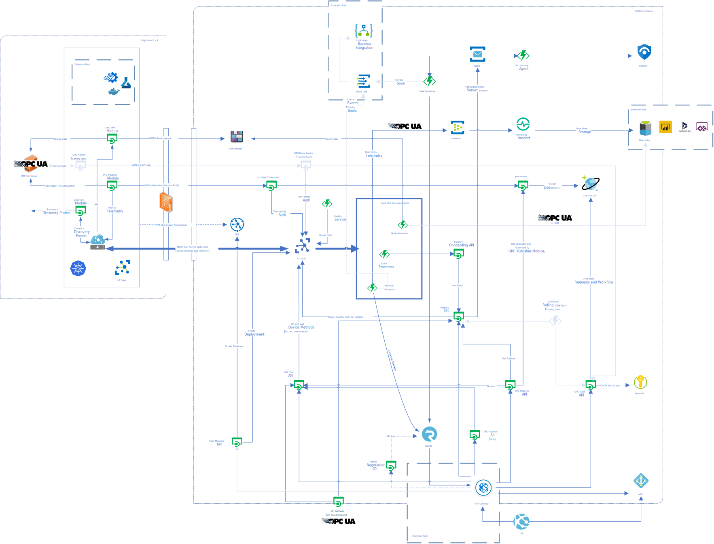

# Industrial IoT Platform Architecture

[Home](readme.md)

The following diagram shows the overall platform architecture.

A detailed view of all of the individual Microservices and Agent processes is shown [here](architecture-details.md).

## Next steps

* [Deploy Industrial IoT components](deploy/readme.md)
* [Check out the OPC Twin flow diagrams](architecture-flow.md)
