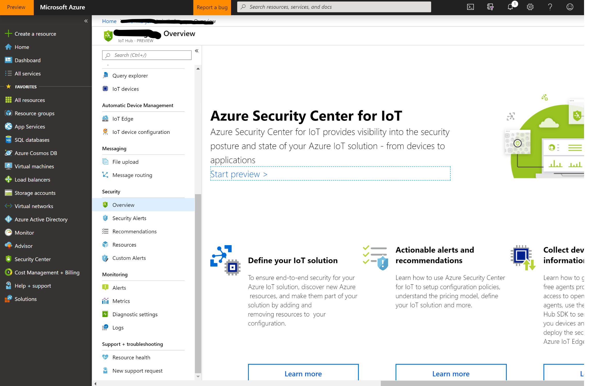
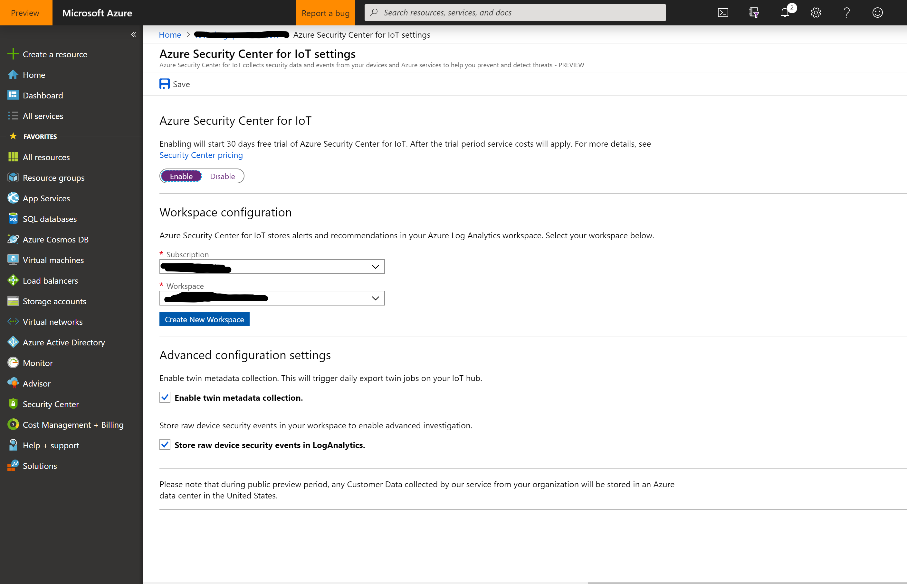
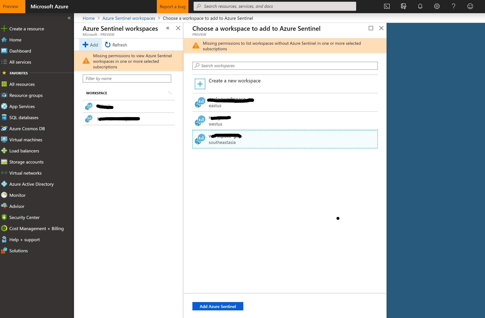
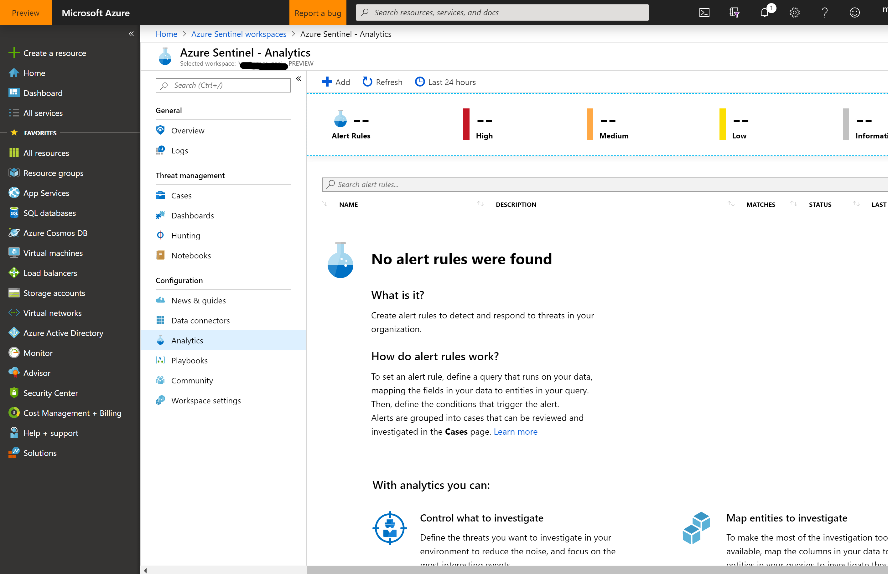
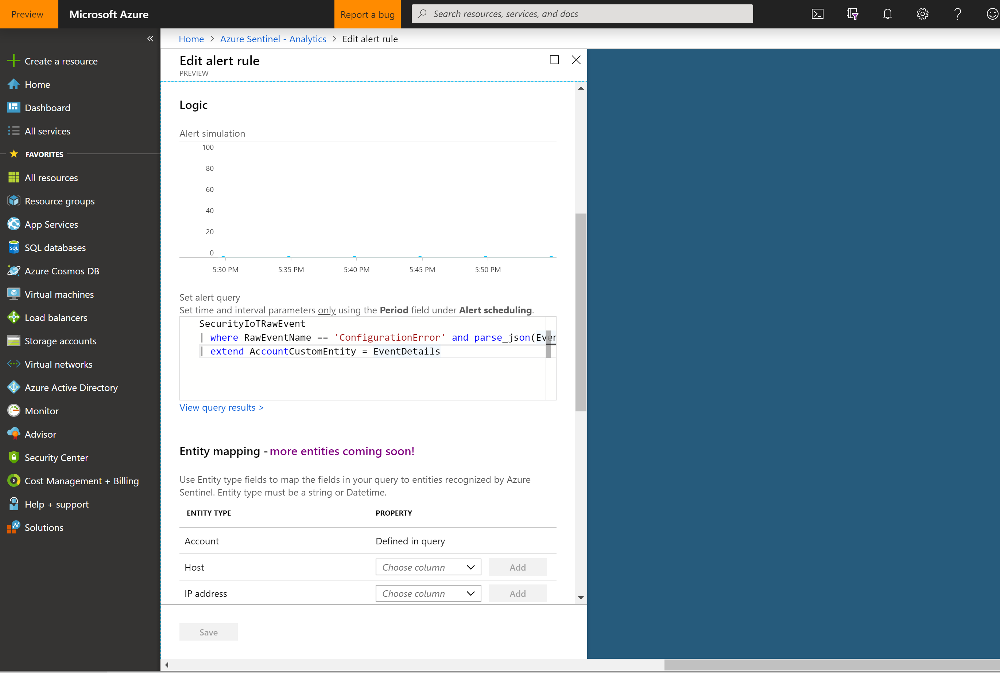
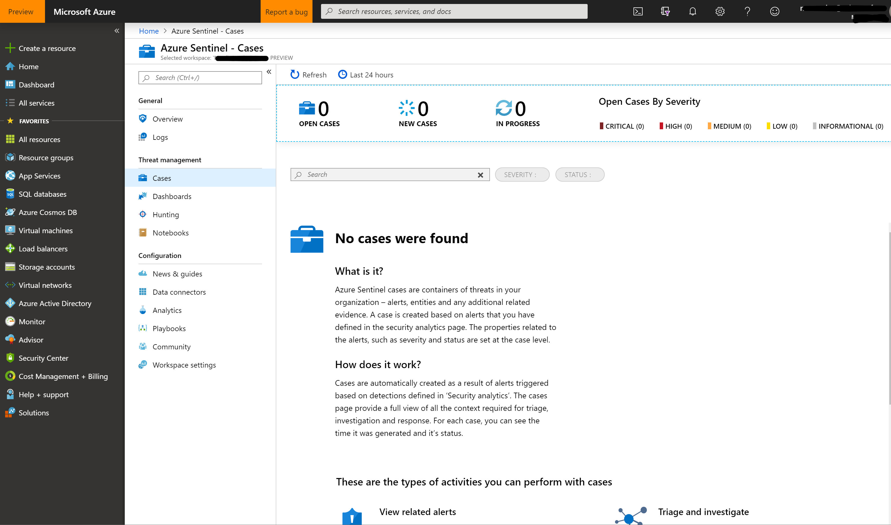

# Azure Security Center and Azure Sentinel Integration

[Home](readme.md)

## Prerequisites

* Log Analytics workspace
  * Information is stored by default in your Log Analytics Workspace by ASC for IoT
* IoT Hub [deployed](readme.md)

## Steps

1. Enable ASC for IoT
   * Open your IoT Hub in Azure portal
   * Under the Security menu, click Overview, then click Start preview
   * Choose Enable IoT Security
   * Provide your Log Analytics Workspace details (workspace should NOT be the default one)
     * Elect to store raw events in addition to the default information types of storage by leaving the raw event toggle On
     * Elect to enable twin collection by leaving the twin collection toggle On
   * Click Save

   
  
   

2. Add Azure Sentinel to Log Analytics Workspace
   * Go to Azure Sentinel and click New. This opens a new blade showing list of workspaces to add. Choose your workspace and click Add Azure Sentinel

   

3. Create Alert rules
   * Go to Azure Sentinel and select the workspace from Step 2
   * Go to Analytics and click Add

   

   * Create the alert rule using the following query:

     ```text
     SecurityIoTRawEvent
     | where RawEventName == 'ConfigurationError' and parse_json(EventDetails)['ErrorType'] == 'NotOptimal'
     | extend AccountCustomEntity = EventDetails
     ```

   

   * And you're done! Next time an alert is raised matching the alert rule, a case is created which you can check on Cases. You could also go to Logs section to check logs in certain time period

   
