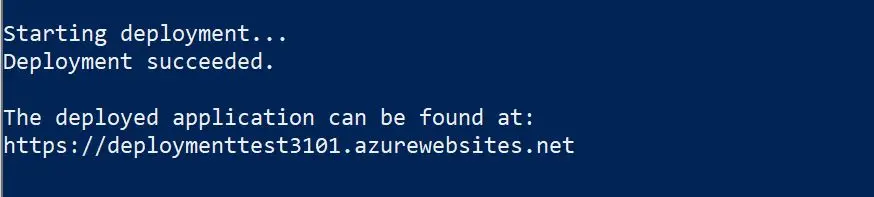

# Deploying Azure Industrial IoT Platform and dependencies

[Home](readme.md)

This article explains how to deploy the Azure Industrial IoT Platform and Simulation in Azure using the deployment scripts.
The ARM deployment templates included in the repository deploy the platform and an entire simulation environment consisting of

- Linux and Windows IoT Edge simulation running all required modules
- A PLC server simulation
- All required Azure infrastructure
- The Industrial IoT Platform
- The Industrial IoT Engineering tool

**This deployment option is not supported for production workloads**, it is used to quickly demonstrate the platform and includes simulation gateways and devices.
Use [AKS](howto-deploy-aks.md) to host services in a production deployment.  

## Running the script

The latest platform and simulation can also be deployed using the deploy script.

1. If you have not done so yet, clone the GitHub repository. To clone the repository you need git. If you do not have git installed on your system, follow the instructions for [Linux or Mac](https://git-scm.com/book/en/v2/Getting-Started-Installing-Git), or [Windows](https://gitforwindows.org/) to install it. Open a new command prompt or terminal and run:

   ```bash
   git clone https://github.com/Azure/Industrial-IoT
   cd Industrial-IoT
   ```

2. Open a command prompt or terminal to the repository root and start the guided deployment:

   - On Windows:

     ```pwsh
     .\deploy
     ```

   - On Linux:

     ```bash
     ./deploy.sh
     ```

   > Additional supported parameters can be found [here](#deployment-script-options).

3. Follow the prompts to assign a name to the resource group of the deployment and a name to the website. The script deploys the Microservices and their Azure platform dependencies into the resource group in your Azure subscription. The script also registers an Application in your Azure Active Directory (AAD) tenant to support OAUTH based authentication.
   Deployment will take several minutes. An example of what you'd see once the solution is successfully deployed:

   

   The output includes the URL of the public endpoint.

   In case you run into issues please follow the steps [below](#troubleshooting-deployment-failures).

4. Once the script completes successfully, select whether you want to save the `.env` file. You need the `.env` environment file if you want to connect to the cloud endpoint using tools such as the [Console](../tutorials/tut-use-cli.md) or for debugging.

## Troubleshooting deployment failures

### Execution Policy

If you receive a message that the execution policy not being set you can set the execution policy when starting the PowerShell session:

```pwsh
pwsh -ExecutionPolicy Unrestricted
```

To set the execution policy on your machine:

1. Search for Windows PowerShell in Start
2. Right click on result Windows PowerShell and choose Run as Administrator
3. In PowerShell (Administrator) run:

```pwsh
Set-ExecutionPolicy -ExecutionPolicy Unrestricted -Force
```

### Security Warning

If you see a message in PowerShell

`Security warning
Run only scripts that you trust. While scripts from the internet can be useful, this script can potentially harm your computer. If you trust this script, use the Unblock-File cmdlet to allow the script to run without this warning message. Do you want to run <...> deploy.ps1?
[D] Do not run [R] Run once [S] Suspend [?] Help (default is "D"):
Do you want to run this script?`

Choose R to run once.

### Resource group name

Ensure you use a short and simple resource group name. The name is used also to name resources as such it must comply with resource naming requirements.

### Website name already in use

It is possible that the name of the website is already in use. If you run into this error, you need to use a different application name.

### Azure Active Directory registration

The deployment script tries to register three AAD applications representing the web app, the client and the platform (service). This requires [Global Administrator, Application Administrator or Cloud Application Administrator](https://docs.microsoft.com/azure/active-directory/manage-apps/grant-admin-consent) rights.

If the deployment fails or if you see the following error when trying to sign-in, see further below for options:

> **Need admin approval**  
> \<APPLICATION\> needs permission to access resources in your organization that only an admin can grant. Please ask an admin to grant permission to this app before you can use it.

**Option 1** (recommended for production): Ask your AAD admin to grant tenant-wide admin consent for your application, there might be a process or tool for this in your enterprise environment.

**Option 2** (recommended for production): An AAD admin can create the AAD applications for you. The `deploy/scripts` folder contains the `aad-register.ps1` script to perform the AAD registration separately from the deployment. The output of the script is a file containing the relevant information to be used as part of deployment and must be passed to the `deploy.ps1` script in the same folder using the `-aadConfig` argument.

   ```pwsh
   cd deploy/scripts
   ./aad-register.ps1 -Name <application-name> -ReplyUrl https://<application-name>.azurewebsites.net/ -Output aad.json
   ./deploy.ps1 -aadConfig aad.json
   ```

If you need additional reply URLs, you may add them manually as this does not require AAD admin rights. The script `aad-register.ps1` also supports the parameter `-TenantId`, which can be used to explicitly select an AAD tenant, and can be executed from the [Cloud Shell](https://docs.microsoft.com/azure/cloud-shell/overview).

**Option 3** (recommended as PoC): Create your [own AAD tenant](https://docs.microsoft.com/azure/active-directory/develop/quickstart-create-new-tenant), in which you are the admin

- Azure Portal: Create a resource -> Azure Active Directory
- After about 1 min, click the link to manage the directory, or click on your account profile at the top right of the Azure Portal -> Switch directory, then select it from *All Directories*
- Copy the Tenant ID

Start the deployment with as many details about the environment as you can provide. You can use the following template to provide targeted details about how you would like the deployment to occur, supplying at least the `-authTenantID` parameter ... 

   ```pwsh
   ./deploy.cmd -authTenantId {tenant_id_for_custom_AAD_instance} -subscriptionName {subscription_name} -tenantId {subscription_tenant_id} -SubscriptionId {subscription_id} -type {e.g. 'all'} -version {e.g. 'latest'} -applicationName {application_name} -resourceGroupName {resource_group_name} -resourceGroupLocation {resource_group_location} 
   ```

### Missing Script dependencies

On **Windows**, the script uses Powershell, which comes with Windows. The deploy batch file uses it to install all required modules.

In case you run into issues, e.g. because you want to use pscore, run the following two commands in PowerShell as Administrator. See more information about [AzureAD and Az modules](https://docs.microsoft.com/powershell/azure/install-az-ps).

   ```pwsh
   Install-Module -Name Az -AllowClobber
   Install-Module -Name AzureAD -AllowClobber
   ```

On non - **Ubuntu** Linux or in case you run into issues follow the guidance in the next section.

### Deploy from Linux other than Ubuntu

To install all necessary requirements on other Linux distributions, follow these steps:

1. First [install PowerShell](https://docs.microsoft.com/powershell/scripting/install/installing-powershell-core-on-linux?view=powershell-7). Follow the instructions for your Linux distribution.

2. Open PowerShell using `sudo pwsh`.

3. Install the required Azure Az Powershell module:

   ```pwsh
   Set-psrepository -Name PSGallery -InstallationPolicy Trusted
   Install-Module -Repository PSGallery -Name Az -AllowClobber
   ```

4. To also have the installation script create AAD Application registrations (aad-register.ps1) install the preview Azure AD module:

   ```pwsh
   Register-PackageSource -ForceBootstrap -Force -Trusted -ProviderName 'PowerShellGet' -Name 'Posh Test Gallery' -Location https://www.poshtestgallery.com/api/v2/
   Install-Module -Repository 'Posh Test Gallery' -Name AzureAD.Standard.Preview -RequiredVersion 0.0.0.10 -AllowClobber
   ```

5. `exit`

## Deployment script options

Using the `deploy/scripts/deploy.ps1` script you can deploy several configurations including deploying images from a private Azure Container Registry (ACR).

To support these scenarios, the `deploy.ps1` takes the following parameters:

```bash
 .PARAMETER type
    The type of deployment (minimum, local, services, simulation, app, all), defaults to all.

 .PARAMETER version
    Set to mcr image tag to deploy - if not set and version can not be parsed from branch name will deploy "latest".

 .PARAMETER branchName
    The branch name where to find the deployment templates - if not set, will try to use git.

 .PARAMETER repo
    The repository to find the deployment templates in - if not set will try to use git or set default.

 .PARAMETER resourceGroupName
    Can be the name of an existing or new resource group.

 .PARAMETER resourceGroupLocation
    Optional, a resource group location. If specified, will try to create a new resource group in this location.

 .PARAMETER subscriptionId
    Optional, the subscription id where resources will be deployed.

 .PARAMETER subscriptionName
    Or alternatively the subscription name.

 .PARAMETER tenantId
    The Azure Active Directory tenant tied to the subscription(s) that should be listed as options.

 .PARAMETER authTenantId
    Specifies an Azure Active Directory tenant for authentication that is different from the one tied to the subscription.

 .PARAMETER accountName
    The account name to use if not to use default.

 .PARAMETER applicationName
    The name of the application, if not local deployment.

 .PARAMETER aadConfig
    The aad configuration object (use aad-register.ps1 to create object). If not provided, calls aad-register.ps1.

 .PARAMETER context
    A previously created az context to be used for authentication.

 .PARAMETER aadApplicationName
    The application name to use when registering aad application. If not set, uses applicationName.

 .PARAMETER acrRegistryName
    An optional name of an Azure container registry to deploy containers from.

 .PARAMETER acrSubscriptionName
    The subscription of the container registry, if different from the specified subscription.

 .PARAMETER environmentName
    The cloud environment to use, defaults to AzureCloud.

 .PARAMETER simulationProfile
    If you are deploying a simulation, the simulation profile to use, if not default.

 .PARAMETER numberOfSimulationsPerEdge
    Number of simulations to deploy per edge.

 .PARAMETER numberOfLinuxGateways
    Number of Linux gateways to deploy into the simulation.

 .PARAMETER numberOfWindowsGateways
    Number of Windows gateways to deploy into the simulation.
```

## Next steps

Now that you have successfully deployed the Azure Industrial IoT Platform and Simulation, here are the suggested next steps:

- [Deploy Industrial IoT modules to IoT Edge](howto-install-iot-edge.md)
- [Learn more about the Platform services](../services/readme.md)
- [Learn more about the deployed Azure Service dependencies](../services/dependencies.md)
