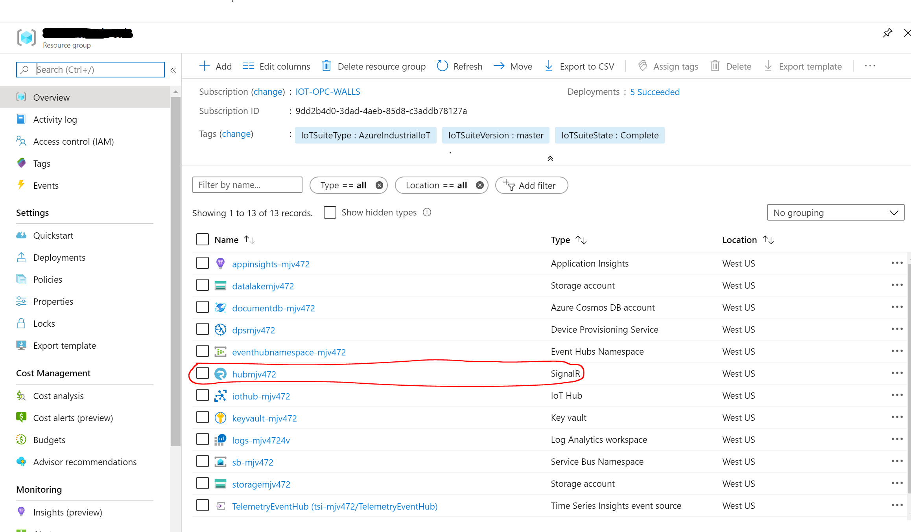
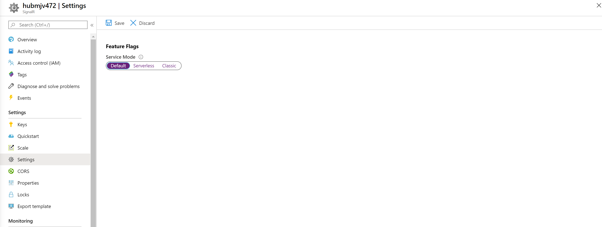

# Upgrade

[Home](readme.md)

## Update a 2.6 to 2.7 deployment manually

If you want to use a 2.6 deployment with 2.7 code you must manually update your deployment.

1. Sign in to the [Azure portal](https://portal.azure.com/) and navigate to the signalR deployed earlier

    > A simple way to locate your signalR is to find the resource group variable in your `.env` file.  This resource group contains the signalR resource.

2. Select **Settings** from the left-hand menu.

3. Click on **Default** in the Service Mode options.

4. Select **Save**

