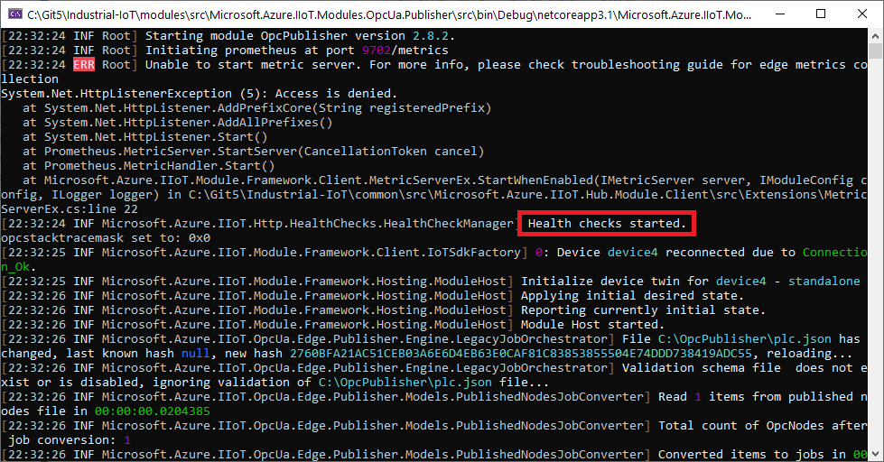

# Health checks

The OPC Publisher exposes port `8080` (as configured in [IHealthCheckManager](../../common/src/Microsoft.Azure.IIoT.Http.HealthChecks/IHealthCheckManager.cs)) as a health check endpoint. The health checks include a liveness and a readiness probe, you can read more about them [here](https://kubernetes.io/docs/tasks/configure-pod-container/configure-liveness-readiness-startup-probes/).

The liveness probe will respond as soon as possible. The readiness probe is continuously evaluated in the existing `EnsureWorkerRunningTimer_ElapsedAsync` event handler ([WorkerSupervisor](C:\Git5\Industrial-IoT\common\src\Microsoft.Azure.IIoT.Agent.Framework\src\Agent\Default\WorkerSupervisor.cs)).

## How to use

The health check endpoint is enabled by default. You can verify that it has started by the logs output by the OPC Publisher.

You can use a browser or a command line to probe the health check endpoint:
1. Liveness: `http://localhost:8080/healthz`
1. Readiness: `http://localhost:8080/ready`

## Format

A healthy response from the health check endpoint is an HTTP response with its status code 200, its `Content-Type` header set to "text/plain", and its body set to "OK". An unhealthy probe will not yield a response.