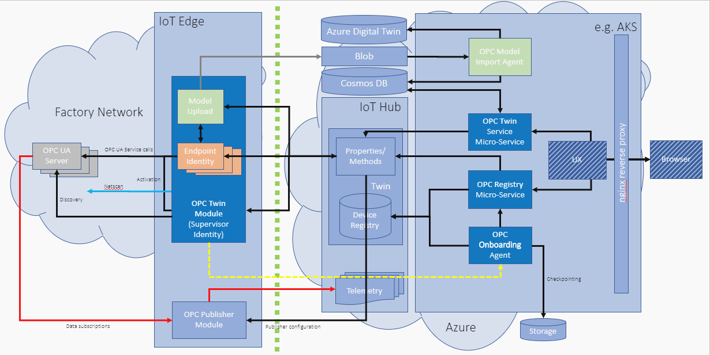

# Industrial IoT and its Components

##  Industrial IoT

Industrial IoT or IIoT connects machines and devices in industries. This connectivity allows for data collection, exchange and analysis, potentially  improving productivity and efficiency. To read more about Microsoft Azure IoT, click [here](https://azure.microsoft.com/en-us/overview/iot/) and about Industry 4.0, [here](https://azure.microsoft.com/en-us/overview/iot/industry/discrete-manufacturing/)

Watch a [demo](https://azure.microsoft.com/en-us/features/iot-accelerators/connected-factory/) about improving industrial efficiencies with a connected factory. Connected Factory is basically an implementation of Azure Industrial IoT reference architecture, packaged as on open-source solution.

##  Industrial IoT Components

The Industrial IoT components include:

1. **Device** or **machine** - which has OPC UA Server
2. **IoT Edge device** - comprised of Edge Runtime and Edge modules. Edge modules are docker containers which are the smallest unit of computation e.g. OPC Publisher and OPC Twin in our case. Edge device is used to deploy such modules which act as mediator between OPC UA server and IoT Hub in cloud. More information about IoT Edge is [here](https://docs.microsoft.com/en-us/azure/iot-edge/about-iot-edge).
3. **IoT Hub** - acts as a central message hub for bi-directional communication between IoT application and the devices it manages. This is an open and flexible cloud platform as a service that supports open-source SDKs and multiple protocols. Read more about IoT Hub [here](https://azure.microsoft.com/en-us/services/iot-hub/).
4. **Microservices in the cloud** - 
* OPC Twin Microservices: These Microservices provide discovery, registration, and remote control of industrial devices. 
* OPC Vault Microservices: These Microservices enable secure communication among OPC UA enabled devices and the cloud.  

The complete architecture of Industrial IoT Components is shown below:

## Learn more 

* [Complete code structure](docs/code-structure)
* [Deploy Azure Industrial IoT](docs/readme.md)
* [Deploy the Microservices](docs/howto-deploy-microservices.md)