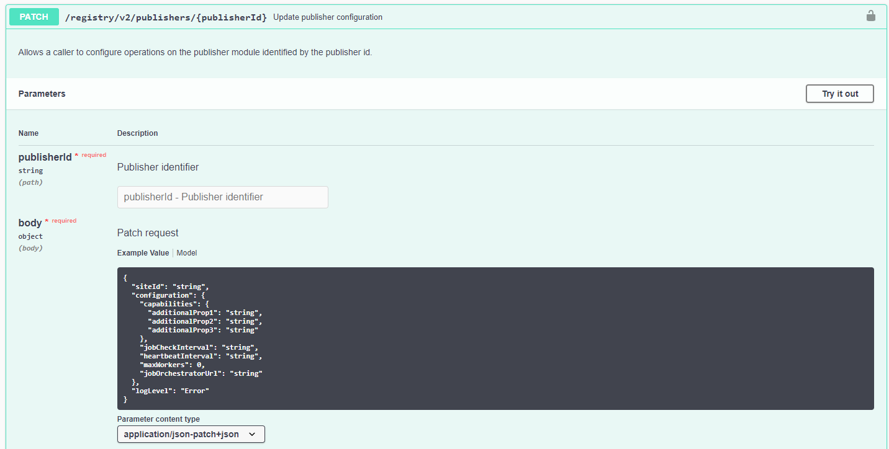

[Home](../../readme.md)

# Operations Manual

## Introduction

The document guides system operators to run the Azure Industrial IoT Platform in production scenarios. It explains how to set it up, what each of its components do and how to troubleshoot it.

### Uses Cases of the Azure Industrial IoT Platform

The Azure Industrial IoT Platform is a Microsoft suite of modules and services that are deployed on Azure. These modules and services have fully embraced openness (an open platform, open source, open industrial standards and an open data model is used). Specifically, we leverage Azure's managed Platform as a Service (PaaS) offering, open-source software licensed via MIT license, open international standards for communication (OPC UA, AMQP, MQTT, HTTP) and interfaces (Open API) and open industrial data models (OPC UA) on the edge and in the cloud.

The Azure Industrial IoT Platform covers industrial connectivity of shop floor assets (including discovery of OPC UA-enabled assets), normalizes their data into OPC UA format and transmits asset telemetry data to Azure in OPC UA PubSub format. There, it stores the telemetry data in a cloud database. In addition, the platform enables secure access to the shop floor assets via OPC UA from the cloud. Device management capabilities (including security configuration) is also built in. The OPC UA functionality has been built using Docker container technology for easy deployment and management. For non-OPC UA-enabled assets, we have partnered with the leading industrial connectivity providers and helped them port their OPC UA adapter software to Azure IoT Edge. These adapters are available in the [Azure Marketplace](https://azuremarketplace.microsoft.com/marketplace/apps/category/internet-of-things?page=1&subcategories=iot-edge-modules).

The edge services are implemented as Azure IoT Edge modules and run on-premises. The cloud microservices are implemented as ASP.NET microservices with a REST interface and run on managed Azure Kubernetes Services or stand-alone on Azure App Service. For both edge and cloud services, we have provided pre-built Docker containers in the Microsoft Container Registry (MCR), removing this step for the customer. The edge and cloud services are leveraging each other and must be used together. We have also provided easy-to-use deployment scripts that allow one to deploy the entire platform with a single command.

### The Platform’s Components

The following edge modules are part of the platform:

- OPC Publisher Module

  The OPC Publisher module runs on Azure IoT Edge and connects to OPC UA-enabled assets, reads data from them using OPC UA subscriptions, converts the resulting OPC UA "Data Changed Notifications" into OPC UA PubSub messages, and sends them to the cloud via [IoT Edge](https://docs.microsoft.com/azure/iot-edge/module-edgeagent-edgehub). It can be configured from the cloud or locally via a configuration file.

- OPC Twin Module

  The OPC Twin module runs on Azure IoT Edge and connects to OPC UA-enabled assets, browses their data model, reads and writes ad-hoc data, and calls methods on the asset. It can be accessed from the cloud.

- Discovery Module

  The Discovery module runs on Azure IoT Edge and scans the shop floor network for OPC UA-enabled assets. When it finds an asset, it queries the assets endpoints (including its security configuration) and registers an IoT Hub device in the IoT Hub Device Registry for each endpoint.

- Registry Microservice

  The Registry microservice is responsible for CRUD commands to the [IoT Hub Device Registry](https://docs.microsoft.com/en-us/azure/iot-hub/iot-hub-devguide-identity-registry) as well as providing a HTTP REST interface for cloud applications. It manages all OPC UA asset endpoints that are stored in the IoT Hub device registry.

- OPC Twin Microservice

  The OPC Twin microservice is responsible for accessing OPC UA assets via the OPC Twin edge module and provides a HTTP REST interface to cloud applications.

- OPC Publisher Microservice and Orchestrator Microservice

  The OPC Publisher microservice is responsible for managing OPC Publisher module subscriptions to OPC UA assets. It provides a HTTP REST interface to cloud applications.

  The Orchestrator microservice is an internal service responsible for load-balancing publishing jobs across OPC Publisher modules deployed in the same shop floor. It is also used to fail over publishing jobs from one OPC Publisher module to another.

- Edge Telemetry Processor Microservice

  The Edge Telemetry Processor microservice is responsible for decoding OPC UA PubSub messages received by IoT Hub and provides the data to post processing Azure services like Azure Event Hubs, Azure Data Lake Storage or Azure Time Series Insights for further processing and visualization.

- Registry Onboarding Processor Microservice

  The Registry Onboarding Processor microservice responsible for processing OPC UA endpoints sent to the cloud by the Discovery module.

- Edge Event Processor Microservice

  The Edge Event Processor microservice is responsible for decoding discovery messages sent to it by the Discovery module and forwards their payload, i.e., OPC UA endpoints, to the Registry Onboarding Processor. It implements an Event Processor.

- Registry Synchronization Microservice

  The Registry Synchronization microservice is responsible for providing a HTTP REST interface to cloud applications that want to initiate an asset discovery process via the Discovery module.

### Data Flow Diagram

The following shows a data flow diagram of the Azure Industrial IoT Platform:


## Deep Dive into each Platform Component

This section provides a thorough description of the functionalities of individual components of the platform.

### Industrial IoT Edge Modules

The Azure Industrial IoT Platform includes modules for Azure IoT Edge to connect assets on the shop floor network. Therefore, IoT Edge needs to be placed in a networking later with Internet connectivity and at the same time have access to all industrial assets to be connected. This usually requires configuring a specific route from IoT Edge to the public Internet through several on-premise routers. In terms of firewall configuration, IoT Edge just needs a single outbound port to operate, i.e., port 443.

The diagram below shows the relationships between them and OPC UA assets.


#### Discovery Module

The Discovery Module provides discovery services to discover assets (OPC UA servers) on the local shop floor network where the IoT Edge device is deployed and registers them with the [Onboarding service](../services/processor-onboarding.md) which can be controlled using REST API calls documented [here](../api/registry/readme.md).

Use cases for this module:

- An industrial solution wants to detect assets which are unknown by its asset management system.
- A customer wants to access an asset without looking up the connectivity information in his asset management database or Excel spreadsheet printout from 10 years ago!
- A customer wants to onboard an asset which was recently added to a production line without causing additional network load.

The Discovery module supports two modes of operation:

- Active Scan mode: The local network is actively scanned by the Discovery module.

- Targeted discovery mode: A list of asset addresses can be specified to be checked.

Discovery is based on native OPC UA server functionality as specified in the OPC UA specification, which allows discovery of endpoint information including security profile information without establishing an OPC UA authenticated and encrypted OPC UA session.

The results of the discovery process are sent to the Onboarding service via the IoT Edge Hub’s and IoT Hub’s telemetry path.

The Discovery can be configured via the OPC Registry REST API and allows a fine-grained configuration of the discovery process for recurring as well as one-time scans.

##### Configuration of the Discovery module

The Discovery module can be configured to do active network and port scanning. The following parameters can be configured for active scanning:

- address ranges (needed when hosted in a Docker context where the host interfaces are not visible)

- port ranges (to narrow or widen scanning to a list of known ports)

- number of workers and time between scans (Advanced)

Active scanning should be used with care since it causes load on the local network and might be identified by network security software as a threat.

For a targeted discovery, the configuration requires a specific list of discovery URLs. Please note that targeted discovery disables the use of address and port ranges as only the specific list of discovery URLs are checked.

##### Recurring discovery

Recurring discovery can be enabled for a Discovery module, which has impact on the network and CPU load the Discovery module generates. This is controlled by specifying a specific "mode" for the Discovery module in addition to the configuration mentioned above:

- **Off**: no scanning takes place (default)

- **Local**: only scan the network addresses of each interface visible in the Discovery module container, i.e. localhost.

- **Fast**: only scan the first 255 addresses of each interface's subnet using a set of well-known OPC UA server ports.

- **Scan**: Do a full scan of all interfaces using all IANA unassigned ports as well as the OPC UA LDS ports 4840-4841.

##### One-time discovery

One-time discovery is supported by the Discovery module and can be initiated through a REST API call exposed by the Industrial IoT Registry microservice (documented [here](../api/registry/readme.md)). A discovery configuration is part of the request payload. All one-time discovery requests are serialized in the Discovery module at the edge, i.e. will be performed one by one.

Using the targeted discovery mode, servers can be registered using a well-known discovery URL without active scanning.

##### Discovery Progress

The discovery progress as well as current request queue size is reported via the telemetry path and available in the cloud for applications by the Registry microservice REST interface.

Detailed configuration options are documented [here](../modules/discovery.md).

#### OPC Twin Module

The functionality of this module is to connect to assets (OPC UA servers) and enables browse, read, and write OPC UA nodes of the assets.

Use cases for this module:

- A customer wants to gather the configuration of an asset by reading configuration parameters of the asset.
- A customer wants to browse an OPC UA server’s information model/address space for telemetry selection.
- An industrial solution wants to react on a condition detected in an asset by changing a configuration parameter in the asset.

The OPC Twin Module provides an IoT Hub device direct method API allowing the OPC Twin microservice to invoke OPC UA method call functionality. The payload is transcoded from JSON to OPC UA binary and passed on through the OPC UA stack (integrated into the OPC Twin module) to the OPC UA server. The response is reencoded to JSON and passed back as the result of the direct method call to the OPC Twin microservice. This includes Variant encoding and decoding in a consistent JSON format.

Payloads that are larger than the Azure IoT Hub’s supported device method payload size are chunked, compressed, sent, then decompressed and reassembled for both request and response. This allows fast and large value writes and reads, as well as returning large browse results.

A single OPC UA session is opened to the asset (OPC UA server) on demand per endpoint, so the OPC UA server is not overburdened with simultaneous requests, which means the implementation of the OPC Twin module is stateless in respect to the OPC UA connections.

Detailed configuration options are documented here..

#### OPC Publisher Module

The OPC Publisher runs on IoT Edge. It connects to assets (OPC UA servers) and publishes OPC UA telemetry data from these servers to Azure IoT Hub.

Use cases for this module:

- A customer wants to get insights for her assets and visualize them in the cloud.
- Data from assets should be stored for analytics purposes in the cloud.

The module can be configured via a REST API of the OPC Publisher microservice (documented [here](../api/publisher/readme.md)) to publish data value changes of tags in an asset (OPC UA server). To achieve this, it connects to assets (OPC UA servers) on the shop floor and sets up OPC UA subscriptions to monitor data (OPC UA nodes) by using an integrated OPC UA stack.

When a data value change of a OPC UA node is reported, it transcodes the OPC UA data value change notification into the configured encoding and publishes it to IoT Hub. The supported schemas are:

- OPC UA Network Messages (as per Part 14 of the OPC UA specification)
- Simplified monitored item notification messages (non-standardized)

The encoding of the published messages is JSON or OPC UA binary.

The OPC Publisher supports two operational modes:

- Standalone mode
- Orchestrated mode

The modes differentiate how the operation of OPC Publisher is controlled. The mode is controlled by the fact if the OPC Publisher module is configured to read its configuration from a configuration file (see "pf" option below).

In standalone mode all configuration is done via command line options when starting the module and via a configuration file, which controls which OPC UA nodes should be published as well as specifying more detailed parameters for the publishing of each node:

- `PublishingInterval`: The interval in milliseconds on which the underlying OPC UA stack should publish the current value of the node.
- `SamplingInterval`: The interval in milliseconds at which the OPC UA server should sample the nodes value and check for changes to be published at the next `PublishingInterval`
- `Heartbeat`: an interval in seconds, which enforce to publish the value of the node even it has not changed

In standalone mode OPC Publisher supports configuration via container launch options. See configuration section for its options.

In orchestrated mode the OPC Publisher module is controlled by the OPC Publisher and Orchestrator microservice. The REST API documented [here](../api/publisher/readme.md) allows to control the publishing.

In this mode the OPC Publisher module runs a configurable number of workers (which can be set by the "Update publisher configuration" REST API documented [here](../api/registry/readme.md)). Those workers are checking in regular intervals for assignment of new publishing jobs. The assignment is done based on site IDs, which allows to run multiple IoT Edge installations in the same shop floor network segment (same site ID) and achieve redundancy for the publishing jobs, which publish data from OPC UA server systems in this network segment.

##### Overview of how Standalone Mode Works

OPC Publisher Module checks on a regular basis if there is a `publishednodes.json` file in its application directory. If there is one, the file is parsed and the OPC Publisher Module creates a new OPC UA subscription for each OPC UA server endpoint specified in the file and starts monitoring for data changes from this OPC UA server. Additionally, we support json schema validation of `publishednodes.json` file if a schema file is available to the OPC Publisher. Default location for schema file is `schemas/publishednodesschema.json` in its application directory. Default location of schema file can be changed via cli options [here](../modules/publisher-commandline.md), if a schema file is not found by OPC Publisher, a warning message is logged and module continues to load.

##### Overview of how Orchestrated Mode Works

1. During module startup, the OPC Publisher module also registers itself with the Orchestrator microservice so the orchestrator knows which publishing jobs it can possibly assign to it.

2. The user sends a publishing request to the OPC Publisher microservice.

3. The OPC Publisher microservice contacts the Orchestrator microservice who will create a new publishing job or modify an existing one if there already is one for that OPC UA server endpoint.

4. The Orchestrator microservice does not leverage the IoT Hub device identity for the OPC UA server endpoint but instead creates a new IoT Hub device for the publishing job, so in theory we could have multiple publishing jobs per OPC UA server endpoint. However, to maintain backward compatibility with the V1 Publisher REST API, there can only be 1 job per OPC UA server endpoint right now.

5. A job can contain several `DataSetWriters`. A `DataSetWriter` must have a distinct publishing interval (e.g., "publish this data every second"). Therefore, if you want to publish a set of OPC UA data items ("nodes") at different publishing intervals, the orchestrator will create multiple `DataSetWriters`.

   > Implementation detail: Right now, the OPC Publisher creates a separate subscription per `DataSetWriter`.

   

6. OPC Publisher Module checks on a regular basis if there is a publishing job waiting for it from the Orchestrator microservice. If there is one, the job is assigned to the OPC Publisher Module and the OPC Publisher Module creates a new OPC UA subscription to the associated OPC UA server endpoint and starts monitoring for data changes from this OPC UA server.

### OPC UA stack

The OPC UA .NET Standard reference stack of the OPC Foundation (contributed by Microsoft) is used for OPC UA secure communications by the Industrial IoT platform. Modules and services consume the NuGet package redistributable licensed by the OPC Foundation. The open source for the reference implementation is provided by the OPC Foundation on GitHub in [this public repository](https://github.com/OPCFoundation/UA-.NETStandard).

### Cloud Microservices

In the cloud, the platform is built on top of several Azure PaaS Services which provide identity, gateway, compute, message processing and storage functionality. Azure IoT Hub acts as a central message hub for bi-directional communication between the Azure cloud components and the IoT Edge components. Industrial solutions can use the REST API of the Industrial IoT Platform microservices to implement a variety of different manufacturing-specific use cases. The Industrial IoT microservices support two hosting models. The recommended hosting model for production is to use [Azure Kubernetes Service](https://azure.microsoft.com/en-us/services/kubernetes-service/) (AKS). A hosting model for lower cost and with no fault tolerance is to use the [Azure App Service](https://azure.microsoft.com/en-us/services/app-service/).

The following cloud microservices (providing external-facing REST interfaces) are part of the platform:

1. Registry Microservice

2. OPC Twin Microservice

3. OPC Publisher Microservice

These microservices provide discovery, registration, and remote control of industrial devices through REST APIs that can be implemented in any programming language and framework that can call an HTTP REST endpoint.

The following cloud microservices are part of the platform and handle event processing as well as non-user-driven tasks:

1. Edge Telemetry Processor

2. Edge Event Processor

3. Registry Onboarding Processor

4. Registry Synchronization Service

5. Publisher Orchestrator Service

#### Registry Microservice

The role of the Registry microservice is to manage entries in the IoT Hub Device Registry. These include:

- **Applications:** In OPC parlance, an "Application" can be a server, a client or both. It is also a grouping mechanism for endpoints, i.e., Applications have endpoints. An application contains all server provided information, such as Discovery URLs, Application and Product URIs.

- **Endpoints:** Each endpoint is represented as the IoT Hub device twin of an OPC UA Server application's endpoint. A server can have multiple endpoints with different configurations, including security properties. Endpoint identities are used to invoke OPC UA services or retrieve endpoint specific information, such as certificates.

- **Gateways:** The gateway is an IoT Edge device that hosts Discovery, OPC Twin and OPC Publisher modules, all of which have their IoT Edge module identities managed in the registry.

One can update, read, and query all entries in the IoT Hub Device Registry.

The following diagram shows the registry service in relation to the other components:


##### Activate and Deactivate Endpoints

After the initial registration in the IoT Hub Device Registry, server endpoints are by default deactivated for security reasons. An operator must inspect an endpoint certificate and actively activate endpoints using the provided Activation REST API before they can be used.

#### OPC Twin Microservice

The OPC Twin microservice exposes a REST API to call the following OPC UA services on activated endpoints in an OPC Twin edge module:

- Read and write a "value" on a variable node. Write is also exposed as desired/reported property on the endpoint identity.

- Read and write node "Attributes".

- Call a "Method".

- History read and update service calls to interact with historians.

- Batching of any of the above calls.

- Browse / browse next (with and without reading the browsed target nodes)

- Get meta data of methods (to display input arguments to a user)

The diagram for the Registry microservice above also shows the OPC Twin service in relationship to other components.

#### OPC Publisher Microservice

The OPC Publisher service provides an API to configure the OPC UA PubSub configuration surface of the OPC Publisher module.

It configures the OPC Publisher and manages job that an OPC Publisher module can receive to publish data.

##### Jobs

The Jobs-API provides functionality to List, Query, Get, Cancel, Restart and Delete jobs. The creation of jobs in handled automatically by using the Publish-API. The Jobs API is internal and subject to change in future releases.  You should not take a dependency on it.

##### Publish

The Publish-API provides functionality to start the publishing of values of an endpoint. This endpoint also handles the creation of new jobs. There is also the possibility to bulk publish nodes (i.e., to publish multiple nodes at once).

##### Workers

The Worker REST API can be used to Get/List the active workers and to remove a worker from the list.  Like the Jobs API it is internal and subject to change in future releases. You should likewise not take a dependency on it.

#### Publisher Job Orchestrator Microservice

The OPC Publisher orchestration service is responsible to manage distribution of Jobs across publishers. It is used to orchestrate and fail over publishing of nodes from one publisher module to another. It does not create/update jobs, for that, the OPC Publisher Service is used.  Only the OPC Publisher edge module uses this API, you should not take a dependency on it in your applications.

#### Edge Telemetry Processor

The telemetry processor processes all edge telemetry by

- Filtering out edge events. Those are processed by the Edge Event processor.

- Decoding both Json and binary encoded OPC UA PubSub network messages

- Converting PubSub Network messages into simple messages

- Forwarding these and other telemetry to a secondary Event Hub. From there telemetry events may be forwarded to applications, processed through TSI and/or stored in Azure Data Lake Storage.

The edge telemetry processor is an event processor host and can be scaled out to handle the configured number of partitions. It connects to the configured telemetry consumer group on IoT Hub, defaults to "telemetry".

#### Edge Event Processor Microservice

The edge event processor processes events received from edge modules. This includes:

- Discovery progress events forwarded to SignalR.

- Discovery results forwarded to the Onboarding Micro Service

The edge event processor is an Event Processor Host, and it can be scaled out to handle the configured number of partitions. It connects to a configured events consumer group on IoT Hub and defaults to "events".

#### Registry Onboarding Processor

The Onboarding processor service is used to process discovery events from the OPC Discovery module resulting from a discovery scan. The onboarding service consumes messages from IoT Hub and creates IoT Hub device for each OPC UA server endpoint using the IoT Hub Device Registry.

Applications and their endpoints that have not been found for a while can be purged using the OPC Registry API.

#### Registry Synchronization Microservice

The Registry Synchronization microservice is an internal service that manages state between the edge modules and their representation in the IoT Hub Device Registry.

### Azure Resources

Azure Industrial IoT platform requires a host of Azure managed resources to run. The main of them is Azure IoT Hub, which acts as a central messaging and device management hub that most of the cloud microservices build on.

In this document we are going to concentrate on operations aspects of the platform in Helm chart-based deployment scenario. That means that we are going to assume that the Azure Industrial IoT platform is being deployed on top of existing Azure resources. So, the deployment itself is not going to create Azure resources itself. This is not to say that we do not support that scenario. In fact, we provide scripts and applications for two different deployment setups of the platform, one using a PowerShell script and one using a .NET Core-based bootstrapping application. For all supported deployment and hosting options please check the GitHub page:

Reference: [Deploying Azure Industrial IoT Platform](../deploy/readme.md)

#### Azure Account, Subscription

First, an Azure Account with an active Subscription is needed. The subscription is going to host all Azure resources necessary for the platform.

Reference: [Subscriptions, licenses, accounts, and tenants for Microsoft's cloud offerings](https://docs.microsoft.com/en-us/microsoft-365/enterprise/subscriptions-licenses-accounts-and-tenants-for-microsoft-cloud-offerings?view=o365-worldwide)

#### Azure Active Directory

Azure Active Directory (Azure AD or AAD) is Microsoft’s cloud-based identity and access management service, which helps your employees sign in and access resources in:

- External resources, such as Microsoft 365, the Azure portal, and thousands of other SaaS applications.

- Internal resources, such as apps on your corporate network and intranet, along with any cloud apps developed by your own organization.

Specifically, Azure Industrial IoT platform is using Azure AD as an identity provider which authenticates users and applications accessing the platform. Azure AD will be providing access tokens to authenticated users or applications which are then checked by the platform components to identify the identities of clients.

We are also going to use Azure AD to register app entities and setup authentication flows for components of the platform.

Reference: [Azure Active Directory overview](https://docs.microsoft.com/en-us/azure/active-directory/fundamentals/active-directory-whatis)

#### Azure AD Tenant

An Azure AD tenant is a specific instance of Azure AD containing accounts and groups. Paid or trial subscriptions of Microsoft 365 or Dynamics 365 include a free Azure AD tenant. This Azure AD tenant does not include other Azure services and is not the same as an Azure trial or paid subscription.

Reference: [Subscriptions, licenses, accounts, and tenants for Microsoft's cloud offerings](https://docs.microsoft.com/en-us/microsoft-365/enterprise/subscriptions-licenses-accounts-and-tenants-for-microsoft-cloud-offerings?view=o365-worldwide)

#### Azure IoT Hub

Azure IoT Hub is a managed service, hosted in the cloud, that acts as a central message hub for bi-directional communication between IoT applications and the devices that they manage. One can use Azure IoT Hub to build IoT solutions with reliable and secure communications between millions of IoT devices and a cloud-hosted solution backend.

Azure IoT Hub supports communications both from the device to the cloud and from the cloud to the device. IoT Hub supports multiple messaging patterns such as device-to-cloud telemetry, file upload from devices, and request-response to control your devices from the cloud. IoT Hub monitoring helps to maintain the health of your solution by tracking events such as device creation, device failures, and device connections.

IoT Hub's capabilities help build scalable, full-featured IoT solutions such as managing industrial equipment used in manufacturing, tracking valuable assets in healthcare, and monitoring office building usage.

Azure IoT Hub is a cornerstone of Azure Industrial IoT Platform, that uses it for all communications between the IoT Edge modules and cloud microservices. Apart from that Azure IoT Hub is also used for:

- Managing entities and identities such as Applications, Endpoints and Gateways.

- Managing IoT Edge devices.

- Managing IoT Edge module deployment definitions and rules for applying them.

- Calling device methods on IoT Edge modules.

- Several of the event-processors consume telemetry and management events directly from built-in Event Hub of IoT Hub.

Reference: [Azure IoT Hub overview](https://docs.microsoft.com/en-us/azure/iot-hub/about-iot-hub)

#### Azure Event Hub

Azure Event Hubs is a big data streaming platform and event ingestion service. It can receive and process millions of events per second. Event Hubs provides a distributed stream processing platform with low latency and seamless integration, with data and analytics services inside and outside Azure to build your complete big data pipeline.

We use Azure Event Hub (separate instance from Azure IoT Hub built-in one) to send decoded and processed edge telemetry messages from the OPC Publisher module. This is done by Edge Telemetry Processor cloud microservice. Data from this secondary Event Hub is then used:

- as source for Azure Time Series Insights (TSI).

- as source for SignalR Event Service to be delivered to SignalR clients, such as Industrial IoT Engineering Tool.

References:

- [Azure Event Hubs a big data streaming platform and event ingestion service](https://docs.microsoft.com/en-us/azure/event-hubs/event-hubs-about)

- [Features and terminology in Azure Event Hubs](https://docs.microsoft.com/en-us/azure/event-hubs/event-hubs-features)

#### Azure Cosmos DB Account

Azure Cosmos DB is Microsoft's globally distributed, multi-model database service. With a click of a button, Cosmos DB enables one to elastically and independently scale throughput and storage across any number of Azure regions worldwide. One can elastically scale throughput and storage, and take advantage of fast, single-digit-millisecond data access using variety of APIs including SQL, MongoDB, Cassandra, Tables, or Gremlin. Cosmos DB provides comprehensive service level agreements (SLAs) for throughput, latency, availability, and consistency guarantees, something no other database service offers.

Cloud microservices of Azure Industrial IoT use Cosmos DB for storing:

- List of publisher workers agents and their state.

- List of publisher jobs and their state.

References:

- [Welcome to Azure Cosmos DB](https://docs.microsoft.com/en-us/azure/cosmos-db/introduction)

- Request Units in Azure Cosmos DB

#### Azure Storage Account

The Azure Storage platform is Microsoft's cloud storage solution for modern data storage scenarios. Core storage services offer a massively scalable object store for data objects, disk storage for Azure virtual machines (VMs), a file system service for the cloud, a messaging store for reliable messaging, and a NoSQL store. The services are:

- **Durable and highly available**. Redundancy ensures that your data is safe in the event of transient hardware failures. One can also opt to replicate data across datacenters or geographical regions for additional protection from local catastrophe or natural disaster. Data replicated in this way remains highly available in the event of an unexpected outage.

- **Secure**. All data written to an Azure storage account is encrypted by the service. Azure Storage provides one with fine-grained control over who has access to your data.

- **Scalable**. Azure Storage is designed to be massively scalable to meet the data storage and performance needs of today's applications.

- **Managed**. Azure handles hardware maintenance, updates, and critical issues.

- **Accessible**. Data in Azure Storage is accessible from anywhere in the world over HTTP or HTTPS. Microsoft provides client libraries for Azure Storage in a variety of languages, including .NET, Java, Node.js, Python, PHP, Ruby, Go, and others, as well as a mature REST API. Azure Storage supports scripting in Azure PowerShell or Azure CLI. And the Azure portal and Azure Storage Explorer offer easy visual solutions for working with your data.

##### Blob Storage

Azure Blob storage is Microsoft's object storage solution for the cloud. Blob storage is optimized for storing massive amounts of unstructured data, such as text or binary data.

Blob storage is ideal for:

- Serving images or documents directly to a browser.

- Storing files for distributed access.

- Streaming video and audio.

- Storing data for backup and restore, disaster recovery, and archiving.

- Storing data for analysis by an on-premises or Azure-hosted service.

Objects in Blob storage can be accessed from anywhere in the world via HTTP or HTTPS. Users or client applications can access blobs via URLs, the Azure Storage REST API, Azure PowerShell, Azure CLI, or an Azure Storage client library. The storage client libraries are available for multiple languages, including .NET, Java, Node.js, Python, PHP, and Ruby.

Cloud microservices of Azure Industrial IoT use Azure Blob Storage for:

- Event Hub consumer offset checkpointing

- [ASP.NET Core Data Protection](https://docs.microsoft.com/en-us/aspnet/core/security/data-protection/introduction?view=aspnetcore-3.1) feature

- [Azure IoT Hub file upload](https://docs.microsoft.com/en-us/azure/iot-hub/iot-hub-devguide-file-upload) feature

References:

- [Azure Blob storage overview](https://docs.microsoft.com/en-us/azure/storage/blobs/storage-blobs-overview)

- [Introduction to the core Azure Storage services](https://docs.microsoft.com/en-us/azure/storage/common/storage-introduction)

#### Azure Service Bus

Microsoft Azure Service Bus is a fully managed enterprise integration message broker. Service Bus can decouple applications and services. Service Bus offers a reliable and secure platform for asynchronous transfer of data and state.

Data is transferred between different applications and services using messages. A message is in binary format and can contain JSON, XML, or just text.

Some common use-case scenarios for Azure Service Bus are:

- Messaging. Transfer business data, such as sales or purchase orders, journals, or inventory movements.

- Decouple applications. Improve reliability and scalability of applications and services. Client and service don't have to be online at the same time.

- Topics and subscriptions. Enable 1:n relationships between publishers and subscribers.

- Message sessions. Implement workflows that require message ordering or message deferral.

Components of Azure Industrial IoT platform use Service Bus for communication between cloud microservices. The data passed between through it can be classified as command and control. No telemetry data is passed through Service Bus.

References:

- [Azure Service Bus overview](https://docs.microsoft.com/en-us/azure/service-bus-messaging/service-bus-messaging-overview)

- [Choose between Azure messaging services - Event Grid, Event Hubs, and Service Bus](https://docs.microsoft.com/en-us/azure/event-grid/compare-messaging-services)

#### Azure Key Vault

Azure Key Vault is a tool for securely storing and accessing secrets. A secret is anything that one wants to tightly control access to, such as API keys, passwords, or certificates.

Azure Key Vault helps solve the following problems:

- **Secrets Management** - Azure Key Vault can be used to Securely store and tightly control access to tokens, passwords, certificates, API keys, and other secrets.

- **Key Management** - Azure Key Vault can also be used as a Key Management solution. Azure Key Vault makes it easy to create and control the encryption keys used to encrypt your data.

- **Certificate Management** - Azure Key Vault is also a service that lets one easily provision, manage, and deploy public and private Transport Layer Security/Secure Sockets Layer (TLS/SSL) certificates for use with Azure and your internal connected resources.

- **Store secrets backed by Hardware Security Modules** - The secrets and keys can be protected either by software or FIPS 140-2 Level 2 validated HSMs.

Azure Industrial IoT platform mainly uses Azure Key Vault as a centralized store of application secrets. We store information about whole deployment environment such as Azure resource details, their connections strings, as well as application configuration in Key Vault.

We also use Azure Key Vault for enabling [ASP.Net Core Data Protection](https://docs.microsoft.com/en-us/aspnet/core/security/data-protection/introduction?view=aspnetcore-3.1) feature that is used by Engineering Tool component. It takes care of encryption of cookies which are created and used by Engineering Tool. This is relevant only if Engineering Tool is deployed.

References:

- [About Azure Key Vault](https://docs.microsoft.com/en-us/azure/key-vault/general/overview)

- [About keys, secrets and certificates](https://docs.microsoft.com/en-us/azure/key-vault/general/about-keys-secrets-certificates)

- [ASP.NET Core Data Protection](https://docs.microsoft.com/en-us/aspnet/core/security/data-protection/introduction?view=aspnetcore-3.1)

#### Azure App Registrations

To delegate Identity and Access Management functions to Azure AD, an application must be registered with an Azure AD tenant. When one registers the application with Azure AD, one is creating an identity configuration for your application that allows it to integrate with Azure AD. When one registers an app, one can choose whether it's a single tenant (only accessible in your tenant) or multi-tenant (accessible to in other tenants) and can optionally set a redirect URI (where the access token is sent to).

When one completes the app registration, one has a globally unique instance of the app (the application object) which lives within your home tenant or directory. One also has a globally unique ID for your app (the app or client ID). One can then add secrets or certificates and scopes to make your app work, customize the branding of your app in the sign-in dialog, and more.

The application object describes three aspects of an application:

- how the service can issue tokens to access the application

- resources that the application might need to access.

- the actions that the application can take.

Deployment of Azure Industrial IoT platform requires Azure AD app registrations to enable authentication for the components. With authentication enabled, every call to APIs of Azure Industrial IoT components will require an Access Token to authenticate and authorize the caller. The authentication will happen against Azure AD using details of app registration. So, we generally require two apps to be registered in your AAD:

- one which will define identity and permissions of Azure Industrial IoT components, we refer to this one as **ServicesApp**

- one for clients accessing APIs of Azure Industrial IoT components, we refer to this as **ClientsApp**.

Based on your setup, one might decide to split **ClientsApp** into two app registrations for client applications instead of one, one for web clients and one for native clients, such as CLI applications.

References:

- [Microsoft identity platform overview](https://docs.microsoft.com/en-us/azure/active-directory/develop/v2-overview)

- [Application and service principal objects in Azure Active Directory](https://docs.microsoft.com/en-us/azure/active-directory/develop/app-objects-and-service-principals)

- [Azure AAD App Registration](../../deploy/helm/azure-industrial-iot/README.md#azure-aad-app-registration)

#### Azure Kubernetes Service (AKS)

Azure Kubernetes Service (AKS) makes it simple to deploy a managed Kubernetes cluster in Azure. AKS reduces the complexity and operational overhead of managing Kubernetes by offloading much of that responsibility to Azure. As a hosted Kubernetes service, Azure handles critical tasks like health monitoring and maintenance. The Kubernetes masters are managed by Azure. The client only need to manage and maintain the agent nodes.

Cloud microservices of Azure Industrial IoT Platform are designed to be easily deployed into AKS clusters. For this we provide azure-industrial-iot Helm chart. It allows one to install, upgrade, rollback or uninstall all of the Azure Industrial IoT microservices at once. Helm chart configuration allows one to either pass all of Azure resource details directly using the chart or to rely on configuration parameters in Azure Key Vault.

References:

- [About Azure Kubernetes Service (AKS)](https://docs.microsoft.com/en-us/azure/aks/intro-kubernetes)

- [azure-industrial-iot Helm chart](../../deploy/helm/azure-industrial-iot/README.md)

#### Azure Monitor

Azure Monitor helps in detecting and diagnosing issues faster by collecting, analyzing, and acting on telemetry from cloud and on-premises environments. It helps to understand how your applications are performing and proactively identifies issues affecting them and the resources they depend on. Azure Monitor is the bigger umbrella for overall operations monitoring and it comprises of Azure Applications Insights, Azure Log Analytics and Azure Workbook. Each of these is described in next sections in addition to how we use them in Azure Industrial IoT Platform.

Reference: [Introduction to Azure Monitor](https://docs.microsoft.com/en-us/azure/azure-monitor/overview)

#### Azure Application Insights

Application Insights, a feature of Azure Monitor, is an extensible Application Performance Management (APM) service for developers and DevOps professionals. It is used to monitor applications. It will automatically detect performance anomalies and includes powerful analytics tools to help diagnose issues and to understand. It's designed to help continuously improve performance and usability.

We are using Azure Application Insights to monitor the cloud applications. The logs from the cloud micro-services are sent to Azure Application Insights. The metrics from the microservices running in Azure App Service are also sent to Application Insights.

Application Insights queries are based on Kusto Query Language (KQL). One can search for the specific log traces by writing log queries. One can also create alerts based on metric values or log search entries.

References:

- [Introduction to Azure Application Insights](https://docs.microsoft.com/en-us/azure/azure-monitor/app/app-insights-overview)

- [Overview of alerts in Microsoft Azure](https://docs.microsoft.com/en-us/azure/azure-monitor/platform/alerts-overview?toc=%2Fazure%2Fazure-monitor%2Ftoc.json)

- [How to view logs and metrics in Azure Application Insights](../tutorials/tut-applicationinsights.md)

#### Azure Log Analytics

Azure Log Analytics workspace is a unique environment for Azure Monitor log data. Each workspace has its own data repository and configuration, and data sources and solutions are configured to store their data in a particular workspace.

We use Azure Log Analytics workspace to collect metrics from Edge modules as well as metrics from micro-services running in AKS cluster. We could also check other metrics of the Kubernetes cluster.

References:

- [Introduction to Azure Log Analytics Workspace](https://docs.microsoft.com/en-us/azure/azure-monitor/learn/quick-create-workspace)

- [How to view metrics in Azure Log Analytics Workspace](../tutorials/tut-loganalytics.md)

#### Azure Time Series Insights

Azure Time Series Insights is built to store, visualize, and query large amounts of time series data, such as that generated by IoT devices. Azure Time Series Insights has four key jobs:

- It's fully integrated with cloud gateways like Azure IoT Hub and Azure Event Hubs. It easily connects to these event sources and parses JSON from messages and structures that have data in clean rows and columns. It joins metadata with telemetry and indexes your data in a columnar store.

- Azure Time Series Insights manages the storage of your data. To make sure that data is always easily accessible, it stores your data in memory and SSDs for up to 400 days. You can interactively query billions of events in seconds–on demand.

- Azure Time Series Insights provides out-of-the-box visualization through the Azure Time Series Insights Explorer.

- Azure Time Series Insights provides a query service, both in the Azure Time Series Insights Explorer and by using APIs that are easy to integrate to embed your time series data into custom applications.

Time Series Insights can be configured to consume processed telemetry messages that Azure Industrial IoT platform stores in secondary Event Hub. For that you would add secondary Event Hub as event source of your Azure Time Series Insights environment. Please check references bellow for more details on how to connect Time Series Insights to an Event Hub, as well as, how to use Time Series Insights to visualize telemetry sent from OPC Publisher.

References:

- [What is Azure Time Series Insights Gen2?](https://docs.microsoft.com/en-us/azure/time-series-insights/overview-what-is-tsi)

- [Add an event hub event source to your Azure Time Series Insights environment](https://docs.microsoft.com/en-us/azure/time-series-insights/how-to-ingest-data-event-hub)

- [Time Series Insights](../tutorials/tut-timeseriesinsights.md)

## Deployment, Configuration, Scale, Dataflow

This section describes the different installation and configuration options, scale considerations, as well as how the data flows between the different components.

### Deployment of the Industrial IoT Platform

The following information about components and installation types covers only the main resources. Dependencies such as disks or network interfaces are not explicitly listed.

#### Main Components

- Minimum dependencies: IoT Hub, Cosmos DB, Service Bus, Event Hub, Key Vault, Storage

- Standard dependencies: Minimum + SignalR Service, Azure Active Directory (AAD) app registrations, Device Provisioning Service, Time Series Insights, Workbook, Log Analytics, Application Insights

- Microservices: App Service Plan, App Service

- UI (Web app): App Service Plan (shared with microservices), App Service

- Simulation: Virtual machine, Virtual network, IoT Edge

- Azure Kubernetes Service

#### Installation Types

- Minimum: Minimum dependencies

- Local: Minimum + standard dependencies

- Services: Local + microservices

- Simulation: Minimum dependencies + simulation components

- App: Services + UI

- All (default): App + simulation

#### Requirements

- IoT Edge (1.4 LTS) supports Windows and Linux, see [here](https://docs.microsoft.com/en-us/azure/iot-edge/support)

- Git: <https://git-scm.com/downloads>

Azure subscription

- The AAD app registrations used for authentication require Global Administrator, Application Administrator or Cloud Application Administrator rights to provide tenant-wide admin consent (see below for further options)

#### Clone Repository

From the command prompt or terminal:

```bash
git clone https://github.com/Azure/Industrial-IoT

cd Industrial-IoT
```

#### Start Guided Deployment

On Windows:

```bash
.\deploy
```

On Linux or Mac:

```bash
./deploy.sh
```

The script will collect the required information, such as Azure account, subscription, target resource group and application name.

#### AAD admin consent

The microservices and the UI are web applications that require authentication, this requires three app registrations in the AAD. If the required rights are missing, there are two possible solutions:

- Ask the AAD admin to grant tenant-wide admin consent for the application.

- An AAD admin can create the AAD applications. The deploy/scripts folder contains the aad-register.ps1 script to perform the AAD registration separately from the deployment. The output of the script is a file containing the relevant information to be used as part of deployment and must be passed to the deploy.ps1 script in the same folder using the -aadConfig argument.

    ```powershell
    cd deploy/scripts
    ./aad-register.ps1 -Name &lt;application-name> -Output aad.json
    ./deploy.ps1 -aadConfig aad.json
    ```

#### Azure Kubernetes Service

For production deployments that require staging, rollback, scaling and resilience, the platform can be deployed into [Azure Kubernetes Service (AKS)](../deploy/howto-deploy-aks.md).

References:

- [Deploying Azure Industrial IoT Platform](https://github.com/Azure/Industrial-IoT/tree/main/docs/deploy)

- [How to deploy all-in-one](../deploy/howto-deploy-all-in-one.md)

- [How to deploy platform into AKS](../deploy/howto-deploy-aks.md)


### Deployment of Azure Industrial IoT components using Helm chart

[Helm](https://helm.sh/docs/) is a [Kubernetes](https://kubernetes.io/docs/concepts/overview/what-is-kubernetes/) package and operations manager, analogous to yum and apt. Application packages themselves are called Helm Charts and can be installed using the Helm tool. Helm allows users to easily templatize their Kubernetes manifests and provide a set of configuration parameters that allows users to customize their deployment.

For the deployment of cloud microservices of Azure Industrial IoT platform into a Kubernetes cluster we provide **azure-industrial-iot** Helm chart. Version `0.4.4` of azure-industrial-iot Helm chart should be used for deployment of `2.8.x` versions of Azure Industrial IoT microservices.

#### Prerequisites

##### Helm CLI

Helm CLI (3+) is required to be install, upgrade, roll back and uninstall Helm charts. Helm CLI can be installed in two ways:

1. Using official installation steps: [Installing Helm](https://helm.sh/docs/intro/install/)

2. Using Azure CLI. The command for that is:

    ```bash
    az acr helm install-cli
    ```

Please note that we require Helm **3+**, and suggest **3.2+**, so be sure to set the version using `--client-version` parameter.

##### Azure Resources

Helm chart is responsible only for the deployment of microservices into a Kubernetes cluster. It is not intended for and cannot create any Azure resources. So the installation of the chart requires one to already have Azure resources that are described in Azure Resources part of previous section. Detail of those Azure resources are provided to the chart as configuration parameters and are passed down to microservices as environment variables.

Documentation of the chart lists all required Azure resources and provides steps for manually creating them if needed. It also described details of Azure resources that are required for installation of the chart. It can be found [here](../../deploy/helm/azure-industrial-iot/README.md).

#### Installing the Chart

##### Add Helm Repository

To install the chart first ensure that you have added either one of two Helm repositories where we publish azure-industrial-iot Helm chart. It can be found in:

- <https://azure.github.io/Industrial-IoT/helm>

  > NOTE: This is the recommended Helm chart repository to use.

  To add the repository run the following command:

  ```bash
  helm repo add industrial-iot https://azure.github.io/Industrial-IoT/helm
  ```

- <https://azureiiot.blob.core.windows.net/helm>

  > NOTE: This is a legacy Helm chart repository. We will keep updating it, but we recommend using `https://azure.github.io/Industrial-IoT/helm`.

  To add the repository run the following command:

  ```bash
  helm repo add azure-iiot https://azureiiot.blob.core.windows.net/helm
  ```

- <https://microsoft.github.io/charts/repo>

  > NOTE: This is a legacy Helm chart repository. We will keep updating it, but we recommend using `https://azure.github.io/Industrial-IoT/helm`.

  To add the repository run the following command:

  ```bash
  helm repo add microsoft https://microsoft.github.io/charts/repo
  ```

We will use first repository for the installation of the chart.

##### Create Namespace

Make sure to create a Kubernetes namespace where the chart will be installed, let’s use **azure-iiot-ns** name for example:

```bash
kubectl create namespace azure-iiot-ns
```

##### Install azure-industrial-iot Helm chart

To install the chart with a specific release name, **azure-iiot** for example, one would run the following command changing all values in &lt;&gt; with the ones specific to their deployment and Azure resources. For command on how to manually obtain those for an existing deployment of Azure resources please check [Prerequisites](../../deploy/helm/azure-industrial-iot/README.md#prerequisites) of the Helm documentation.

```bash
helm install azure-iiot microsoft/azure-industrial-iot --namespace azure-iiot-ns \
    --set azure.tenantId=<TenantId> \
    --set azure.iotHub.eventHub.endpoint=<IoTHubEventHubEndpoint> \
    --set azure.iotHub.eventHub.consumerGroup.events=<IoTHubEventHubEventsConsumerGroup> \
    --set azure.iotHub.eventHub.consumerGroup.telemetry=<IoTHubEventHubTelemetryConsumerGroup> \
    --set azure.iotHub.eventHub.consumerGroup.onboarding=<IoTHubEventHubOnboardingConsumerGroup> \
    --set azure.iotHub.sharedAccessPolicies.iothubowner.connectionString=<IoTHubConnectionString> \
    --set azure.cosmosDB.connectionString=<CosmosDBConnectionString> \
    --set azure.storageAccount.connectionString=<StorageAccountConnectionString> \
    --set azure.eventHubNamespace.sharedAccessPolicies.rootManageSharedAccessKey.connectionString=<EventHubNamespaceConnectionString> \
    --set azure.eventHubNamespace.eventHub.name=<EventHubName> \
    --set azure.eventHubNamespace.eventHub.consumerGroup.telemetryUx=<EventHubTelemetryUxConsumerGroup> \
    --set azure.serviceBusNamespace.sharedAccessPolicies.rootManageSharedAccessKey.connectionString=<ServiceBusNamespaceConnectionString> \
    --set azure.keyVault.uri=<KeyVaultURI> \
    --set azure.auth.servicesApp.appId=<ServicesAppId> \
    --set azure.auth.servicesApp.secret=<ServicesAppSecret> \
    --set azure.auth.servicesApp.audience=<ServicesAppAudience> \
    --set azure.auth.clientsApp.appId=<ClientsAppId> \
    --set azure.auth.clientsApp.secret=<ClientsAppSecret>
```

Alternatively, a YAML file that specifies the values for the parameters can be provided while installing the chart, for example:

```bash
helm install azure-iiot microsoft/azure-industrial-iot --namespace azure-iiot-ns -f values.yaml
```

Sample values.yaml file will look like this:

```yaml
azure:
  tenantId: <TenantId>
iotHub:
  eventHub:
    endpoint: <IoTHubEventHubEndpoint>
    consumerGroup:
      events: <IoTHubEventHubEventsConsumerGroup>
      telemetry: <IoTHubEventHubTelemetryConsumerGroup>
      onboarding: <IoTHubEventHubOnboardingConsumerGroup>
  sharedAccessPolicies:
    iothubowner:
      connectionString: <IoTHubConnectionString>
cosmosDB:
  connectionString: <CosmosDBConnectionString>
storageAccount:
  connectionString: <StorageAccountConnectionString>
eventHubNamespace:
  sharedAccessPolicies:
  rootManageSharedAccessKey:
    connectionString: <EventHubNamespaceConnectionString>
  eventHub:
    name: <EventHubName>
    consumerGroup:
      telemetryUx: <EventHubTelemetryUxConsumerGroup>
  serviceBusNamespace:
    sharedAccessPolicies:
      rootManageSharedAccessKey:
        connectionString: <ServiceBusNamespaceConnectionString>
keyVault:
  uri: <KeyVaultURI>
auth:
  servicesApp:
    appId: <ServicesAppId>
    secret: <ServicesAppSecret>
    audience: <ServicesAppAudience>
  clientsApp:
    appId: <ClientsAppId>
    secret: <ClientsAppSecret>
```

As an alternative to specifying all details of Azure resources through command line (or the YAML file), we support loading them from Azure Key Vault. In this case, only minimal configuration is required to enable microservices to fetch configuration secrets from Azure Key Vault. This option can be used in cases where Azure resources have been bootstrapped using a scripts that also pushed Azure resource details as secrets into Azure Key Vault, such as our deploy.ps1 PowerShell script. For more details about this option please check [Load Configuration From Azure Key Vault](../../deploy/helm/azure-industrial-iot/README.md#load-configuration-from-azure-key-vault).

For all configuration options that are available for azure-industrial-iot Helm chart please check its [documentation](../../deploy/helm/azure-industrial-iot/README.md) and [values.yaml](../../deploy/helm/azure-industrial-iot/values.yaml) file of the chart itself.

References:

- [Helm documentation](https://helm.sh/docs/)

- [azure-industrial-iot Helm chart](../../deploy/helm/azure-industrial-iot/README.md)

- [Compatibility matrix of Helm chart versions and Azure Industrial IoT components](../deploy/howto-deploy-helm.md)

### Configuration Settings

The deployment script automatically configures all components to work with each other using default values. Here are some of the more relevant customization settings for the components:

- `IoT Hub`

  - `Networking -> Public access`: Configure Internet access, e.g., IP filters.

  - `Networking -> Private endpoint connections`: Create an endpoint that is not accessible through the Internet and can be consumed internally by other Azure services or on-premises devices (e.g., through a VPN connection)

  - `IoT Edge`: Manage the configuration of the edge devices that are connected to the OPC UA servers
    - Manage the identities of the IoT Edge devices that may access the hub, configure which modules are installed and which configuration they use, e.g. encoding parameters for the OPC Publisher

- `Cosmos DB`

  - Replicate data globally: Configure data-redundancy.

  - Firewall and virtual networks: Configure Internet and VNET access, and IP filters.

  - Private endpoint connections: Create an endpoint that is not accessible through the Internet.

- `Key Vault`

  - Secrets: Manage platform settings

  - Access policies: Manage which applications and users may access the data in the Key Vault and which operations (e.g. read, write, list, delete) are they allowed to perform

  - Networking: Firewall, VNET and private endpoints

- `Azure Active Directory (AAD) -> App registrations`

  - `<APP_NAME>-web -> Authentication`: Manage reply URIs, which is the list of URIs that can be used as landing pages after authentication succeeds. The deployment script may be unable to configure this automatically under certain scenarios, such as lack of AAD admin rights; one may want to add or modify URIs when changing the hostname of the Web app, e.g. the port number used by the localhost for debugging

- `App Service`

  - Configuration: Manage the environment variables that control the services or UI

- `Virtual machine`
  - Networking: Configure supported networks and firewall rules

  - Serial console: SSH access to get insights or for debugging, get the credentials from the output of deployment script or reset the password

- `IoT Hub -> IoT Edge -> <DEVICE> -> Set Modules -> OpcPublisher` (for standalone OPC Publisher operation only)

<table><thead><tr class="header"><th>Configuration Option<br />
(shorthand|full name)</th><th>Description</th></tr></thead><tbody><tr class="odd"><td>pf|publishfile</td><td>the filename to configure the nodes to publish. If this Option is specified it puts OPC Publisher into standalone mode.</td></tr><tr class="even"><td>pfs|publishfileschema</td><td>the filename for json schema, to validate the published nodes file. If this option is specified it validates published nodes file against json schema specified here otherwise default location is used.</td></tr><tr class="odd"><td>lf|logfile</td><td>the filename of the logfile to use.</td></tr><tr class="even"><td>ll|loglevel</td><td>the log level to use (allowed: Fatal, Error, Warning, Information, Debug, Verbose).</td></tr><tr class="odd"><td>me|messageencoding</td><td>The messaging encoding for outgoing messages allowed values: Json, Uadp</td></tr><tr class="even"><td>mm|messagingmode</td><td>The messaging mode for outgoing messages allowed values: PubSub, Samples</td></tr><tr class="odd"><td>fm|fullfeaturedmessage</td><td>The full featured mode for messages (all fields filled in). Default is 'true', for legacy compatibility use 'false'</td></tr><tr class="even"><td>aa|autoaccept</td><td>The publisher trusted all servers it is establishing a connection to</td></tr><tr class="odd"><td>bs|batchsize</td><td>The number of OPC UA data-change messages to be cached for batching.</td></tr><tr class="even"><td>si|iothubsendinterval</td><td>The trigger batching interval in seconds.</td></tr><tr class="odd"><td>ms|iothubmessagesize</td><td>The maximum size of the (IoT D2C) message.</td></tr><tr class="even"><td>om|maxoutgressmessages</td><td>The maximum size of the (IoT D2C) message egress buffer.</td></tr><tr class="odd"><td>di|diagnosticsinterval</td><td>Shows publisher diagnostic info at the specified interval in seconds (need log level info).<br />
-1 disables remote diagnostic log and diagnostic output</td></tr><tr class="even"><td>lt|logflugtimespan</td><td>The timespan in seconds when the logfile should be flushed.</td></tr><tr class="odd"><td>ih|iothubprotocol</td><td>Protocol to use for communication with the hub. Allowed values: AmqpOverTcp, AmqpOverWebsocket, MqttOverTcp, MqttOverWebsocket, Amqp, Mqtt, Tcp, Websocket, Any</td></tr><tr class="even"><td>hb|heartbeatinterval</td><td>The publisher is using this as default value in seconds for the heartbeat interval setting of nodes without a heartbeat interval setting.</td></tr><tr class="odd"><td>ot|operationtimeout</td><td>The operation timeout of the publisher OPC UA client in ms.</td></tr><tr class="even"><td>ol|opcmaxstringlen</td><td>The max length of a string opc can transmit/receive.</td></tr><tr class="odd"><td>oi|opcsamplinginterval</td><td>Default value in milliseconds to request the servers to sample values</td></tr><tr class="even"><td>op|opcpublishinginterval</td><td>Default value in milliseconds for the publishing interval setting of the subscriptions against the OPC UA server.</td></tr><tr class="odd"><td>ct|createsessiontimeout</td><td>The interval in seconds the publisher is sending keep alive messages to the OPC servers on the endpoints it is connected to.</td></tr><tr class="even"><td>kt|keepalivethresholt</td><td>Specify the number of keep alive packets a server can miss, before the session is disconnected.</td></tr><tr class="odd"><td>tm|trustmyself</td><td>The publisher certificate is put into the trusted store automatically.</td></tr><tr class="even"><td>at|appcertstoretype</td><td>The own application cert store type (allowed: Directory, X509Store).</td></tr></tbody></table>

Reference: [OPC Publisher Edge Module](../modules/publisher-commandline.md)

### Configuration Environment Variables

In the following sections, one can find the configuration environment variables to configure the different microservices. The values can be changed by setting environment variables (that are defined in the second column). For legacy reasons, multiple environment variables exist for one value. They overwrite each other from top to bottom (last one wins).

#### Configuration Parameters

##### Diagnostics Configuration

Configuration for sending log data to Application Insights.

| Environment Variable Names           | Modality | Default Value | Description                                                                                                |
|--------------------------------------|----------|---------------|------------------------------------------------------------------------------------------------------------|
| PCS_APPINSIGHTS_INSTRUMENTATIONKEY   | optional | (empty)       | Instrumentation Key for Application Insights                                                               |
| PCS_APPINSIGHTS_LOGLEVEL             | optional | Information   | Minimimal logging level<br>Possible values: _Verbose_, _Debug_, _Information_, _Warning_, _Error_, _Fatal_ |

##### Cors Configuration

Configuration to enable/disable CORS on service level and to configure the CORS Whitelist.

| Environment Variable Names | Modality | Default Value | Description                                                                                                                                |
|----------------------------|----------|---------------|--------------------------------------------------------------------------------------------------------------------------------------------|
| Cors:Whitelist             | optional | (empty)       |                                                                                                                                            |
|                            | optional | false         | When a [CORS](https://fetch.spec.whatwg.org/#http-cors-protocol) Whitelist is set, CORS will be enabled. Otherwise, CORS will be disabled. |

##### OpenApi Configuration

Configuration for OpenApi/Swagger.

<table><thead><tr class="header"><th>Environment Variable Names</th><th>Modality</th><th>Default Value</th><th>Description</th></tr></thead><tbody><tr class="odd"><td>OpenApi:Enabled<br />
PCS_OPENAPI_ENABLED</td><td>required</td><td>false</td><td>Whether OpenApi should be enabled</td></tr><tr class="even"><td>Auth:Required<br />
PCS_AUTH_REQUIRED</td><td>required</td><td>false</td><td>Whether authentication should be added to OpenAPI UI.</td></tr><tr class="odd"><td>OpenApi:UseV2<br />
PCS_OPENAPI_USE_V2<br />
PCS_SWAGGER_V2</td><td>optional</td><td>true</td><td>Create v2 open api json</td></tr><tr class="even"><td><p>OpenApi:AppId<br />
PCS_OPENAPI_APPID<br />
PCS_AAD_CONFIDENTIAL_CLIENT_APPID</p><p>PCS_AAD_CONFIDENTIAL_CLIENT_APPID</p></td><td>optional</td><td>(empty)</td><td>The Application id for the OpenAPI UI client.</td></tr><tr class="odd"><td>OpenApi:AppSecret<br />
PCS_OPENAPI_APP_SECRET<br />
PCS_AAD_CONFIDENTIAL_CLIENT_SECRET<br />
PCS_APPLICATION_SECRET</td><td>optional</td><td>(empty)</td><td>Application Secret</td></tr><tr class="even"><td>OpenApi:AuthorizationUrl</td><td>optional</td><td>(empty)</td><td>Authorization URL</td></tr><tr class="odd"><td>OpenApi:ServerHost<br />
PCS_OPENAPI_SERVER_HOST</td><td>optional</td><td>(empty)</td><td>Server host for OpenAPI</td></tr></tbody></table>

##### ServiceBus Configuration

Configuration on Service Bus.

<table><thead><tr class="header"><th>Environment Variable Names</th><th>Modality</th><th>Default Value</th><th>Description</th></tr></thead><tbody><tr class="odd"><td>ServiceBus:ConnectionString<br />
PCS_SERVICEBUS_CONNSTRING<br />
_SB_CS</td><td>required</td><td>null</td><td>Service bus connection string</td></tr></tbody></table>

##### CosmosDb Configuration

Configuration of CosmosDB.

<table><thead><tr class="header"><th>Environment Variable Names</th><th>Modality</th><th>Default Value</th><th>Description</th></tr></thead><tbody><tr class="odd"><td>CosmosDb:ConnectionString<br />
PCS_COSMOSDB_CONNSTRING</td><td>required</td><td>null</td><td>CosmosDB Connection string</td></tr><tr class="even"><td>CosmosDb:ThroughputUnits<br />
PCS_COSMOSDB_THROUGHPUT</td><td>optional</td><td>400</td><td>Throughput units</td></tr></tbody></table>

##### Item Container Configuration

| Environment Variable Names | Modality | Default Value | Description                                                         |
|----------------------------|----------|---------------|---------------------------------------------------------------------|
|                            | required | null          | The name of the container with a CosmosDB. Hardcoded to ‘iiot_opc’  |
|                            | required | null          | The name of the Database of CosmosDB. Hardcoded to ‘iiot_opc’.      |

##### Forwarded Headers Configuration

<table><thead><tr class="header"><th>Environment Variable Names</th><th>Modality</th><th>Default Value</th><th>Description</th></tr></thead><tbody><tr class="odd"><td>AspNetCore:ForwardedHeaders:Enabled<br />
ASPNETCORE_FORWARDEDHEADERS_ENABLED</td><td>optional</td><td>false</td><td>Determines whether processing of forwarded headers should be enabled or not.</td></tr><tr class="even"><td>AspNetCore:ForwardedHeaders:ForwardLimit<br />
ASPNETCORE_FORWARDEDHEADERS_FORWARDLIMIT</td><td>optional</td><td>0</td><td>Determines limit on number of entries in the forwarded headers.</td></tr></tbody></table>

##### LogWorkspace Configuration

<table><thead><tr class="header"><th>Environment Variable Names</th><th>Modality</th><th>Default Value</th><th>Description</th></tr></thead><tbody><tr class="odd"><td>Docker:WorkspaceId<br />
PCS_WORKSPACE_ID</td><td>required</td><td>null</td><td>Log Analytics Workspace Id</td></tr><tr class="even"><td>Docker:WorkspaceKey<br />
PCS_WORKSPACE_KEY</td><td>required</td><td>null</td><td>Log Analytics Workspace Key</td></tr></tbody></table>

##### Web Host Configuration

<table><thead><tr class="header"><th>Environment Variable Names</th><th>Modality</th><th>Default Value</th><th>Description</th></tr></thead><tbody><tr class="odd"><td>Auth:HttpsRedirectPort<br />
PCS_AUTH_HTTPSREDIRECTPORT</td><td>required</td><td>0</td><td>null value allows http. Should always be set to the https port except for local development. JWT tokens are not encrypted and if not sent over HTTPS will allow an attacker to get the same authorization.</td></tr><tr class="even"><td>Host:ServicePathBase<br />
PCS_SERVICE_PATH_BASE</td><td>required</td><td>null</td><td>Determines URL path base that service should be running on.</td></tr></tbody></table>

##### IoT Hub Configuration

<table><thead><tr class="header"><th>Environment Variable Names</th><th>Modality</th><th>Default Value</th><th>Description</th></tr></thead><tbody><tr class="odd"><td>IoTHubConnectionString<br />
PCS_IOTHUB_CONNSTRING<br />
_HUB_CS</td><td>required</td><td>null</td><td>IoT hub connection string</td></tr></tbody></table>

##### Container Registry Configuration

<table><thead><tr class="header"><th>Environment Variable Names</th><th>Modality</th><th>Default Value</th><th>Description</th></tr></thead><tbody><tr class="odd"><td>Docker:Server<br />
PCS_DOCKER_SERVER</td><td>required</td><td>null</td><td>URL of the server</td></tr><tr class="even"><td>Docker:User<br />
PCS_DOCKER_USER</td><td>required</td><td>null</td><td>Username</td></tr><tr class="odd"><td>Docker:Password<br />
PCS_DOCKER_PASSWORD</td><td>required</td><td>null</td><td>Password</td></tr><tr class="even"><td>Docker:ImagesNamespace<br />
PCS_IMAGES_NAMESPACE</td><td>required</td><td>null</td><td>The namespace of the images</td></tr><tr class="odd"><td>Docker:ImagesTag<br />
PCS_IMAGES_TAG</td><td>required</td><td>null</td><td>The tag of the images</td></tr></tbody></table>

##### Job Database Configuration

See [Item Container Configuration](#Item-Container-Configuration).

##### Registry Configuration

<table><thead><tr class="header"><th>Environment Variable Names</th><th>Modality</th><th>Default Value</th><th>Description</th></tr></thead><tbody><tr class="odd"><td>OpcRegistryServiceUrl<br />
PCS_TWIN_REGISTRY_URL</td><td>required</td><td>http://localhost:9042/registry</td><td>Opc registry service URL</td></tr></tbody></table>

##### Twin Configuration

<table><thead><tr class="header"><th>Environment Variable Names</th><th>Modality</th><th>Default Value</th><th>Description</th></tr></thead><tbody><tr class="odd"><td>OpcTwinServiceUrl<br />
PCS_TWIN_SERVICE_URL</td><td>required</td><td>http://localhost:9041/twin</td><td>OPC twin service endpoint URL</td></tr></tbody></table>

##### Worker Database Configuration

See [Item Container Configuration](#Item-Container-Configuration).

##### Job Orchestrator Configuration

| Environment Variable Names | Modality | Default Value | Description                                                                                               |
|----------------------------|----------|---------------|-----------------------------------------------------------------------------------------------------------|
| JobStaleTime               | required | 15 minutes    | The duration after that a job is marked as stale (after the last heartbeat of an agent has been received) |

##### Publisher Configuration

Those are configuration parameters that should be set for OPC Publisher Microservice and they define default values that will be applied for OPC Publisher edge modules.

| Environment Variable Names                     | Modality | Default Value | Description                                                                                                                             |
|------------------------------------------------|----------|---------------|-----------------------------------------------------------------------------------------------------------------------------------------|
| PCS_DEFAULT_PUBLISH_JOB_BATCH_INTERVAL         | optional | 500           | Default batch interval for OPC Publisher module. The value is in milliseconds. Allowed values are between 100 and 3600000 milliseconds. |
| PCS_DEFAULT_PUBLISH_JOB_BATCH_SIZE             | optional | 50            | Default batch size for OPC Publisher module. Allowed values are between 2 and 1000.                                                     |
| PCS_DEFAULT_PUBLISH_MAX_OUTGRESS_MESSAGES      | optional | 200           | Default size of buffer for outgoing messages of OPC Publisher module. Allowed values are between 2 and 25000.                           |

#### Configuration Usage

This table shows which Microservice is using which configuration. If the environment variables are changed, the services that use the specific configuration will reflect the change in their configuration.

|                        | Registry Microservice | OPC Twin Microservice | OPC Publisher Microservice | OPC Publisher Orchestrator Service |
|------------------------|-----------------------|-----------------------|----------------------------|------------------------------------|
| Diagnostics            | ✓                     |                       |                            |                                    |
| CORS                   | ✓                     | ✓                     | ✓                          | ✓                                  |
| OpenApi                | ✓                     | ✓                     | ✓                          | ✓                                  |
| ServiceBus             | ✓                     |                       |                            |                                    |
| CosmosDb               | ✓                     |                       | ✓                          | ✓                                  |
| ItemContainer          | ✓                     |                       |                            |                                    |
| Fowarded Headers       | ✓                     | ✓                     | ✓                          | ✓                                  |
| LogWorkspace           | ✓                     |                       |                            |                                    |
| Role                   | ✓                     | ✓                     | ✓                          | ✓                                  |
| Web Host               | ✓                     | ✓                     | ✓                          | ✓                                  |
| IoT Hub                |                       | ✓                     | ✓                          | ✓                                  |
| Container Registry     |                       | ✓                     | ✓                          |                                    |
| Job Database           |                       |                       | ✓                          | ✓                                  |
| Registry Configuration |                       |                       | ✓                          |                                    |
| Twin                   |                       |                       | ✓                          |                                    |
| Worker Database        |                       |                       | ✓                          | ✓                                  |
| Job Orchestrator       |                       |                       |                            | ✓                                  |
| Publisher              |                       |                       | ✓                          |                                    |

### Scale Configuration

The scale configuration options are described below:

#### IoT Hub

Pricing and scale: A hub can be configured in terms of size (S1, S2, S3) and the number of units of each. Both size and number of units add capabilities and processing capacity.

The important difference is the number of messages that can be sent from a device to the cloud per day. When the limit is reached, messages get rejected until the daily reset at 0:00 UTC.

There are also throttling limits to consider that increase with the size and number of units, see the reference for more information.

The diagnostic information of the OPC Publisher helps estimate the size and cost of the required IoT Hub, see the tutorial below for further details.

References

- [Azure IoT Hub pricing](https://azure.microsoft.com/en-us/pricing/details/iot-hub/)
- [Azure IoT Hub pricing information](https://docs.microsoft.com/en-us/azure/iot-hub/iot-hub-devguide-pricing)
- [IoT Hub quotas and throttling](https://docs.microsoft.com/en-us/azure/iot-hub/iot-hub-devguide-quotas-throttling)
- [IoT Hub limits](https://docs.microsoft.com/en-us/azure/azure-resource-manager/management/azure-subscription-service-limits#iot-hub-limits)
- [How to estimate the costs of running the Azure Industrial IoT Platform](../tutorials/tut-iiot-cost-estimation.md)

#### IoT Edge VM

Size: Manage the size if heavily under- or overused

#### App Service Plan

Overview: Shows CPU, memory, and network usage

Scale up: If the above metrics show heavy usage of the services or UI, the App Service Plan (host VM) can be scaled to a more performant machine.

#### Azure Cosmos DB

Scale of **iiot_opc:iiot_opc** collection: This collection contains definitions of all publisher workers and jobs. Please keep an eye on metrics of this collection to make sure that enough throughput RUs exist so that Cosmos DB is not throttling calls to it from cloud microservices. Throttling of requests to Cosmos DB might cause degradation of responsiveness of Azure Industrial IoT components.

#### Azure Kubernetes Service (AKS)

When Azure Industrial IoT components are deployed into an AKS cluster, it is important to monitor the health of both containers running in the cluster as well as the cluster itself. More details on the relevant metrics to monitor are mentioned in the next section.

We recommend starting with an AKS cluster with at least 3 cluster nodes. If you notice that your cluster is running out of either memory or CPU capacity, then consider scaling your cluster up with more nodes.

References:

- [Scale the node count in an Azure Kubernetes Service (AKS) cluster.](https://docs.microsoft.com/en-us/azure/aks/scale-cluster)

- [Cluster operator and developer best practices.](https://docs.microsoft.com/en-us/azure/aks/best-practices)

### IoT Edge Configuration

All Industrial IoT modules are running on IoT Edge. The installation and configuration of IoT Edge is described .

##### IoT Edge Module Deployment

The main mechanism that the platform uses for deployment of Industrial IoT Edge modules is called IoT Edge layered deployments.

Layered deployments are automatic deployments that can be combined to reduce the number of unique deployments that need to be created. Layered deployments are useful in scenarios where the same modules are reused in different combinations in many deployments.

Layered deployments have the same basic components as any automatic deployment. They target devices based on tags in the IoT Edge Device Twin, and provide the same functionality around labels, metrics, and status reporting. Layered deployments also have priorities assigned to them, but instead of using the priority to determine which deployment is applied to a device, the priority determines how multiple deployments are ranked on a device. For example, if two layered deployments have a module or a route with the same name, the layered deployment with the higher priority will be applied while the lower priority is overwritten.

The system runtime modules, `edgeAgent` and `edgeHub`, don’t have to be configured as part of a layered deployment. Any IoT Edge device targeted by a layered deployment needs a standard automatic deployment applied to it first. The automatic deployment provides the base upon which layered deployments can be added.

An IoT Edge device can apply one and only one standard automatic deployment, but it can apply multiple layered automatic deployments. Any layered deployments targeting a device must have a higher priority than the automatic deployment for that device.

See here for more detail: [Understand IoT Edge automatic deployments for single devices or at scale](https://docs.microsoft.com/en-us/azure/iot-edge/module-deployment-monitoring#layered-deployment)

In the Azure Industrial IoT platform there are several cloud microservices that are responsible for the creation of base automatic deployment and layered deployments for Industrial IoT Edge modules:

1. The Registry Microservice is responsible for:

   1. The creation of a base automatic deployment for the `edgeAgent` and `edgeHub` modules. The deployment is called: `iiotedge`.

   2. The creation of layered deployments for the **Discovery** module. The deployments are called:

      1. `__default-discoverer-windows`

      2. `__default-discoverer-linux`

      3. If details of the Azure Log Analytics Workspace are provided, the creation of layered deployments for the Azure IoT Edge **Metrics Collector** module. The deployments are called:

         1. `__default-metricscollector-windows`

         2. `__default-metricscollector-linux`

2. The OPC Twin Microservice is responsible for:

   1. The creation of layered deployments for the **OPC Twin** module. The deployments are called:

      1. `__default-opctwin-windows`

      2. `__default-opctwin`

3. The OPC Publisher Microservice is responsible for:

   1. The Creation of layered deployments for the **OPC Publisher** module. The deployments are called:

      1. `__default-opcpublisher-windows`

      2. `__default-opcpublisher`

### Data flow scenarios per use case

The data flow scenarios for discovery, OPC UA server access and publishing OPC UA telemetry are described below.

The discovery and activation of endpoints is described as follows:

The operator enables network scanning on the OPC Twin Module or sends a one-time discovery using a discovery URL. The discovered endpoints and server application information is sent via telemetry to the Onboarding microservice for processing. The Onboarding agent processes these discovery events. The discovery events result in application registration and updates in Azure IoT Hub.


The operator inspects the certificate of the discovered endpoint and activates the registered endpoint twin for access using the Activation REST API of the OPC Registry Service.


The interaction with the OPC UA server endpoint is described below:

Once activated, the operator can use the OPC Twin microservice REST API to browse or inspect the OPC UA server information model, read/write object variables and call methods. The API expects the Azure IoT Hub identity of one of the registered OPC UA server endpoints.


The OPC Twin microservice REST interface can also be used to create monitored items and subscriptions inside the OPC Publisher module to publish telemetry to the cloud. The OPC Publisher sends variable changes in the OPC UA server as telemetry to Azure IoT Hub.


The sequence below describes the data flow of a telemetry event through the system when the value of an OPC UA node configured for publishing changes:

1. An OPC UA server exposes nodes with sensor readings (called tags), and additional functionality.

2. The OPC Publisher connects to one or more selected OPC UA servers and creates subscriptions requesting to be notified when the value of the specified nodes change.

3. The publisher groups nodes from the same endpoint and with the same publishing characteristics in subscriptions as monitored items.

4. Each node can be configured with a specific `SamplingInterval`, `PublishingInterval` and `Heartbeat` (keep-alive)

   `SamplingInterval`: The cyclic time in milliseconds, in which the node is sampled for updates.

   `PublishingInterval`: The cyclic time in milliseconds, in which changes to a node (notifications) are sent to the subscriber (OPC Publisher).

   `Heartbeat`: Cyclic time in seconds, in which to send keep-alive messages to indicate that the connection is still being used, in case no notifications are available

5. The OPC Publisher can be configured to send telemetry events individually or in batches. Sending a batch is triggered by exceeding the threshold of a specified number of messages or by exceeding a specified time interval.

6. OPC Publisher groups and encodes the telemetry events using the specified messaging mode and message encoding format.

   - `Messaging mode`: This specifies the schema which should be used for a telemetry event. There are two supported schemas:

     - `PubSub`: A Publisher-Subscriber schema defined in the OPC UA specification

     - `Samples`: Supported for backward compatibility to older versions of OPC Publisher

   - `Message encoding`: The encoding of the schema can be controlled by a separate setting, which supports two encodings:
       - `JSON`: Plain-text JSON format

   Examples for the different telemetry formats can be found here.

   The configuration for `message mode` and `ncoding` is configurable at the OPC Publisher module level via [command line options](../modules/publisher-commandline.md).

7. The encoded telemetry events are added as the payload, which cannot exceed 256kB, the maximum size of an IoT Hub message

8. The messages are sent to the IoT Hub, which stores them for the configured retention time (default: 1 day, max: 7 days, dependent on the size of the ingested messages as well, see [here](https://docs.microsoft.com/en-us/azure/iot-hub/iot-hub-devguide-messages-read-builtin) for more details).

9. The telemetry events can be consumed by applications or other services.

## Limits and Monitoring

### Limits and contributing factors.

#### IoT Edge and IoT Edge Modules

IoT Edge runs on both Windows 10 and Linux (various distributions) and leverages Docker containers for all workloads, including the built-in IoT Edge modules `edgeAgent` and `edgeHub`. Docker has settings for the maximum host resources that each container can consume. These can be displayed by the Docker command "stats" (run "docker stats" from the command line on the gateway host):


Furthermore, the speed at which OPC UA telemetry messages can be sent to the cloud is dependent on the network resources available between the IoT Edge gateway and the Azure cloud datacenter. Here is a high-level data flow diagram:


Customers often require "at least once" delivery of each telemetry message to the cloud, so Quality of Service - QoS must be enabled, in this case. As flow control is a big part of QoS, this significantly increases latency of each message delivered to the cloud. This is countered by packing as many telemetry "tags" as possible into a single message, called "batching." Using batching, between 300 to 475 telemetry tags can be packaged into a single IoT Hub message of maximum size (256KB). The reason for the range stems from the fact that each JSON encoded telemetry tag is not always the same length. It is dependent on tag names, the tag types and OPC UA server URI. Such an IoT Hub message takes about 150 ms to be delivered from Edge Hub to IoT Hub on a typical DSL connection and is much faster when Azure Express Route is leveraged. For a list of practical latency figures, please see [here](https://docs.microsoft.com/en-us/azure/expressroute/expressroute-troubleshooting-network-performance#latencybandwidth-results).

The calculation for the maximum end-to-end latency is:


For example, for 10,000 telemetry tags per second, the maximum latency allowed is 30 ms:


Latency limitations can be mitigated by deploying several parallel IoT Edge gateways, i.e. for a typical DSL Internet connection with 150 ms latency, **up to 5 (150/30) parallel IoT Edge gateways** must be deployed in order to achieve 10,000 telemetry tags per second.

Bandwidth is another important constraint, although usually more straightforward to address than latency.

The calculation for bandwidth is:


For example, for 10,000 telemetry tags per second, the minimum bandwidth required is 69.91 Mbps:


Bandwidth limitations can be mitigated through a larger Internet connection (or a dedicated line like Express Route).

Please also note that this ignores overhead of other consumers of bandwidth on the same connection and bandwidth fluctuations.

Increasing the number of telemetry tags sent in a single message can also be achieved through picking a binary or compressed telemetry encoding. This is possible by specifying a different telemetry format or encoding during deployment of the system. The open standard OPC UA PubSub telemetry format, which Azure Industrial IoT leverages, supports both JSON and binary encodings. JSON has the advantage that many cloud databases can parse the data directly without the need for a separate telemetry processor being hosted in front of the database (which needs to be built, deployed, and maintained). A telemetry processor translates the telemetry message back to JSON.

#### Cloud Microservices

##### Deployment via Helm Charts

Attention should be paid to container resource requests and limits when deploying components of Azure Industrial IoT platform into an AKS cluster using the azure-industrial-iot Helm chart. The resource requests and limits specify how much memory and/or CPU is allocated to a container and the limit. To put it simply:

- A Container is guaranteed to have as much memory as it requests but is not allowed to use more memory than its limit.

- A Containers cannot use more CPU than the configured limit. Provided the system has CPU time free, a container is guaranteed to be allocated as much CPU as it requests.

By default, the Helm chart does not specify any resource requests or limits. The settings in the Helm chart allow one to predefine a maximum memory and CPU that will be consumed by components of Azure Industrial IoT platform. This will also make sure that other applications deployed in the same cluster will not be affected at times of high load.

It is generally assumed, that setting resource limits should be a conscious choice of the user of the Helm chart as resource requests and limits might vary considerably from deployment to deployment based on scale and throughput that are required.

Our testing has shown that there are only a handful of components that require higher resource limits that need to be specified. Those are:

- **Edge Telemetry Processor**: This microservice does initial decoding and processing of telemetry messages from the IoT Hub. In our tests we have seen consumption of:

  - up to 2 GB of memory

  - up to 250 millicores of CPU

- **Publisher Job Orchestrator Microservice**: This service receives heartbeats from OPC Publisher modules and dispatches publisher jobs to them. In setups with many publishers and publishers having big job definitions (several thousands of nodes per job) we have seen consumption of:

  - up to 2 GB of memory

  - up to 1,000 millicores of CPU

In our tests, all other components of Azure Industrial IoT platform nominally consume between 100 and 300 MBs of memory and up to 150 millicores of CPU. So, these usually did not require us to set any specific resource requests or limits.

A sample configuration for setting a resource requests and limits using `values.yaml` file for the Helm chart would look like this:

```yaml
deployment:
  microServices:
    edgeJobs:
      resources:
        requests:
          memory: "512Mi"
          cpu: "200m"
        limits:
          memory: "2Gi"
          cpu: "1000m"
```

Please be sure to monitor both memory and CPU consumption of those microservices and update their limits accordingly considering as-deployed behavior.

More details about configuration of components when deploying them using azure-industrial-iot Helm chart can be found in the [chart documentation](../../deploy/helm/azure-industrial-iot/README.md).

References:

- [Assign Memory Resources to Containers and Pods](https://kubernetes.io/docs/tasks/configure-pod-container/assign-memory-resource/)

- [Assign CPU Resources to Containers and Pods](https://kubernetes.io/docs/tasks/configure-pod-container/assign-cpu-resource/)

####  Azure PaaS Services

##### Azure Subscription

The limits and quotas for Azure Subscription can be found under [Azure Subscription service limits](https://docs.microsoft.com/en-us/azure/azure-resource-manager/management/azure-subscription-service-limits).

##### Azure Active Directory

The limits and quotas for Azure AD can be found under [Active Directory service limits and restrictions](https://docs.microsoft.com/en-us/azure/active-directory/users-groups-roles/directory-service-limits-restrictions).

##### Azure IoT Hub

The limits and quotas for Azure IoT Hub can be found under [IoTHub DevGuide Quotas Throttling](https://docs.microsoft.com/en-us/azure/iot-hub/iot-hub-devguide-quotas-throttling).

##### Azure Event Hub

The limits and quotas for Azure Event Hub can be found under [Event Hubs Quotas](https://docs.microsoft.com/en-us/azure/event-hubs/event-hubs-quotas).

##### Azure Kubernetes Service

The limits and quotas for Azure Kubernetes Service can be found under [AKS Quotas Skus Regions](https://docs.microsoft.com/en-us/azure/aks/quotas-skus-regions). Azure Kubernetes Service has a built-in metrics page which provides information on the state and the health of the AKS cluster. This page leverages the integration of Azure Kubernetes Service and Azure Monitor and it can be accessed from the resource page of the AKS cluster in the Azure Portal. It can be found by selecting **Insights > Cluster** from the left pane and provides the following metrics:

- **Node CPU utilization %**: An aggregated perspective of CPU utilization for the entire cluster. To filter the results for the time range, select Avg, Min, 50th, 90th, 95th, or Max in the percentiles selector above the chart. The filters can be used either individually or combined.

- **Node memory utilization %**: An aggregated perspective of memory utilization for the entire cluster. To filter the results for the time range, select Avg, Min, 50th, 90th, 95th, or Max in the percentiles selector above the chart. The filters can be used either individually or combined.

- **Node count**: A node count and status from Kubernetes. Status values of the cluster nodes represented are Total, Ready, and Not Ready. They can be filtered individually or combined in the selector above the chart.

- **Active pod count**: A pod count and status from Kubernetes. Status values of the pods represented are Total, Pending, Running, Unknown, Succeeded, or Failed. They can be filtered individually or combined in the selector above the chart.


Those are the base metrics which should be referenced when determining if one is hitting limitations of an existing cluster. The page also provides useful insights on state and health of:

- Cluster nodes

- Controllers

- Containers

- Deployments

Reference: [Monitor your Kubernetes cluster performance with Azure Monitor for containers](https://docs.microsoft.com/en-us/azure/azure-monitor/insights/container-insights-analyze)

##### Azure Cosmos DB

The limits and quotas for Azure Cosmos DB can be found under [Azure Cosmos DB service quotas](https://docs.microsoft.com/en-us/azure/cosmos-db/concepts-limits).


###### Scale of jobs collection

The number of requests exceeding throughput capacity of the **iiot_opc:iiot_opc** (format - `database_name:table_name`) collection in Cosmos DB should be monitored on a regular basis and then adjust the scale of the database. This collection contains definitions of all publisher workers and publisher jobs and is accessed frequently by Publisher Job Orchestrator microservice. The exact scale that one should use will vary based on number and size of publisher jobs.

Metrics of this collection should be monitored to make sure that sufficient throughput request units (RUs) are allocated so that Cosmos DB is not throttling calls to it from cloud microservices. Throttling of requests to Cosmos DB might cause degradation of responsiveness of Azure Industrial IoT components.


View of Cosmos DB resource in Azure Portal. For more details, please check references below.

###### Size of job definitions

Job definitions that are stored in Cosmos DB have 2MB limit on their size. This puts an indirect limit on number of nodes that can be put in a single job.

References:

- [Request Units in Azure Cosmos DB](https://docs.microsoft.com/en-us/azure/cosmos-db/request-units)

- [Introduction to provisioned throughput in Azure Cosmos DB](https://docs.microsoft.com/en-us/azure/cosmos-db/set-throughput)

- [Monitor and debug with metrics in Azure Cosmos DB](https://docs.microsoft.com/en-us/azure/cosmos-db/use-metrics)

##### Azure Blob Storage

The limits and quotas for Blob Storage can be found under [Storage scalability targets](https://docs.microsoft.com/en-us/azure/storage/common/scalability-targets-standard-account).

##### Azure Service Bus

The limits and quotas for Service Bus can be found under [Service Bus quotas](https://docs.microsoft.com/en-us/azure/service-bus-messaging/service-bus-quotas).

##### Azure Key Vault

The limits and quotas for Key Vault can be found under [Key Vault service-limits](https://docs.microsoft.com/en-us/azure/key-vault/general/service-limits).

##### Azure Monitor

The limits and quotas for Azure Monitor can be found under [Azure Monitor service limits](https://docs.microsoft.com/en-us/azure/azure-monitor/service-limits).

##### Azure Application Insights

The limits and quotas for Application Insights can be found under [Application Insights limits summary](https://docs.microsoft.com/en-us/azure/azure-monitor/app/pricing#limits-summary).

### Monitoring the health of Azure Industrial IoT Platform

#### Available Metrics

To get the current state of the platform, logging and metrics are available for both Edge modules as well as cloud microservices. The two Azure services that are useful in operations monitoring are Azure Application Insights and Azure Log Analytics Workspace.

#### Edge

Metrics from OPC Twin and OPC Publisher are exposed in Prometheus format. To make use of this data, use a standalone *HttpListener* based metrics server, which exposes metrics on path */metrics* and on port 9701 (for OPC Twin) and 9702 (for OPC Publisher). i.e., when binding these ports to the same ports on the host machine, the URL becomes <http://localhost:9701/metrics> for OPC Twin metrics and <http://localhost:9702/metrics> for OPC Publisher metrics.

##### *Logging*

To get diagnostic logs from the edge modules inside the IoT Edge gateway, run the following from the local command line:

```bash
iotedge logs -f <container name>
```

Additionally, logs from edge modules can be fetched via direct methods. The logs have been made available in Azure IIoT Platform for Edge modules. Using this, one can access and upload logs via direct methods. [This](https://github.com/Azure/iotedge/blob/master/doc/built-in-logs-pull.md) describes how to fetch and upload logs from Edge modules.

For a complete overview of all production deployment settings for IoT Edge, see [here](https://docs.microsoft.com/en-us/azure/iot-edge/production-checklist).

#### Cloud Services

##### Service Metrics

All microservices support both Prometheus and Application Insights for log metrics.

Metrics can be added using any of the two formats. However, for production environment (AKS), recommended way is to use Prometheus. HTTP metrics like response time, status codes, controller counts, etc. using Prometheus middleware are collected. When deploying to AKS, an [oms-agent](https://docs.microsoft.com/en-us/azure/azure-monitor/insights/container-insights-onboard) needs to be installed (if not already) which pulls metrics from the microservices endpoint and pushes them into Log Analytics.

- To enable Prometheus metrics and/or logs scraping, the config file from the repo, e.g, from [main](https://github.com/Azure/Industrial-IoT/blob/main/deploy/src/Microsoft.Azure.IIoT.Deployment/Resources/aks/04_oms_agent_configmap.yaml) branch must be used:

```bash
kubectl apply -f <oms_agent_config_file>.yaml
```

- One should also make sure that scraping of Prometheus metrics is enabled from **azure-industrial-iot** Helm chart itself. The configuration parameter for that is **prometheus.scrape** and is set to **true** by default. More details on this can be found [here](../../deploy/helm/azure-industrial-iot/README.md#prometheus).

One can find the metrics in the Log Analytics workspace in the Azure Portal:

`Log Analytics workspace > Logs > ContainerInsights > InsightMetrics`


More details on how to check the metrics can be found [here](../tutorials/tut-loganalytics.md).

##### Logging

Logs from cloud microservices are sent directly to Azure Application Insights. One can find the logs at:

`Application Insights > Logs > traces`

and

`Application Insights > Logs > exceptions`

More details on how to check the logs can be found [here](../tutorials/tut-applicationinsights.md).

Additionally, when services are deployed inside AKS, the container logs are also sent to Log Analytics.

These logs are available at*:*

`Log Analytics workspace > Logs > ContainerInsights > ContainerLog`

#### Metrics Convention

All metrics in the Azure Industrial IoT platform start with *"iiot"*.

For edge modules: `iiot_<module_name>_<metric_name>`

For cloud services: `iiot_<service_name>_<metric_name>`

Default HTTP Middleware metrics from Prometheus dotnet client start with *"http"*.

#### IIoT Metrics

Several metrics are provided by default to give an overview of the health of the Azure Industrial IoT platform. One can combine information from multiple metrics to understand and paint a bigger picture of the state of the platform. The following tables describes these individual default metrics which are in Prometheus format. The first table describes edge modules metrics while second table describes cloud microservices metrics.

| Metric Name                                                 | Dimensions                                       | Description                                                                             | Type      |
|-------------------------------------------------------------|--------------------------------------------------|-----------------------------------------------------------------------------------------|-----------|
| iiot_edge_module_start                                      | module, version, deviceid, timestamp_utc, runid | Edge modules start timestamp with version. Used to calculate uptime, device restarts.   | gauge     |
| iiot_edge_publisher_monitored_items                     | subscription                                     | Total monitored items per subscription                                                  | gauge     |
| iiot_edge_device_reconnected                             | device, timestamp_utc                           | OPC UA server reconnection count                                                        | gauge     |
| iiot_edge_device_disconnected                            | device, timestamp_utc                           | OPC UA server disconnection count                                                       | gauge     |
| iiot_edge_reconnected                                     | module, device, timestamp_utc                   | Edge device reconnection count                                                          | gauge     |
| iiot_edge_disconnected                                    | module, device, timestamp_utc                   | Edge device disconnection count                                                         | gauge     |
| iiot_edge_publisher_messages_duration                   | le (less than equals)                            | Time taken to send messages from publisher. Used to calculate P50, P90, P95, P99, P99.9 | histogram |
| iiot_edge_publisher_value_changes                       | deviceid, module, triggerid                      | OPC UA server ValuesChanges delivered for processing                                    | gauge     |
| iiot_edge_publisher_value_changes_per_second          | deviceid, module, triggerid                      | OPC UA server ValuesChanges delivered for processing per second                         | gauge     |
| iiot_edge_publisher_data_changes                        | deviceid, module, triggerid                      | OPC UA server DataChanges delivered for processing                                      | gauge     |
| iiot_edge_publisher_data_changes_per_second           | deviceid, module, triggerid                      | OPC UA server DataChanges delivered for processing                                      | gauge     |
| iiot_edge_publisher_iothub_queue_size                  | deviceid, module, triggerid                      | Queued messages to IoTHub                                                               | gauge     |
| iiot_edge_publisher_iothub_queue_dropped_count        | deviceid, module, triggerid                      | IoTHub dropped messages count                                                           | gauge     |
| iiot_edge_publisher_sent_iot_messages                  | deviceid, module, triggerid                      | Messages sent to IoTHub                                                                 | gauge     |
| iiot_edge_publisher_sent_iot_messages_per_second     | deviceid, module, triggerid                      | Messages sent to IoTHub per second                                                      | gauge     |
| iiot_edge_publisher_connection_retries                  | deviceid, module, triggerid                      | Connection retries to OPC UA server                                                     | gauge     |
| iiot_edge_publisher_encoded_notifications               | deviceid, module, triggerid                      | Encoded OPC UA server notifications count                                               | gauge     |
| iiot_edge_publisher_dropped_notifications               | deviceid, module, triggerid                      | Dropped OPC UA server notifications count                                               | gauge     |
| iiot_edge_publisher_processed_messages                  | deviceid, module, triggerid                      | Processed IoT messages count                                                            | gauge     |
| iiot_edge_publisher_notifications_per_message_average | deviceid, module, triggerid                      | OPC UA sever notifications per IoT message average                                      | gauge     |
| iiot_edge_publisher_encoded_message_size_average      | deviceid, module, triggerid                      | Encoded IoT message body size average                                                   | gauge     |
| iiot_edge_publisher_chunk_size_average                 | deviceid, module, triggerid                      | IoT Hub chunk size average                                                              | gauge     |
| iiot_edge_publisher_estimated_message_chunks_per_day | deviceid, module, triggerid                      | Estimated IoT Hub chunks charged per day                                                | gauge     |
| iiot_edge_publisher_is_connection_ok                 | deviceid, module, triggerid                      | Is the endpoint connection ok?                                                          | gauge     |
| iiot_edge_publisher_good_nodes                       | deviceid, module, triggerid                      | How many nodes are receiving data for this endpoint?                                    | gauge     |
| iiot_edge_publisher_bad_nodes                        | deviceid, module, triggerid                      | How many nodes are misconfigured for this endpoint?                                     | gauge     |

Cloud Microservices Metrics are described below:

<table><thead><tr class="header"><th>Metric Name</th><th>Dimensions</th><th>Description</th><th>Type</th></tr></thead><tbody><tr class="odd"><td>http_request_duration_seconds</td><td>action, code, controller, le (less than equals), method</td><td><p>Provides details about the HTTP requests for all microservices.</p><p>Used to calculate P50, P90, P95, P99, P99.9</p></td><td>histogram</td></tr><tr class="even"><td>iiot_event_processor_info</td><td>id, partition_id, status</td><td>Provides details about event processor whether it is created, opened, closed</td><td>gauge</td></tr></tbody></table>

### Metrics Visualization

#### Azure Kubernetes Service

When Azure Industrial IoT components are deployed into an AKS cluster, it is crucial to monitor the health of both the containers running in the cluster as well as the cluster itself.

The most important metrics to monitor for containers are:

- Memory utilization

- CPU utilization

- Number of restarts for a container

Important metrics to monitor for the AKS cluster health are:

- Memory utilization of nodes

- CPU utilization of nodes

- Active pod count. This is relevant because there is a configurable limit on the maximum number of pods that can run simultaneously. There are configuration parameters for both the whole cluster as well as for the number of pods per node.

These metrics are available under `Monitoring -> Metrics` in the left pane of Azure Kubernetes Service resource page in Azure Portal as shown below:


To check the health of an AKS cluster, one can also use the workbooks provided by AKS to see cluster health, state of running pods, resource consumption, and other useful metrics. One can access these workbooks by selecting from the Workbook option under Monitoring, as shown below:


References:

- [Monitor your Kubernetes cluster performance with Azure Monitor for containers](https://docs.microsoft.com/en-us/azure/azure-monitor/insights/container-insights-analyze)

- [Understand Kubernetes cluster health with Azure Monitor for containers](https://docs.microsoft.com/en-us/azure/azure-monitor/insights/container-insights-health)

#### Azure Application Insights

Apart from the information that one can extract from the above mentioned cloud microservices metrics, one can understand about the current state of the platform (cloud microservices) using visualizations provided out of the box from Application Insights as discussed below.

##### Live Metrics

One can monitor live, in-production, applications using Live Metrics Stream from Application Insights. For the Azure Industrial IoT Platform, Live Metrics have been enabled for cloud microservices which allow users to track the state of micro-services in live production environments. In this way, one can validate a fix while it is released by watching performance and failure counts. Traces and exceptions are also displayed in the telemetry of the Live Metrics Stream.


For more information on Live Metrics Stream, please refer [here](https://docs.microsoft.com/en-us/azure/azure-monitor/app/live-stream).

##### Application Map

Application Map helps one detect performance bottlenecks or failure hotspots across all components of the distributed application. Each node on the map represents an application component or its dependencies with relevant health KPI and alerts status readings. One can click through from any component to more detailed diagnostics, such as Application Insights events. Components run on any number of server/role/container instances.

The application map finds components by following HTTP dependency calls made between services with the Application Insights SDK installed. If there are failures, one can click on the "*Investigate failure*" pane for each specific component. To troubleshoot performance problems, select "*Investigate Performance".*

Application Map has been enabled for Azure Industrial IoT Platform’s cloud microservices.


References:

- [Application Map](https://docs.microsoft.com/en-us/azure/azure-monitor/app/app-map?tabs=net)

##### Failures

Application Insights also helps in diagnosing failures within monitored applications. To start, one can click on the Failures option in the Application Insights resource menu under the Investigate section. One can see the full-screen view which shows the failure rate trend of the request. A typical Operations section example is displayed below:


To check the exceptions, one can go to "*Exceptions*" tab. To get the detailed logs responsible for exceptions, one can click on "*Drill into Exceptions*".


When "*Drilled into Exceptions*" is clicked, representative samples for each of these subsets of operations can be reviewed. To diagnose exceptions, one can click on the count of a particular exception to be presented with the End-to-end transaction details tab, such as this one:


More information on how to diagnose failures can be found at <https://docs.microsoft.com/en-us/azure/azure-monitor/app/asp-net-exceptions>.

## Troubleshooting

### Telemetry data issues

Follow the data from the source and check where it stops:

1. Check OPC UA server

2. Check IoT Edge

3. Check OPC Publisher

4. Check EdgeHub

5. Check data arriving in IoT Hub (install and run Azure IoT Explorer)

6. Check logs from Edge Telemetry Processor

7. Check data arriving in database (TSI Explorer or similar if another database is used)

#### Check OPC UA server

The Azure Industrial IoT platform connects to OPC UA servers built into machines or industrial systems via OPC UA client/server. There is an OPC UA client built into both the OPC Publisher Edge module as well as the OPC Twin Edge module. OPC UA Client/server uses an OPC UA Secure Channel to secure this connection. The OPC UA Secure Channel in turn uses X.509 certificates to establish trust between the client and the server. This is done through mutual authentication, i.e. the certificates must be "accepted" (or trusted) by both the client and the server. To simplify setup, the OPC Publisher Edge module and the OPC Twin Edge module have a setting enabled to automatically accept all server certificates ("--aa" in the case of the OPC Publisher, see example below).

However, the biggest hurdle most OT admins need to overcome when deploying the Azure Industrial IoT platform is to accept the Azure Industrial IoT platform X.509 certificate in the OPC UA server the platform tries to connect to. There is usually a configuration tool that comes with the built-in OPC UA server where certificates can be trusted. Here a screenshot of this dialog from PTC’s KepServerEx industrial connectivity software configuration tool:


In the dialog above, it can be seen that the certificate **Microsoft.Azure.IIoT** has been trusted by Kepware `KepServerEx`. Only once this is done the data can be exchanged between the OPC UA server (in this case `KepServerEx`) and the Azure Industrial IoT platform (specifically OPC Publisher Edge module and OPC Twin Edge module).

OPC UA certificates used by the OPC Publisher Edge module and the OPC Twin Edge module are self-signed certificates generated when the modules start up and if the certificates don’t already exist. However, each time a Docker container starts up, all previous state of the container is removed. To avoid re-establishing trust by each OPC UA server on-premises after each restart of the modules, the certificates can be persisted to the local filesystem of the host gateway (where IoT Edge as well as the Docker containers `EdgeHub` and `EdgeAgent` and of course OPC Publisher module and OPC Twin module run on). To do this, the filesystem directory within the container needs to be mapped to an existing filesystem directory on the host through a [bind mount](https://docs.docker.com/storage/bind-mounts). For example, for the OPC Publisher running in "standalone mode" (i.e., without the use of its companion cloud microservices), this can be achieved via the following highlighted container create options:

```json
{
    "Hostname": "publisher",
    "Cmd": [
        "--PkiRootPath=/mount/pki",
        "--pf=/mount/published_nodes.json",
        "--lf=/mount/publisher.log",
        "--mm=Samples",
        "--me=Json",
        "--fm=true",
        "--fd=false",
        "--bs=100",
        "--BatchTriggerInterval=00:00:00.500",
        "--di=20",
        "--sc=1",
        "--aa"
    ],
    "HostConfig": {
        "PortBindings": {
            "9702/tcp": [
                {
                "HostPort": "9702"
                }
            ]
        },
        "Mounts": [
            {
                "Type": "bind",
                "Source": "/mount",
                "Target": "/mount"
            }
        ]
    }
}
```

This option will map the `/mount` directory within the Docker container to the `/mount` directory on the host gateway OS. Every time the container is restarted, the OPC UA certificate stored in the `/mount/pki` application certificate store will be read and reused by the OPC Publisher module and no new certificate will be generated.

Another feature of OPC UA that is often turned off by OT administrators is user authentication. User authentication is another authentication layer on top of the client/server authentication described above. Most OPC UA servers only support anonymous user authentication but some support user authentication based on username and password. If this is the case, a username and password must be supplied to the OPC Publisher’s publish command via the `PublishStartRequestApiModel -> RequestHeaderApiModel -> CredentialApiModel`. A similar setting exists when running the OPC Publisher in "standalone mode". There, username and password can be set in the `publishednodes.json` file (properties `OpcAuthenticationUsername` and `OpcAuthenticationPassword`).

#### Check IoT Edge

To troubleshoot an IoT Edge device, follow these steps:

- Run "`iotedge check`" for windows or "`sudo iotedge check`" for Linux

- View the status of the IoT Edge security manager: "`Get-Service iotedge`" for windows or "`systemctl status iotedge`" for linux*.*

- Restart the IoT Edge Security Daemon: "`Restart-Service iotedge`" for windows or "`systemctl restart iotedge`" for linux.

- Check the logs: "`iotedge logs <container name>`"

- Restart containers: "`iotedge restart <container name>`"

- Restart the IoT Edge runtime containers: "`iotedge restart edgeAgent && iotedge restart edgeHub`"

For more detailed description on how to troubleshoot IoT Edge device, please refer to <https://docs.microsoft.com/en-us/azure/iot-edge/troubleshoot-common-errors>

#### Check OPC Publisher

To diagnose issues with the OPC Publisher, see the limits and monitoring section.

##### Troubleshooting the OPC Publisher Module

To get the logs of the module, the `iotedge` command line utility can be used. The way to retrieve the logs is described in 4.2.2.1 above. These logs contain the current state of operation and can be used to narrow down an issue.

To verify that a device has connectivity with the IoT Hub cloud service, Microsoft provides a tool that is described here: <https://docs.microsoft.com/en-us/azure/iot-hub/tutorial-connectivity#check-device-to-cloud-connectivity>

To restart a module, the `iotedge` command line utility can be used as well. The command is:

```bash
iotedge restart <modulename>
​​```

The name of the module can be retrieved via

​```bash
iotedge list
​​```

##### Troubleshooting the Job Orchestrator Service

As the OPC Publisher module communicates with the Job Orchestrator Service to retrieve the job information on what to do, the service logs could also provide information to debug an issue. The service logs are being sent to Application Insights like described in 4.2.3.2 above.

If the service is running in a docker container on Azure Kubernetes Service, the logs can also be retrieved via the `kubectl` tool in the command line. First, the exact name of the pod that is running the service needs to be retrieved:

​```bash
kubectl get pods –namespace <namespace>
```

For Industrial IoT, the name is *azure-industrial-iot*, so the command is:

```bash
kubectl get pods --namespace azure-industrial-iot
```


With the name of the pod that starts with *azure-industrial-iot-edge-jobs*, the logs can be retrieved:

```bash
kubectl logs <podname> --namespace <namespace>
```

In the example:

```bash
kubectl logs azure-industrial-iot-edge-jobs-67bd44fb6d-7j4jd --namespace azure-industrial-iot
```


To retrieve the request logs of the service, the NGINX Ingress controller can be used. It needs to be deployed in the AKS cluster as described [here](../deploy/howto-add-aks-to-ps1.md).

After deployment, the name of the pod needs to be retrieved like described above but with the namespace *nginx-ingress*:

```bash
kubectl get pods --namespace nginx-ingress
```

The NGINX Ingress controller starts with *nginx-ingress-controller.* The logs can then be retrieved with:

```bash
kubectl logs <podname> --namespace nginx-ingress
```

In the example:

```bash
kubectl logs nginx-ingress-controller-9648785b5-kpxf4 --namespace nginx-ingress
```


The logs contain all requests that are coming to the services in the cluster with the request duration and response code. The logs can be filtered to *azure-industrial-iot-azure-industrial-iot-edge-jobs-9051* to only see the requests from the publisher module to the orchestration service.

If the request duration is too high, that can mean that the service needs more resources than are currently assigned.

Steps to verify that:

- check the memory and CPU consumption on the pod where the service runs to see if they are too high. More than 1 GB of memory consumption and more than 250 millicores of CPU consumption would be considered high.

- check the CosmosDB instance in the Azure portal for alerts like "number of requests exceeding capacity".

If you discover one of these issues, it’s either possible to reduce the resource consumption of the service or to increase assigned resources:

1. Reduce resource consumption by adjusting heartbeat and job checking intervals

   Increasing of the heartbeat and the job check intervals (p.e. to 2 minutes) reduces the overall number of requests and therefore results in a lower usage of resources. However, with increasing interval changes on job will take longer to get reflected by the publisher. To change the intervals, the Registry-Service (see 2.2.1) can be used like this:

   - Get a list of running publishers: `GET /registry/v2/publishers`

     The response will contain a list with active publishers, each of them has a property Configuration with sub-properties `JobCheckInterval` and `HeartbeatInterval`

   - Update the publisher configuration with the updated `JobCheckInterval` and `HeartbeatInterval`-Properties: `PATCH /registry/v2/publishers/<PublisherId>`

     The details of these operations can be found by using the Swagger-Definition of the Registry-Service: `/registry/swagger/`

     

2. Assign higher resource limits for service pod (see 4.1.2.1)

3. Increase RUs for CosmosDB instance (see 4.1.3.6)

##### Job/Worker troubleshooting

To check a job definition, the OPC Publisher Service provides an API to retrieve the jobs that are currently in database (see 2.2.3). The API can be retrieved and used via the according Swagger-Definition.

With that information, a job can be restarted or deleted via the Jobs-Api (see 2.2.3.1). After deleting a job, it can be newly created via the Publish-Api (see 2.2.3.2).

To see, that a worker is running correctly, it sends regular heartbeats with its status. The worker status can be retrieved via the Workers-Api (see 2.2.3.3).

#### Check EdgeHub

If the `edgeHub` module fails to start, you may see a message like this in the logs:

```bash
One or more errors occurred.

(Docker API responded with status code=InternalServerError, response=

{\\"message\\":\\"driver failed programming external connectivity on endpoint edgeHub (6a82e5e994bab5187939049684fb64efe07606d2bb8a4cc5655b2a9bad5f8c80):

Error starting userland proxy: Bind for 0.0.0.0:443 failed: port is already allocated\\"}\\n)
```

Or

```powershell
info: edgelet_docker::runtime -- Starting module edgeHub...

warn: edgelet_utils::logging -- Could not start module edgeHub

warn: edgelet_utils::logging -- caused by: failed to create endpoint edgeHub on network nat: hnsCall failed in Win32:

The process cannot access the file because it is being used by another process. (0x20)
```

To find the root cause and resolution, please refer [here](https://docs.microsoft.com/en-us/azure/iot-edge/troubleshoot-common-errors).

#### Check IoT Edge Module Access

- Login to Edge machine and view logs by running "`iotedge logs -f <modulename>]`" from the command line

- *Getting access denied while running OPC Twin or OPC Publisher module*

  The metrics are exposed using an HttpListener based server. It may throw an **access denied exception** on *Windows* if your user does not have the permission to open a web server on the specified port. You can use the *netsh* command to grant yourself the required permissions:

  OPC Twin:

  `netsh http add urlacl url=http://+:9701/metrics user=Everyone`

  OPC Publisher:

  `netsh http add urlacl url=http://+:9702/metrics user=Everyone`

> More troubleshooting guidelines for IoT Edge can be found [here](https://docs.microsoft.com/en-us/azure/iot-edge/troubleshoot).

#### Check data arriving in IoT Hub

##### IoT Hub Metrics

To verify that the data is arriving in IoT Hub the Metrics of the IoT Hub can be checked. Particularly, select Metrics from the pane on the left side of your Azure IoT Hub resource page in the Azure Portal and select the **Telemetry messages sent** from the **IoT Hub standard metrics** namespace. This page gives an overview on the number of IoT Hub messages that have been sent from the OPC Publisher and from other custom edge modules. Please keep in mind that each of those messages have a size of up to 256KB. If buffering is enabled for the OPC Publisher module, then each IoT Hub message may contain several batches of data changes, where each batch contains a set of OPC value changes.


Another option to troubleshoot the issues in IoT Hub is by checking the "*Diagnose and solve problems"* section of the IoT Hub resource page on the Azure Portal as shown below:


Moreover, enabling the diagnostic settings provides more data to troubleshoot and how to choose where to store that data is shown below:


##### Use Azure IoT Explorer

As a next step the Azure IoT Explorer can be used to validate that messages for a particular Publisher job are delivered to IoT Hub. To install Azure IoT Explorer, please follow the steps here:

- [Install and use Azure IoT Explorer](https://docs.microsoft.com/en-us/azure/iot-pnp/howto-use-iot-explorer)

After Azure IoT Explorer is installed, the connection string for the specific IoT Hub to connect to is required from the Azure Portal.. To get the id of a specific job from the OPC Publisher microservice, the following endpoint lists all publisher jobs:

`/publisher/v2/jobs`

Once the id of the publisher job under investigation is obtained, it is necessary to find the `DataSetWriterV2` device Identity corresponding to that job. Its name would have the following format:

`DataSetWriterV2_<job_id_guid>`

To view the telemetry of this

device identity in Azure IoT Explorer, go to its Telemetry and start monitoring telemetry from that device. If you do not receive any messages for that device after a long period since starting monitoring, then there is a problem which causes telemetry messages not to be delivered to IoT Hub.


#### Check logs of Edge Telemetry Processor

The next step is to check the Edge Telemetry Processor. It reads telemetry data from IoT Hub, decodes it, processes it, and writes it into an Event Hub. From there, data may be directed to Time Series Insights or other Azure services.

The Edge Telemetry Processor does not provide metrics or logs for understanding its current load or throughput, but its logs can be viewed to check for any errors. In usual conditions its logs should mostly report about event-processor partitions being created, opened, and closed.

Please check section "[Logs](#Logs) Get container logs from Azure Kubernetes Service (AKS)" for steps on how to get logs of a running container using kubectl. Also check section [Metrics](#Metrics) Get component metrics from Azure Kubernetes Service (AKS)" for getting metrics using kubectl.

For the Edge Telemetry Processor, the name of the pod has the following structure:

`<helm_release_name>-telemetry-processor-<random_hash>`


In the current version, the only metric , exposed by the Edge Telemetry Processor is `iiot_event_processor_info`, which counts the number of times new event-processor hosts have been created for partitions of Event Hub. Those numbers should not change too often, as balancing of partitions between event-processor hosts happen initially during the start of the microservice. If replicas of the Edge Telemetry Processor are added or removed, then this event triggers re-balancing of partitions between hosts. Otherwise re-balancing can happen if a host encounters a problem and has been restarted.


#### Check data arriving in the Database

By default, Azure Time Series Insights is connected to the Edge Telemetry Processor when a full deployment of the Azure Industrial IoT platform was performed. To access the Time Series Insights dashboard called "Time Series Insights Explorer", permissions to access the portal must be granted first. To do so, navigate to the Azure Portal, select the resource group of the Azure Industrial IoT platform deployment, navigate to the Time Series Insights environment, select "Data Access Policies", select "Add", select "Select user", pick your user Azure Active Directory credentials, select "Select", select "Select role", select "Contributor", select "Ok" and select "Ok" again. Now select "Overview" and select "Go to TSI Explorer" at the top of the page. TSI Explorer will launch in a separate Browser windows and you will see an environment called "Time Series Analytics". You can then zoom into the data time slice you are interested in:


### Common failures for the Azure Industrial IoT Platform Microservices & AKS

#### Logs

For troubleshooting, the logs of the components of the Azure Industrial IoT platform that are deployed to AKS cluster provide information about any anomalies or warnings and errors. Section [Logging](#Logging) describes how to check logs in Application Insights and in the Log Analytics Workspace. It should be noted that details of Application Insights and Log Analytics Workspace should be provided through values of the Helm chart so that logs are delivered to those services. In addition, a set up for the collection of container logs on the cluster might be needed. The default installation uses the oms-agent for log collection. Check section [Logging](#Logging) for more details.

To summarize that section, the logs in Application Insights can be found at:

- `Application Insights > Logs > traces`

- `Application Insights > Logs > exceptions`

The container logs that are sent to the Log Analytics Workspace can be found at:

- `Log Analytics Workspace > Logs > ContainerInsights > ContainerLog`

For more details, please check section [Logging](#Logging).

##### Get container logs from Azure Kubernetes Service (AKS)

Another option to get logs of running containers in AKS is the tool kubectl. The tool can be installed using kubectl. The documentation for the command is [here](https://docs.microsoft.com/en-us/cli/azure/aks?view=azure-cli-latest#az-aks-install-cli), and it looks like this:

```bash
az aks install-cli
```

Once kubectl is installed, the name of the pod corresponding to the service under investigation is needed. In a sample setup, the azure-industrial-iot chart is installed in the namespace of the same name, azure-industrial-iot, although this can be different for each setup. The command to list all logs in a namespace is this:

```bash
kubectl get pods --namespace <namespace>
```

In the sample setup that would be:

```bash
kubectl get pods --namespace azure-industrial-iot
```

The output will look like this:


To get the logs of the Publisher Job Orchestrator Microservice, the name of the pods all start with azure-industrial-iot-edge-jobs. Here the azure-industrial-iot prefix for the pod names is preset by the name of the Helm release. This prefix can be different for custom setups, but even a different Helm prefix is the same for all pods.

The following command can be used to get the logs of a specific pod in a namespace:

```bash
kubectl logs <pod_name> --namespace <namespace>
```

In the sample case that would be:

```bash
kubectl logs azure-industrial-iot-edge-jobs-67bd44fb6d-7j4jd --namespace azure-industrial-iot
```

The output will look like this:


#### Metrics

Please check section [Service Metrics](#Service-Metrics) for details on how to get metrics for the components of the Azure Industrial IoT platform. To get metrics, scraping of Prometheus metrics must be enabled on the cluster, or alternatively on the namespace. The use of the oms-agent is described in aforementioned [section](#Service-Metrics).

##### Get component metrics from Azure Kubernetes Service (AKS)

Metrics can also be directly checked from the running pod in AKS. First, the name of the pod that needs to be checked must be retrieved. Please check I the previous section how to get the name with the **kubectl get pods** command.

Once the pod name is known, e.g. "azure-industrial-iot-registry-9fc849f8b-4rpjp", the **kubectl port-forward** command can be used to read the metrics. The documentation for this command is [here](https://kubernetes.io/docs/tasks/access-application-cluster/port-forward-access-application-cluster/#forward-a-local-port-to-a-port-on-the-pod). The command looks like this:

```bash
kubectl port-forward <pod_name> <local_port>:<container_port> --namespace <namespace>
```

In the sample that will be:

```bash
kubectl port-forward azure-industrial-iot-registry-9fc849f8b-4rpjp 9042:9042 --namespace azure-industrial-iot
```

Command output will look like this:


And then one can check the metrics under this URL: <http://localhost:9042/metrics>


For microservices that expose APIs, the **/metrics** endpoint can be accessed from API endpoints as well, for example:

<https://azure-iiot-27180.westeurope.cloudapp.azure.com/registry/metrics>

Here is the list of metrics ports for our microservices:

| Microservice                            | Port |
|-----------------------------------------|------|
| Registry Microservice                   | 9042 |
| OPC Twin Microservice                   | 9041 |
| OPC Publisher Microservice              | 9045 |
| Publisher Job Orchestrator Microservice | 9051 |
| Edge Telemetry Processor                | 9502 |
| Edge Event Processor Microservice       | 9500 |
| Registry Onboarding Processor           | 9501 |
| Registry Synchronization Microservice   | 9505 |

#### Using Swagger

Four of our main cloud microservices provide APIs for client-communication. These microservices are:

- Registry Microservice

- OPC Twin Microservice

- OPC Publisher Microservice

- Publisher Job Orchestrator Microservice

APIs of the Publisher Job Orchestrator Microservice are intended to be used only by the OPC Publisher module to report its heartbeats and to request jobs, so this is an internal service. APIs of the other three microservices are intended to be used by clients of the platform, whether it is a user or service.

All of those Microservices also provide a Swagger UI for exercising the APIs. The Swagger UI can be found on the **/&lt;component&gt;/swagger/index.html** endpoint for each component:

| Microservice                            | Endpoint                           |
|-----------------------------------------|------------------------------------|
| Registry Microservice                   | /registry/swagger/index.html       |
| OPC Twin Microservice                   | /twin/swagger/index.html           |
| OPC Publisher Microservice              | /publisher/swagger/index.html      |
| Publisher Job Orchestrator Microservice | /edge/publisher/swagger/index.html |

The Open API definition in JSON format for each service is also available at these endpoints under `/<component>/swagger/v2/openapi.json`

In order to use the Swagger UI, an authorization is needed from Azure AD. This authorization validates the identity of the user and will return an access token that will be used for all consecutive API calls. For the authorization please change the scheme from HTTP to HTTPS (1) and click on Authorize (2).


The authorization page comes up, click on Authorize again.


The authorization flow redirects the user to the global Microsoft Azure AD login page which validates the identity and returns the user to the Swagger UI.

After authentication APIs can be used through the Swagger UI. For each endpoint, click on it to open a separate view showing details of the call, such as optional and required parameters, payload structure and response structure. Click on **"Try it out"** button to start populating the fields. Once parameters and a payload is all set, click **"Execute"** to perform the request. The response code and body will be displayed in the same view.


#### Restarts of components running in Azure Kubernetes Service (AKS)

When components of the Azure Industrial IoT platform are deployed into an AKS cluster, the situation might be encountered that specific services are being constantly restarted by Kubernetes. The reason for the restarts can be a high resource utilization by a component without any resource requests or limits being defined for it. The result of not having defined resource requests and limits can be that Kubernetes starts a component on a node where not enough resources are available for high-load scenarios, as AKS is not aware what kind of resource utilization to expect from a component. So, when that results in memory (or CPU) of one of the nodes nearing exhaustion, Kubernetes tries to re-distribute pods from that node to some other node. In this case, pods with high resource utilization and without defined resource (memory and CPU) requests and limits become prime candidates for migration. This will manifest itself as component being constantly restarted.

This kind of conditions can be checked by looking at Kubernetes events for a namespace. The command for that is:

```bash
kubectl get events –-namespace <namespace>
```

In a sample deployment, that would result in

```bash
kubectl get events –-namespace azure-industrial-iot
```

And output will look like this:


Here you can see that the node has a `MemoryPressure` condition which results in restarts of a Publisher Job Orchestration microservice, in this example.

The first step for resolving this situation is to define resource (memory and CPU) requests and limits for high-load components. This will give enough information to the Kubernetes scheduler to distribute those components so that their demands are met. Please check the **Deployment via Helm Charts** section for information on how to set resource requests and limits via Helm chart.

References:

- [Kubernetes: Application Introspection and Debugging](https://kubernetes.io/docs/tasks/debug-application-cluster/debug-application-introspection/)

#### Redirect URIs

For authentication against Azure AD it is required that the App Registration in Azure AD has the correct Redirect URIs set for authentication. The result of an incorrect setup would be an error message indicating an invalid reply URL when someone tries to authenticate.

As an example, let’s see how that will look like when somebody wants to use the Swagger UI of the OPC Publisher cloud microservice. When somebody tries to authenticate in the Swagger UI, the authentication is performed against the Azure AD endpoint of their tenant and the following error page comes up:


When greeted with this page, it is useful to check the URL when this error page comes up as it contains the reply URL that did not match. In this case the URL is:

https://login.microsoftonline.com/6e660ce4-d51a-4585-80c6-58035e212354/oauth2/authorize?response_type=token&client_id=e8488588-ef79-4f25-b1dd-1746cd0c91f7&redirect_uri=https%3A%2F%2Fazure-iiot-27180.westeurope.cloudapp.azure.com%2Fpublisher%2Fswagger%2Foauth2-redirect.html&state=XXXXXXXXXXXXXXXXXXXXXXXXXXXXXXXXXXXXXXXXXXXXXXXXXXXXXXXXXXXXXXXXXXXXXXXXXXXXXXXXXXXXXXXX&resource=https%3A%2F%2F6e660ce4-d51a-4585-80c6-58035e212354%2Fazure-iiot-27180-service

Interesting part of that is:

`redirect_uri=https%3A%2F%2Fazure-iiot-27180.westeurope.cloudapp.azure.com%2Fpublisher%2Fswagger%2Foauth2-redirect.html`

Which when decoded from [percent-encoding](https://en.wikipedia.org/wiki/Percent-encoding) with any URL decoder translates to:

`redirect_uri=https://azure-iiot-27180.westeurope.cloudapp.azure.com/publisher/swagger/oauth2-redirect.html`

To resolve this error, check the App Registration with the given id to see if this is a registered Redirect URI for that application. To get to the App registration page check the **Azure Portal**, then **App Registrations** and enter the id.


Click on this App Registration and go to its Authentication page:


The App registration page reveals that there is a mismatch between the Redirect URI that the authentication request provided and from what is expected based on the App Registration settings. To resolve this issue the erroneous link should be fixed, or a new entry can be added. In this case, the first entry has been set incorrectly and has to be fixed by removing the_error part.

It should be noted that there are two groups of Redirect URIs here, one is for authentication from the Swagger UI and the second one is for authentication from the Engineering Tool. The endpoint for the Swagger UIs should have the following structure:

`https://<hostname>/<component>/swagger/oauth2-redirect.html`

And the one for the Engineering Tool has the following structure:

`https://<hostname>/frontend/signin-oidc`

When the incorrect Redirect URI is changed from the first Uri to the second Uri, the authentication from the Swagger UI of the OPC Publisher to access the publisher cloud microservice should start to work:

```
https://azure-iiot-27180.westeurope.cloudapp.azure.com/publisher_error/swagger/oauth2-redirect.html

https://azure-iiot-27180.westeurope.cloudapp.azure.com/publisher/swagger/oauth2-redirect.html
```

References:

- [Configure your App Service or Azure Functions app to use Azure AD login](https://docs.microsoft.com/azure/app-service/configure-authentication-provider-aad)

- [Redirect URI (reply URL) restrictions and limitations](https://docs.microsoft.com/azure/active-directory/develop/reply-url)

#### External Service URL

For deployments of Azure Industrial IoT platform using the Helm chart, external service URL is the URL on which components of Azure Industrial IoT platform will be available externally. It is required to set this configuration parameter during the deployment because the value will be used for generating URL of Publisher Jobs Orchestrator and will be delivered to OPC Publisher module. OPC Publisher module will use the URL to communicate with Publisher Jobs Orchestrator cloud microservice (*edgeJobs*) and report its status and request publisher jobs. If parameter is not set, then Helm chart will set it to a Kubernetes internal URL, which will be accessible only from within the Kubernetes cluster.

Sample Helm configuration of `externalServiceUrl` in `values.yaml` file will look like this:

`externalServiceUrl: https://azure-iiot-27180.westeurope.cloudapp.azure.com`

If that is not set, format of generated value (Kubernetes internal URL) for it will be:

`http://<service_name>.<namespace>:<service_port>`.

Result of a misconfiguration of `externalServiceUrl` will be that OPC Publisher modules is not able to communicate (send its heartbeats and request jobs) to cloud microservice. In this case logs of the module will have error like these:


To troubleshoot the error, validate that URL that OPC Publisher module is trying to connect to is accessible from the gateway host that it is running on. To do that one can open a web browser and access Swagger UI that Publisher Job Orchestrator microservice exposes. If URL path for heartbeat is:

`/edge/publisher/v2/heartbeat`

Then path for Swagger UI will be

`/edge/publisher/swagger/index.html`

In a case of a sample deployment, the full URL to check if the service is available will be:

`https://azure-iiot-2718x.westeurope.cloudapp.azure.com/edge/publisher/swagger/index.html`

Swagger UI that one should see will look like this:


More information about external service URL can be found in the [documentation](../../deploy/helm/azure-industrial-iot/README.md) of azure-industrial-iot Helm chart.

## SLA, Disaster Recovery, Backup/Restore

### SLA

The Azure Industrial IoT platform is offered as a freely available codebase; therefore, it does not have a financially backed SLA. These components are built on top of several Azure PaaS Services; the table below lists their SLAs.

| Service                  | SLA                                                                                             |
|--------------------------|-------------------------------------------------------------------------------------------------|
| Azure Active Directory   | SLA can be found [here](https://azure.microsoft.com/support/legal/sla/active-directory/v1_0/)   |
| Azure IoT Hub            | SLA can be found [here](https://azure.microsoft.com/support/legal/sla/iot-hub/v1_2/)            |
| Azure Event Hub          | SLA can be found [here](https://azure.microsoft.com/support/legal/sla/event-hubs/v1_1/)         |
| Azure Cosmos DB          | SLA can be found [here](https://azure.microsoft.com/support/legal/sla/cosmos-db/v1_3/)          |
| Azure Service Bus        | SLA can be found [here](https://azure.microsoft.com/support/legal/sla/service-bus/v1_1/)        |
| Azure Storage Account    | SLA can be found [here](https://azure.microsoft.com/support/legal/sla/storage/v1_5/)            |
| Azure Key Vault          | SLA can be found [here](https://azure.microsoft.com/support/legal/sla/key-vault/v1_0/)          |
| Azure Monitor            | SLA can be found [here](https://azure.microsoft.com/support/legal/sla/monitor/v1_3/)            |
| Azure Kubernetes Service | SLA can be found [here](https://azure.microsoft.com/support/legal/sla/kubernetes-service/v1_1/) |
| Azure IoT Edge           | SLA can be found [here](https://azure.microsoft.com/support/legal/sla/iot-edge/v1_0/)           |

### **Disaster Recovery**

The IIoT Platform’s IoT Edge modules and cloud microservices rely on the underlying Azure PaaS services’ support for disaster recovery mechanisms.

For the operator using the IIoT Platform, the [Azure Business Continuity Technical Guidance](https://docs.microsoft.com/azure/architecture/framework/resiliency/backup-and-recovery) can give guidance how to address Disaster Recovery in their solutions architecture.

| Service                  | DR Options                                                                                                                          |
|--------------------------|-------------------------------------------------------------------------------------------------------------------------------------|
| Azure Active Directory   | DR options can be found [here](https://azure.microsoft.com/blog/setting-up-active-directory-for-a-disaster-recovery-environment-2/) |
| Azure IoT Hub            | DR options can be found [here](https://docs.microsoft.com/azure/iot-hub/iot-hub-ha-dr)                                              |
| Azure Event Hub          | DR options can be found [here](https://docs.microsoft.com/azure/event-hubs/event-hubs-geo-dr)                                       |
| Azure Cosmos DB          | DR options can be found [here](https://docs.microsoft.com/azure/cosmos-db/online-backup-and-restore)                                |
| Azure Service Bus        | DR options can be found [here](https://docs.microsoft.com/azure/service-bus-messaging/service-bus-geo-dr)                           |
| Azure Storage Account    | DR options can be found [here](https://docs.microsoft.com/azure/storage/common/storage-disaster-recovery-guidance)                  |
| Azure Key Vault          | DR options can be found [here](https://docs.microsoft.com/azure/key-vault/general/disaster-recovery-guidance)                       |
| Azure Kubernetes Service | DR options can be found [here](https://docs.microsoft.com/azure/aks/operator-best-practices-multi-region)                           |
| Azure IoT Edge           | Azure IoT Edge does not have documented DR options                                                                                  |

### **Backup and Restore**

Please refer to documentation here for guidance on Azure PaaS services’ backup/restore support: <https://docs.microsoft.com/azure/architecture/framework/resiliency/backup-and-recovery>

## **Recommendations on Version Upgrade**

In the context of the Azure Industrial IoT Platform, version upgrade relates to upgrading cloud microservices to newer versions. The exact mechanism depends on the deployment method and can be accomplished in 2 ways:

- Update of components using Helm CLI for deployments into an AKS cluster using Helm chart.

- Update of components through change of Docker image tag that is hosted in App Service.

Our strong recommendation is to run the same version of components together across the deployment to eliminate any potential compatibility issues. This recommendation is enforced in the Helm chart approach, which does not allow one to specify different versions for different components.

### **Deployment via Helm chart**

Follow the steps below to update Azure Industrial IoT microservices, which are deployed using azure-industrial-iot Helm chart.

Please note that when microservices are deployed using Helm chart, it is not possible to update only one microservice. The Helm chart is designed to use the same image tag for all components.

A prerequisite for these steps is the Helm CLI. It will be used for getting configuration values of an existing Helm release and upgrading it.

In the below commands "`azure-industrial-iot`" is used as the namespace. Please update the namespace to the value appropriate for your deployment.

1. Get the name of existing Helm release. The following command can be used for that:

   `helm ls --namespace azure-industrial-iot`

   The output will look something like this:

   

​   We will need this `azure-industrial-iot` release name later to get the configuration values.

2. Get values that have been provided to this Helm release when it was deployed, save output in a file:

   `helm get values azure-industrial-iot --namespace azure-industrial-iot > values.yaml`

3. Update image tag to in `values.yaml` to a newer version. For example, let’s assume that we want to upgrade from `2.7.206` version to `2.8.4`.

   Please check the `values.yaml` file to see if there is an image tag set, the parameter for that is `image.tag`. If there is one, change its value to `2.8.4` from `2.7.206`. If there isn’t one, please add it.

4. After that we can update the existing release with new images. For that we will use `values.yaml` that we modified previously:

   `helm upgrade azure-industrial-iot microsoft/azure-industrial-iot --namespace azure-industrial-iot -f values.yaml`

   This command will keep existing setup unchanged, except for the version of docker images that are deployed.

It should be noted that different versions of Helm chart are intended for deploying different versions of the Azure Industrial IoT platform. This stems from the fact that there can be a different number of components in different versions of the Azure Industrial IoT platform, so deployment requirements and configuration parameters differ between versions. Currently, the latest version of the Helm chart is `0.4.4` which by default deploys the latest version of the components. The same version can be used for deployment of `2.8.0` and higher `2.8.x` versions. For the version compatibility matrix, please check out [how to deploy using Helm](../deploy/howto-deploy-helm.md).

#### IoT Edge Modules

Once the cloud microservices start up, they will update layered deployments in IoT Hub with new module versions. After some time, those layered deployments are evaluated against existing IoT Edge devices and new IoT Edge module will be applied.

Please note that it usually takes several minutes (up to 10 minutes) before the modules are updated. The update will happen only after the IoT Edge runtime has received module definition and has pulled the desired image. Only after that is the old module stopped and the new one started. So, the downtime is minimized.

### Deployment via script

Please note that deployment via scripts is recommended only for demos/POC case as all-in-one service cannot scale to handle data throughput levels required for production deployments.

When components of the Azure Industrial IoT platform are deployed using [deploy.cmd](https://github.com/Azure/Industrial-IoT/blob/main/deploy.cmd) or [these](https://github.com/Azure/Industrial-IoT/blob/main/deploy.sh) scripts, back-end microservices are hosted in two instances of App Service. Those two App Service instances will be hosting the following components:

- All-in-one service: The all-in-one service host combines all micro services and agents into a single process that hosts each individual web API on its named resource endpoint. It is an easy way to host the entire platform in a single container or on a single web application instance in the cloud. Docker container for this is `mcr.microsoft.com/iot/industrial-iot-services-all`.

- Engineering Tool: The Engineering tool is a ASP.net Core *Blazor* application that provides a simple frontend for the contained services. It is a sample and showcases all API's just like the CLI. Docker container for this is `mcr.microsoft.com/iot/industrial-iot-frontend`.

Updating the components in this case is done by specifying a new tag for the docker images for of the App Service Instances and restarting the resources. To do that, one would need to find both instances of the App Service resource in the resource group of the deployment.

Here are resources of a sample deployment:


Then, go to one of those resources in Azure Portal, then to Container Settings under Settings on left pane, then change tag of the image specified in "Full Image Name and Tag" to the version that is desired, let’s say `2.8.4`, and then click on Save.


Now go to Overview of the App Service resource and click on Stop on top. After service is stopped, start it by clicking on Start on top. This restart of the service will force the image to be updated to the desired version.

Now the same steps should be performed for the second App Service resource. After that both components should be updated to the desired version.

Please note that this method should be used for upgrading within the same minor versions, meaning that deployment that initially deployed `2.7.x` version of Azure Industrial IoT components should not be upgraded by this method to a `2.8.x` version. The reason for this limitation is that this method relies on components using the same configuration parameters and Azure resources. If new configuration is added, or if details of new Azure resources are required for new version, then those details will not be present in the existing configuration and thus will cause issues.

#### IoT Edge Modules

As in the case of deployment via Helm chart, version of automatically deployed IoT Edge modules is defined in the layered deployments that Azure Industrial IoT components create. And as such, it will be updated to deploy the same version of IoT Edge modules as the cloud microservices.
