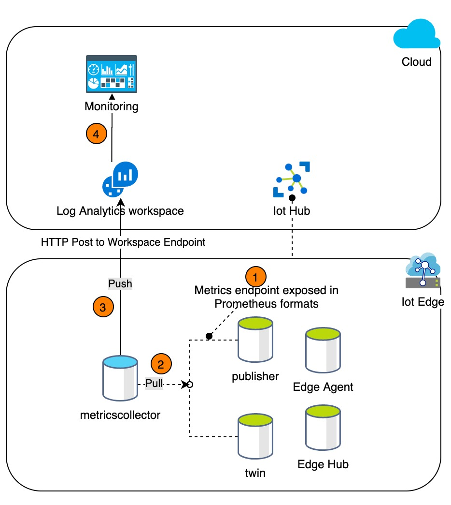

# Metrics Collector

[Home](readme.md)

We have used Metrics Collector module to collect the metrics from other edge modules. The `metricscollector` module runs inside IoT Edge. 

Edge modules would be instrumented with [Prometheus](https://github.com/prometheus-net/prometheus-net) metrics. Each module would expose the metrics on a pre-defined port.  The `metricscollector` module would use the configuration settings to scrape metrics in a defined interval. It would then push the scraped metrics to Log Analytics Workspace. Using Kusto, we could then query our metrics from workspace. We are creating and deploying an Azure Workbook which would provide insights into the edge modules. This would act as our primary monitoring system for edge modules.


## Edge Diagnostics

The metrics collector module pulls metrics exposed by `twin` and `publisher` modules, and pushes them to the Log Analytics workspace. Both `twin` and `publisher` expose metrics in Prometheus format. To do so, they use a standalone `HttpListener` based metrics server, which exposes metrics on  path `/metrics` and on port `9701` and `9702` respectively. The overview is shown below:



### Configuration

The default configuration to scrape metrics is:

```json
{ 
    "schemaVersion": "1.0",
	"scrapeFrequencySecs": 120,
	"metricsFormat": "Json",
	"syncTarget": "AzureLogAnalytics",
	"endpoints": {
		"opctwin": "http://opctwin:9701/metrics",
		"opcpublisher": "http://opcpublisher:9702/metrics"
	}
}
```

***Please Note:***

If you want to disable metrics collection , please set the environment variable ***EnableMetrics*** to ***false*** (default is set to true)

### Troubleshooting

The metrics are exposed using an`HttpListener` based server. It may throw an **access denied exception** on *Windows* if your user does not have the right to open a web server on the specified port. You can use the *netsh* command to grant yourself the required permissions:

**twin**:

> netsh http add urlacl url=http://+:9701/metrics user=Everyone

**publisher**:

> netsh http add urlacl url=http://+:9702/metrics user=Everyone


## Next steps

* [Learn how to use Prometheus metrics](../dev-guides/howto-use-prometheus-metrics.md)
* [Learn how to view metrics in Log Analytics Workspace](../tutorials/tut-loganalytics.md)
* [Learn how to view logs and metrics in Application Insights](../tutorials/tut-applicationinsights.md)
* [Learn how to deploy Discovery Module](../deploy/howto-install-iot-edge.md)
