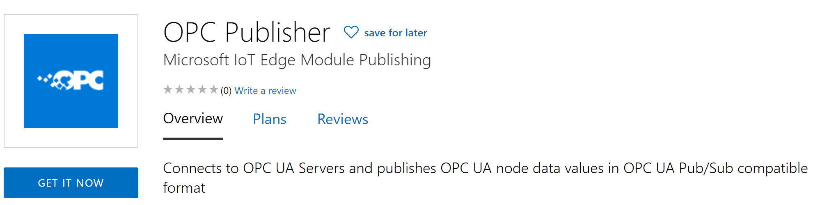

[Home](../../readme.md)

# Microsoft OPC Publisher - Standalone Mode

OPC Publisher is a fully supported Microsoft product, developed in the open, that bridges the gap between industrial assets and the Microsoft Azure cloud. It does so by connecting to OPC UA-enabled assets or industrial connectivity software and publishes telemetry data to [Azure IoT Hub](https://azure.microsoft.com/en-us/services/iot-hub/) in various formats, including IEC62541 OPC UA PubSub standard format (from version 2.6 onwards).

It runs on [Azure IoT Edge](https://azure.microsoft.com/en-us/services/iot-edge/) as a Module or on any Open Container Initiative compatible run-time like Docker as a container. Since it leverages the [.Net cross-platform runtime](https://docs.microsoft.com/en-us/dotnet/core/introduction), it also runs natively on Linux and Windows 10.

## Getting Started

Please use our released containers for OPC Publisher available in the Microsoft Container Registry, rather than building from sources. The easiest way to deploy OPC Publisher is through the [Azure Marketplace](https://azuremarketplace.microsoft.com/en-us/marketplace/apps/microsoft_iot.iotedge-opc-publisher).

[](https://azuremarketplace.microsoft.com/en-us/marketplace/apps/microsoft_iot.iotedge-opc-publisher)

Simply click the Get It Now button to log into the [Azure Portal](https://portal.azure.com) and deploy OPC Publisher. The following steps are required:

1. Pick the Azure subscription to use. If no Azure subscription is available, one must be created.
2. Pick the IoT Hub the OPC Publisher is supposed to send data to. If no IoT Hub is available, one must be created.
3. Pick the IoT Edge device the OPC Publisher is supposed to run on (or enter a name for a new IoT Edge device to be created).
4. Click Create. The "Set modules on Device" page for the selected IoT Edge device opens.
5. Click on "OPCPublisher" to open the OPC Publisher's "Update IoT Edge Module" page and then select "Container Create Options".
6. Specify additional container create options based on your usage of OPC Publisher, see next section below.

##### Accessing the Microsoft Container Registry Docker containers for OPC Publisher manually

The latest released version of OPC Publisher can be run manually via:

```
docker run mcr.microsoft.com/iotedge/opc-publisher:latest <name>
```

Where "name" is the name for the container.


### Specifying Container Create Options in the Azure Portal
When deploying OPC Publisher through the Azure Portal, container create options can be specified in the Update IoT Edge Module page of OPC Publisher. These create options must be in JSON format. The OPC Publisher command line arguments can be specified via the Cmd key, e.g.:
```
"Cmd": [
    "--pf=./publishednodes.json",
    "--aa"
],
```

A typical set of IoT Edge Module Container Create Options for OPC Publisher running under Linux is:
```
{ 
    "Hostname": "opcpublisher", 
    "Cmd": [ 
        "PkiRootPath=/mount/pki", 
        "--pf=/mount/published_nodes.json", 
        "--lf=/mount/publisher.log", 
        "--mm=PubSub", 
        "--me=Json", 
        "--fm=true", 
        "--fd=false", 
        "--bs=100", 
        "--di=20", 
        "--sc=1",
        "--aa"
    ], 
    "HostConfig": { 
        "Mounts": [ 
            { 
                "Type": "bind", 
                "Source": "/opcpublisher", 
                "Target": "/mount" 
            } 
        ] 
    } 
}

```

With these options specified, OPC Publisher will read the configuration file `./published_nodes.json`. The OPC Publisher's working directory is set to `/mount` at startup and thus OPC Publisher will read the file `/mount/publishednodes.json` inside its container.
OPC Publisher's log file will be written to `/mount` and the `CertificateStores` directory (used for OPC UA certificates) will also be created in this directory. To make these files available in the IoT Edge host file system, the container configuration requires a bind mount volume. The **Mounts** section will  map the directory `/mount` to the host directory `/opcpublisher` (which will be created by the IoT Edge runtime if it doesn't exist). 

**Without this bind mount volume, all OPC Publisher configuration files will be lost when the container is restarted.**

A connection to an OPC UA server using its hostname without a DNS server configured on the network can be achieved by adding an `ExtraHosts` entry to the `HostConfig` section:

```
"HostConfig": {
    "ExtraHosts": [
        "opctestsvr:192.168.178.26"
    ]
}
```

## Configuring OPC Publisher

OPC Publisher has several interfaces that can be used to configure it.

### Configuring Security

IoT Edge provides OPC Publisher with its security configuration for accessing IoT Hub automatically. OPC Publisher can also run as a standalone Docker container by specifying a device connection string for accessing IoT Hub via the `dc` command line parameter. A device for IoT Hub can be created and its connection string retrieved through the Azure Portal.

For accessing OPC UA-enabled assets, X.509 certificates and their associated private keys are used by OPC UA. This is called OPC UA application authentication and in addition to OPC UA user authentication. OPC Publisher uses a file system-based certificate store to manage all application certificates. During startup, OPC Publisher checks if there is a certificate it can use in this certificate stores and creates a new self-signed certificate and new associated private key if there is none. Self-signed certificates provide weak authentication, since they are not signed by a trusted Certificate Authority, but at least the communication to the OPC UA-enabled asset can be encrypted this way.

Security is enabled in the configuration file via the `"UseSecurity": true,` flag. The OPC Publisher will connect to the most secure endpoint available on the OPC UA servers.
By default, OPC Publisher uses anonymous user authentication (in additional to the application authentication described above). However, OPC Publisher also supports user authentication using username and password. This can be specified via the REST API configuration interface (described below) or the configuration file as follows:
```
"OpcAuthenticationMode": "UsernamePassword",
"OpcAuthenticationUsername": "usr",
"OpcAuthenticationPassword": "pwd",
```
In addition, OPC Publisher version 2.5 and below encrypts the username and password in the configuration file. Version 2.6 and above only supports the username and password in plain text. 

To persist the security configuration of OPC Publisher across restarts, the certificate and private key located in the certificate store directory must be mapped to the IoT Edge host OS filesystem. Please see Specifying Container Create Options in the Azure Portal above.

### Configuration via Configuration File

The simplest way to configure OPC Publisher is via a configuration file. An example configuration file is provided via the file [`publishednodes.json`](https://raw.githubusercontent.com/Azure/iot-edge-opc-publisher/main/opcpublisher/publishednodes.json).
Configuration file syntax has changed over time and OPC Publisher still can read old formats, but converts them into the latest format when persisting the configuration, done regularly in an automated fashion. Additionally, the configuration file can be schema validated before publisher loads it, a reference schema file is available [here](https://raw.githubusercontent.com/Azure/Industrial-IoT/main/modules/src/Microsoft.Azure.IIoT.Modules.OpcUa.Publisher/src/schemas/publishednodesschema.json). Please refer to OPC Publisher manual for schema validation details [here](https://github.com/Azure/Industrial-IoT/blob/main/docs/manual/readme.md).

A basic configuration file looks like this:
```
[
  {
    "EndpointUrl": "opc.tcp://testserver:62541/Quickstarts/ReferenceServer",
    "UseSecurity": true,
    "OpcNodes": [
      {
        "Id": "i=2258",
        "OpcSamplingInterval": 2000,
        "OpcPublishingInterval": 5000,
        "DisplayName": "Current time"
      }
    ]
  }
]
```

OPC UA optimizes network bandwidth by only sending data changes to OPC Publisher when the data has changed. If data changes need to be published more often or at regular intervals, OPC Publisher supports a "heartbeat" for every configured data item that can be enabled by additionally specifying the HeartbeatInterval key in the data item's configuration. The interval is specified in seconds:
```
 "HeartbeatInterval": 3600,
```

An OPC UA always send the current value of a data item when OPC Publisher first connects to it. To prevent publishing this data to IoT Hub, the SkipFirst key can be additionally specified in the data item's configuration:
```
 "SkipFirst": true,
```

### Configuration via Command Line Arguments

There are several command line arguments that can be used to set global settings for OPC Publisher. They are described [here](publisher-commandline.md).

### Configuration via the built-in OPC UA Server Interface
**Please note: This feature is only available in version 2.5 and below of OPC Publisher.**

OPC Publisher has a built-in OPC UA server, running on port 62222. It implements three OPC UA methods:

  - PublishNode
  - UnpublishNode
  - GetPublishedNodes

This interface can be accessed using an OPC UA client application, for example [UA Expert](https://www.unified-automation.com/products/development-tools/uaexpert.html).

### Configuration via IoT Hub Direct Methods

**Please note: This feature is only available in version 2.5 and below of OPC Publisher.**

OPC Publisher implements the following [IoT Hub Direct Methods](https://docs.microsoft.com/en-us/azure/iot-hub/iot-hub-devguide-direct-methods) which can be called from an application (from anywhere in the world) leveraging the [IoT Hub Device SDK](https://docs.microsoft.com/en-us/azure/iot-hub/iot-hub-devguide-sdks):

  - PublishNodes
  - UnpublishNodes
  - UnpublishAllNodes
  - GetConfiguredEndpoints
  - GetConfiguredNodesOnEndpoint
  - GetDiagnosticInfo
  - GetDiagnosticLog
  - GetDiagnosticStartupLog
  - ExitApplication
  - GetInfo

We have provided a [sample configuration application](https://github.com/Azure-Samples/iot-edge-opc-publisher-nodeconfiguration) as well as an [sample application for reading diagnostic information](https://github.com/Azure-Samples/iot-edge-opc-publisher-diagnostics) from OPC Publisher open-source, leveraging this interface.

_Hint: The samples applications are not actively maintained and may be outdated._

### Configuration via Cloud-based, Companion REST Microservice

**Please note: This feature is only available in version 2.6 and above of OPC Publisher.**

A cloud-based, companion microservice with a REST interface is described and available [here](https://github.com/Azure/Industrial-IoT/blob/master/docs/services/publisher.md). It can be used to configure OPC Publisher via an OpenAPI-compatible interface, for example through Swagger.

## OPC Publisher Telemetry Format

OPC Publisher version 2.6 and above supports standardized OPC UA PubSub JSON format as specified in [part 14 of the OPC UA specification](https://opcfoundation.org/developer-tools/specifications-unified-architecture/part-14-pubsub/) and looks like this:
```
{
  "MessageId": "18",
  "MessageType": "ua-data",
  "PublisherId": "uat46f9f8f82fd5c1b42a7de31b5dc2c11ef418a62f",
  "DataSetClassId": "78c4e91c-82cb-444e-a8e0-6bbacc9a946d",
  "Messages": [
    {
      "DataSetWriterId": "uat46f9f8f82fd5c1b42a7de31b5dc2c11ef418a62f",
      "SequenceNumber": 18,
      "MetaDataVersion": {
        "MajorVersion": 1,
        "MinorVersion": 1
    },
    "Timestamp": "2020-03-24T23:30:56.9597112Z",
    "Status": null,
    "Payload": {
      "http://test.org/UA/Data/#i=10845": {
        "Value": 99,
          "SourceTimestamp": "2020-03-24T23:30:55.9891469Z",
          "ServerTimestamp": "2020-03-24T23:30:55.9891469Z"
        },
        "http://test.org/UA/Data/#i=10846": {
          "Value": 251,
          "SourceTimestamp": "2020-03-24T23:30:55.9891469Z",
          "ServerTimestamp": "2020-03-24T23:30:55.9891469Z"
        }
      }
    }
  ]
}
```

In addition, all versions of OPC Publisher support a non-standardized, simple JSON telemetry format, which is compatible with [Azure Time Series Insights](https://azure.microsoft.com/en-us/services/time-series-insights/) and looks like this:
```
[
   {
      "EndpointUrl": "opc.tcp://192.168.178.3:49320/",
      "NodeId": "ns=2;s=Pump\\234754a-c63-b9601",
      "MonitoredItem": {
         "ApplicationUri": "urn:myfirstOPCServer"
      },
      "Value": {
         "Value": 973,
         "SourceTimestamp": "2020-11-30T07:21:31.2604024Z",
         "StatusCode": 0,
         "Status": "Good"
      }
  },
  {
      "EndpointUrl": "opc.tcp://192.168.178.4:49320/",
      "NodeId": "ns=2;s=Boiler\\234754a-c63-b9601",
      "MonitoredItem": {
         "ApplicationUri": "urn:mySecondOPCServer"
      },
      "Value": {
         "Value": 974,
         "SourceTimestamp": "2020-11-30T07:21:32.2625062Z",
         "StatusCode": 0,
         "Status": "Good"
      }
   }
]
```

**Warning: The `Samples` format changed over time**

### Configuration of the simple JSON telemetry format via Separate Configuration File

**Please note: This feature is only available in version 2.5 and below of OPC Publisher.**

OPC Publisher allows filtering the parts of the non-standardized, simple telemetry format via a separate configuration file, which can be specified via the `tc` command line option. If no configuration file is specified, the full JSON telemetry format is sent to IoT Hub. The format of the separate telemetry configuration file is described [here](publisher-telemetryformat.md).

## Performance and Memory Tuning OPC Publisher
When running OPC Publisher in production setups, network performance requirements (throughput and latency) and memory resources must be considered. OPC Publisher exposes the following command line parameters to help meet these requirements:

* Message queue capacity (`mq` for version 2.5 and below, not available in version 2.6, `om` for version 2.7)
* IoT Hub send interval (`si`)

The `mq/om` parameter controls the upper limit of the capacity of the internal message queue. This queue buffers all messages before they are sent to IoT Hub. The default size of the queue is up to 2 MB for OPC Publisher version 2.5 and below and 4000 IoT Hub messages for version 2.7 (i.e. if the setting for the IoT Hub message size is 256 KB, the size of the queue will be up to 1 GB). If OPC Publisher is not able to send messages to IoT Hub fast enough, the number of items in this queue increases. If this happens during test runs, one or both of the following can be done to mitigate:

* Decrease the IoT Hub send interval (`si`)
* Use OPC Publisher > 2.6 in standalone mode
  * Use PubSub format (`--mm=PubSub`)
  * When Samples format (`--mm=Samples`) is required
    * Don't use FullFeaturesMessage (`--fm=false`)
	* Use batching (--bs=600) in combination with batch interval (--si=20)
		* Batching is also useable with PubSub but current implementation of PubSub batches automatically based on Publishing Interval of OPC UA nodes, when most nodes using same publishing interval it isn't necessary
	* Increase Monitored Items Queue capacity (`--mq=25000`)
	* Don't use "fetch display name" (`--fd=false`)
* General recommendations	
  * Try to use less different publishing intervals
  * Experiment with the numbers, depending on the IoT Hub connectivity it seems to be better to have less messages with more OPC UA value changes in it (check OPC Publisher logs) but it could also be better to have more messages with less OPC UA value changes, this is specific to every factory


If the queue keeps growing even though the parameters have been adjusted, eventually the maximum queue capacity will be reached and messages will be lost. This is due to the fact that all parameter have physical limits and the Internet connection between OPC Publisher and IoT Hub is simply not fast enough for the amount of messages that must be sent in a given scenario. In that case, only setting up several, parallel OPC Publishers will help. The `mq/om` parameter also has the biggest impact on the memory consumption by OPC Publisher. 

It must be noted that IoT Hub also has limits in terms of how many messages it will accept, i.e. there are quotas for a given IoT Hub SKU defined [here](https://docs.microsoft.com/en-us/azure/iot-hub/iot-hub-devguide-quotas-throttling). If this quota is exceeded, OPC Publisher will generate an error trying to send the message to IoT Hub and the message will be lost.

The `si` parameter forces OPC Publisher to send messages to IoT Hub at the specified interval. A message is sent either when the maximum IoT Hub message size of 256 KB of data is available (triggering the send interval to reset) or when the specified interval time has passed.

The `ms` parameter enables batching of messages sent to IoT Hub. In most network setups, the latency of sending a single message to IoT Hub is high, compared to the time it takes to transmit the payload. This is mainly due to Quality of Service (QoS) requirements, since messages are acknowledged only once they have been processed by IoT Hub). Therefore, if a delay for the data to arrive at IoT Hub is acceptable, OPC Publisher should be configured to use the maximal message size of 256 KB by setting the `ms` parameter to 0. It is also the most cost-effective way to use OPC Publisher.

The metric `monitored item notifications enqueue failure`  in OPC Publisher version 2.5 and below and `messages lost` in OPC Publisher version 2.7 shows how many messages were lost.

When both `si` and `ms` parameters are set to 0, OPC Publisher sends a message to IoT Hub as soon as data is available. This results in an average IoT Hub message size of just over 200 bytes. However, the advantage of this configuration is that OPC Publisher sends the data from the connected asset without delay. The number of lost messages will be high for use cases where a large amount of data must be published and hence this is not recommended for these scenarios.

To measure the performance of OPC Publisher, the `di` parameter can be used to print performance metrics to the trace log in the interval specified (in seconds).

## Local metrics dashboard for OPC Publisher

To learn more about how to create a local metrics dashboard for OPC Publisher V2.7, please refer to the tutorial [here](./docs/prometheus-metrics/MetricsDashboard.md).

## Next steps

* [Learn how to deploy OPC Publisher and Twin Modules](../deploy/howto-install-iot-edge.md)
* [Learn about the OPC Publisher Microservice](../services/publisher.md)
