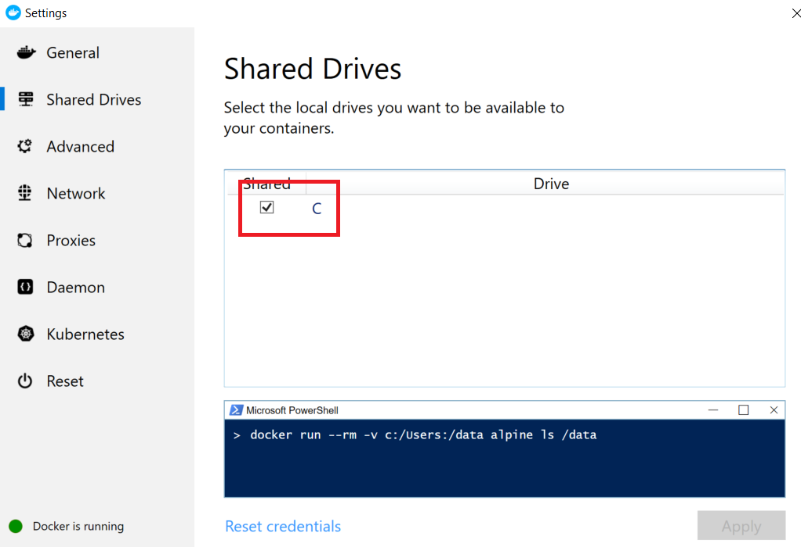

# OPC Publisher Edge Module

[Home](readme.md)

The OPC Publisher runs inside IoT Edge.  The Publisher module connects to OPC UA servers and publishes OPC UA telemetry data from these servers to Azure IoT Hub.  

The publisher is able to subscribe to Variable changes (sampling) and Events and publish these in the form of

* OPC UA Network Messages (UADP and JSON as per Part 14).
* Simplified monitored item notification messages (JSON - non standardized)

The publisher module can be configured using Writer Group jobs through the Industrial IoT Job Micro services.   These Writer Group jobs represent a JSON version of the OPC UA Part 14 configuration model.

## OPC UA X.509 certificates

The default store type for all cert stores is the file system. You can change that via command line options. Especially when you run OPC Publisher in a container, then the persistency of the certificates is important, since the container does not provide persistency. You need to use docker's `-v` option to persist the certificate stores in the host file system or a docker volume. If you are use a docker volume, you can pass in certificate relevant data via base64 encoded strings.

You need to take special care how certificate stores are handled. Especially for the application certificate the runtime environment has impact and you want to make sure that it is persisted and not created new on each start:

* Running on Windows natively, you can not use an application certificate store of type `Directory`, since the access to the private key fails. Please use the option `--at X509Store` in this case.
* Running as Linux docker container, you can map the certificate stores to the host file system by using the docker run option `-v <hostdirectory>:/appdata`. This will make the certificate persistent over re-starts.
* Running as Linux docker container and want to use an X509Store for the application certificate, you need to use the docker run option `-v x509certstores:/root/.dotnet/corefx/cryptography/x509stores` and the application option `--at X509Store`

## Legacy configuration using configuration file

To support backwards compatibility with previous versions of the publisher, the publisher also supports a legacy mode where the publishing configuration can be specified through a local configuration file.

An example for the format of the configuration file is:

```json
        [
          {
            "EndpointUrl": "opc.tcp://testserver:62541/Quickstarts/ReferenceServer",
            "UseSecurity": false,
            "OpcNodes": [
              {
                "Id": "i=2258",
                "OpcSamplingInterval": 2000,
                "OpcPublishingInterval": 5000,
                "DisplayName": "Current time"
              }
            ]
          }
        ]
```

### Host files to container binding

To expose the configuration file in the docker container a volume needs to be bind mounted into the container in the [deployment manifest](../deploy/deployment-manifest.md) "createOptions" property.  This volume must contain the JSON configuration file.

An example of a bind configuration is as follows:

```json
    "Binds": [
      "c:/iiotedge:/appdata"
    ]
```

On Windows you also need to enable file sharing in the Docker configuration UI:



Check out this [link](https://github.com/Azure/iotedge/issues/1745) for more information.

## Breaking changes in 2.6.x from 2.5.x and lower versions

We attempt to maintain backwards compatibility as much as possible.  This means you can use any publisher module as a drop-in replacement for a previous version. However, to support new functionality from 2.6.x forward we removed previously (up to version 2.5.x) available functionality:

* Configuration via OPC UA server and IoT Hub device method interface. The old model has been replaced with the new cloud-based Writer Group configuration interface, see [Publisher API](../api/publisher/readme.md).
* Message shaping using the `--tc` option and telemetry configuration file.
* Message batching (array of messages).  This has been replaced with the new and standardized Network Message format, which can also be emitted as binary (UADP) encoded messages.
* Several command line options (see `--help` for more details) which were listed in previous documentation.

If you feel functionality has been removed that you are relying on, please open a GitHub issue providing the use case.

## Previous Version (2.5.x) documentation

Documentation of previous versions can be found [here](https://github.com/Azure/iot-edge-opc-publisher/blob/master/README.md).

### Licensing

All OPC UA components use the OPC Foundation's OPC UA reference stack as nuget packages and therefore licensing of their nuget packages apply. Visit https://opcfoundation.org/license/redistributables/1.3/ for the licensing terms.

## Next steps

* [Learn how to deploy OPC Publisher and Twin Modules](../deploy/howto-install-iot-edge.md)
* [Learn about the OPC Publisher Microservice](../services/publisher.md)
