# Observability <!-- omit in toc -->

[Home](./readme.md)

## Table Of Contents <!-- omit in toc -->

- [Logging](#logging)
- [Runtime diagnostics output](#runtime-diagnostics-output)
- [Available metrics](#available-metrics)
- [IoT Edge Metrics collector](#iot-edge-metrics-collector)
- [OpenTelemetry](#opentelemetry)
- [Prometheus](#prometheus)
  - [Setup](#setup)
  - [View Prometheus dashboard](#view-prometheus-dashboard)
  - [View Grafana dashboard](#view-grafana-dashboard)

## Logging

Logging can be configured using the `--ll` [command line argument](./commandline.md). It allows to set a desired log level. More fine grained logging can be configured using an appsettings.json file as per .net documentation.

It is also possible to enable more detailed logging of the OPC UA stack using the `--sl` option.

To get the logs the `iotedge` command line utility can be used. Run the following from the local command line:

```bash
iotedge logs -f <container name>
```

These logs contain the current state of operation and can be used to narrow down an issue.

Additionally, logs from edge modules can be fetched [via direct methods](https://github.com/Azure/iotedge/blob/master/doc/built-in-logs-pull.md) describes how to fetch and upload logs from Edge modules.

## Runtime diagnostics output

The OPC Publisher emits metrics through its Prometheus endpoint (`/metrics`). To learn more about how to create a local metrics dashboard for OPC Publisher V2.7, refer to the tutorial [here](./observability.md).

To measure the performance of OPC Publisher, the `di` parameter can be used to print metrics to the log in the interval specified (in seconds). Using `--pd=Events` the diagnostics information can instead be emitted to a topic or to IoT Hub. The routing or topic can be configured using the `--dtt` [command line option](./commandline.md).

The following table describes the instruments that are collected per writer group and subsequently emitted:

| Log line item name                      | Diagnostic info property name       | Description |
|-----------------------------------------|-------------------------------------|-------------|
| # OPC Publisher Version (Runtime)       | n/a                                 | The full version and runtime used by the publisher |
| # Time                                  | timestamp                           | The timestamp of the diagnostics information |
| # Ingestion duration                    | ingestionDuration                   | How long the data flow inside the publisher has been executing after it was created (either from file or API) |
| # Opc endpoint connected?               | opcEndpointConnected                | Whether the pipeline is currently connected to the OPC UA server endpoint or in a reconnect attempt. |
| # Connection retries                    | connectionRetries                   | How many times connections to the OPC UA server broke and needed to be reconnected as it pertains to the data flow. |
| # Monitored Opc nodes succeeded count   | monitoredOpcNodesSucceededCount     | How many of the configured monitored items have been established successfully inside the data flow's OPC UA subscription and should be producing data. |
| # Monitored Opc nodes failed count      | monitoredOpcNodesFailedCount        | How many of the configured monitored items inside the data flow failed to be created in the subscription (the logs will provide more information). |
| # Subscriptions count                   | subscriptionsCount (*)              | How many subscriptions were created that contain above monitored items. |
| # Queued/Minimum request count          | publishRequestsRatio (*)            | The ratio of currently queued requests to the server as a percentage of the subscription count measured here vs. the overall number of subscriptions in the underlying session (e.g., if the session is shared). |
|                                         | minPublishRequestsRatio (*)         | The ratio of minimum number of publish requests that should always be queued to the server. |
| # Good/Bad Publish request count        | goodPublishRequestsRatio (*)        | The ratio of currently queued publish requests that are in progress in the server and awaiting a response. |
|                                         | badPublishRequestsRatio (*)         | The ratio of defunct publish requests which have not been resulting in a publish response from the server. |
| # Ingress value changes                 | ingressValueChanges                 | The number of value changes inside the OPC UA subscription notifications processed by the data flow. |
| # Ingress Events                        | ingressEvents                       | The number of events that were part of these OPC UA subscription notifications that were so far processed by the data flow. |
| # Received Data Change Notifications    | ingressDataChanges                  | The number of OPC UA subscription notification messages with data value changes that have been received by publisher inside this data flow |
| # Received Event Notifications          | ingressEventNotifications           | The number of OPC UA subscription notification messages with events that have been received by publisher so far inside this data flow |
| # Received Keep Alive Notifications     | ingressEventNotifications           | The number of received OPC UA subscription notification messages that were keep alive messages |
| # Generated Cyclic read Notifications   | ingressCyclicReads                  | The number of cyclic read notifications generated from sampling nodes on the client side. Each notification contains the changed value. |
| # Generated Heartbeats Notifications    | ingressHeartbeats                   | The number of notifications that contain heartbeats. Each notification contains the heartbeat value. |
| # Notification batch buffer size        | ingressBatchBlockBufferSize         | The number of messages awaiting encoding and sending tot he telemetry message destination inside the data flow pipeline. |
| # Encoder input / output size           | encodingBlockInputSize              | The number of messages awaiting encoding into the output format. |
|                                         | encodingBlockOutputSize             | The number of messages already encoded and waiting to be sent to the telemetry message destination. |
| # Encoder Notif. processed/dropped      | encoderNotificationsProcessed       | The total number of subscription notifications processed by the encoder stage of the data flow pipeline since the pipeline started. |
|                                         | encoderNotificationsDropped         | The total number of subscription notifications that were dropped because they could not be encoded, e.g., due to their size being to large to fit into the message. |
| # Encoder Network Messages produced     | encoderIoTMessagesProcessed         | The total number of encoded messages produced by the encoder since the start of the pipeline. |
| # Encoder avg Notifications/Message     | encoderAvgNotificationsMessage      | The average number of subscription notifications that were pressed into a message. |
| # Encoder avg Message body size         | encoderAvgIoTMessageBodySize        | The average size of the message body produced over the course of the pipeline run. |
| # Encoder avg Chunk (4 Kb) usage        | encoderAvgIoTChunkUsage             | The average use of IoT Hub chunks (4k). |
| # Estimated Chunks (4 KB) per day       | estimatedIoTChunksPerDay            | An estimate of how many chunks are used per day by publisher which enables correct sizing of the IoT Hub to avoid data loss due to throttling. |
| # Egress Messages queued/dropped        | outgressInputBufferCount            | The aggregated number of messages waiting in the input buffer of the configured telemetry message destination sinks. |
|                                         | outgressInputBufferDropped          | The aggregated number of messages that were dropped in any of the configured telemetry message destination sinks. |
| # Egress Messages successfully sent     | outgressIoTMessageCount             | The aggregated number of messages that were sent by all configured telemetry message destination sinks. |
|                                         | sentMessagesPerSec                  | Publisher throughput meaning the number of messages sent to the telemetry message destination (e.g., IoT Hub / Edge Hub) per second |

(*) Not exposed through the API

## Available metrics

By convention, all instrument names start with _"iiot"_, e.g., `iiot_<component>_<metric>`. Metrics are collected through the .net Observability infrastructure. For backwards compatibility and to support IoT Edge metrics collector, metrics from OPC Publisher are exposed in Prometheus format on path _/metrics_ on the default HTTP server port (see `-p` [command line argument](./commandline.md). When binding the HTTPS port to 9072 on the host machine, the URL becomes <https://localhost:9072/metrics>.

One can combine information from multiple metrics to understand and paint a bigger picture of the state of the publisher. The following table describes the individual default metrics which are in Prometheus format.

| Instrument Name | Dimensions | Description | Type |
|-----------------|------------|-------------|------|
| iiot_edge_module_start                                  | Edge modules start timestamp with version. Used to calculate uptime, device restarts.   | gauge     |
| iiot_edge_publisher_monitored_items                     | Total monitored items per subscription                                                  | gauge     |
| iiot_edge_device_reconnected                             | OPC UA server reconnection count                                                        | gauge     |
| iiot_edge_device_disconnected                            | OPC UA server disconnection count                                                       | gauge     |
| iiot_edge_reconnected                                     | Edge device reconnection count                                                          | gauge     |
| iiot_edge_disconnected                                   | Edge device disconnection count                                                         | gauge     |
| iiot_edge_publisher_messages_duration                  | Time taken to send messages from publisher. Used to calculate P50, P90, P95, P99, P99.9 | histogram |
| iiot_edge_publisher_value_changes                                             | OPC UA server ValuesChanges delivered for processing                                    | counter     |
| iiot_edge_publisher_value_changes_per_second                                | OPC UA server ValuesChanges delivered for processing per second                         | gauge     |
| iiot_edge_publisher_heartbeats                                             | OPC Publisher heartbeats delivered for processing and included in the value changes. | counter     |
| iiot_edge_publisher_cyclicreads                                             | OPC Publisher cyclic reads delivered for processing and included in the value changes. | counter     |
| iiot_edge_publisher_data_changes                                              | OPC UA server DataChanges delivered for processing                                      | counter     |
| iiot_edge_publisher_data_changes_per_second                                 | OPC UA server DataChanges delivered for processing                                      | gauge     |
| iiot_edge_publisher_iothub_queue_size                                        | Queued messages to IoTHub                                                               | gauge     |
| iiot_edge_publisher_iothub_queue_dropped_count                              | IoTHub dropped messages count                                                           | gauge     |
| iiot_edge_publisher_messages                                        | Messages sent to IoTHub                                                                 | counter     |
| iiot_edge_publisher_messages_per_second                           | Messages sent to IoTHub per second                                                      | gauge     |
| iiot_edge_publisher_connection_retries                                        | Connection retries to OPC UA server                                                     | gauge     |
| iiot_edge_publisher_encoded_notifications                                     | Encoded OPC UA server notifications count                                               | counter     |
| iiot_edge_publisher_dropped_notifications                                     | Dropped OPC UA server notifications count                                               | counter     |
| iiot_edge_publisher_processed_messages                                        | Processed IoT messages count                                                            | counter     |
| iiot_edge_publisher_notifications_per_message_average                       | OPC UA sever notifications per IoT message average                                      | gauge     |
| iiot_edge_publisher_encoded_message_size_average                            | Encoded IoT message body size average                                                   | gauge     |
| iiot_edge_publisher_chunk_size_average                                       | IoT Hub chunk size average                                                              | gauge     |
| iiot_edge_publisher_estimated_message_chunks_per_day                       | Estimated IoT Hub chunks charged per day                                                | gauge     |
| iiot_edge_publisher_is_connection_ok                                       | Is the endpoint connection ok?                                                          | gauge     |
| iiot_edge_publisher_good_nodes                                             | How many nodes are receiving data for this endpoint?                                    | gauge     |
| iiot_edge_publisher_bad_nodes                                              | How many nodes are misconfigured for this endpoint?                                     | gauge     |

You can use the IoT Edge [Metrics Collector](#iot-edge-metrics-collector) module to collect the metrics.

Edge modules would be instrumented with [Prometheus](https://github.com/prometheus-net/prometheus-net) metrics. Each module would expose the metrics on a pre-defined port.  The `metricscollector` module would use the configuration settings to scrape metrics in a defined interval. It would then push the scraped metrics to Log Analytics Workspace. Using Azure Data Explorer (ADX), we can then query our metrics from workspace. We are creating and deploying an Azure Workbook which would provide insights into the edge modules. This would act as our primary monitoring system for edge modules.

## IoT Edge Metrics collector

The metrics collector module pulls metrics exposed by OPC Publisher and pushes them to the Log Analytics workspace.

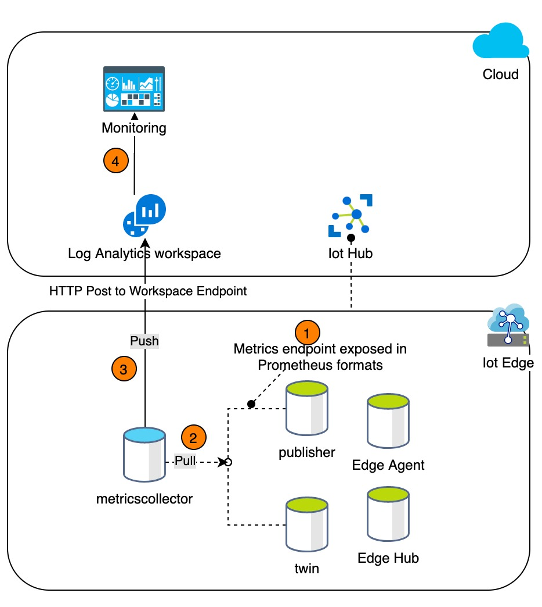

The default configuration to enable scraping metrics is:

```json
{
    "schemaVersion": "1.0",
    "scrapeFrequencySecs": 120,
    "metricsFormat": "Json",
    "syncTarget": "AzureLogAnalytics",
    "endpoints": {
        "opcpublisher": "http://opcpublisher/metrics"
    }
}
```

> This assumes the http server in OPC Publisher has not been disabled. Disabling the internal HTTP server also disables the Prometheus endpoint.

## OpenTelemetry

It is possible to export all [metrics](#available-metrics), traces and [logs](#logging) to an OpenTelemetry (OTEL) collector. To specify the OTLP GRPC endpoint to export to, use the `--oc` [command line argument](./commandline.md).

An example setup using the OpenTelemetry (OTEL) Contrib Collector and Grafana stack can be found in the `/deploy/docker` folder.

## Prometheus

OPC Publisher module also exposes all [metrics](#available-metrics) to a Prometheus scraper (at the standard `/metrics` path). For troubleshooting and debugging, a local Grafana dashboard can be configured on Azure IoT Edge.

> It is recommended to use the OpenTelemetry collector and expose metrics from the collector to Prometheus.

This section shows you how to setup and view OPC Publisher and EdgeHub metrics as bird's eye view and how to quickly drill down into the issues in case of failures.

In this tutorial two pre-configured docker images (for Prometheus and Grafana) must be created and deployed as Azure IoT Edge Modules. The Prometheus Module scrapes the metrics from OPC Publisher and EdgeHub, while Grafana is used for visualization of metrics.

### Setup

1. Create and configure [Azure Container Registry](https://docs.microsoft.com/azure/container-registry/container-registry-get-started-portal) to have an admin account enabled.  **Registry name** and **password**  are needed for pushing the docker images of Prometheus and Grafana.

    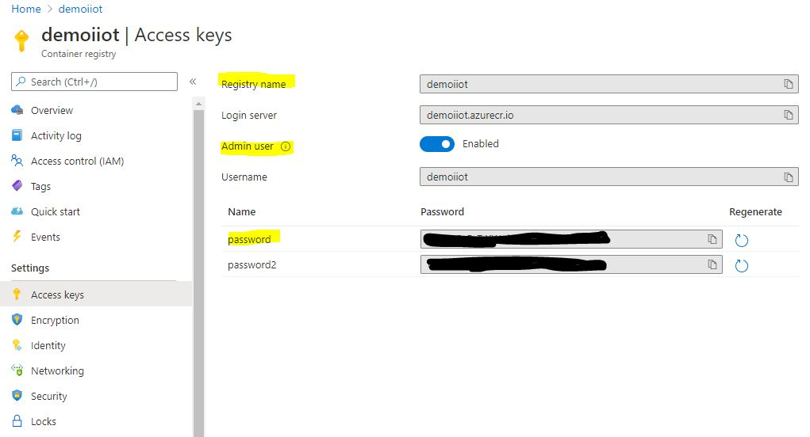

2. Create and push images to this ACR:

    - Download the zip (_metricsdashboard.zip_) located in this folder and extract it.

    - Navigate to **prometheus** folder as shown:

      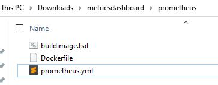

    - Edit _prometheus.yml_ if needed. It defaults to scraping EdgeHub metrics at 9600 and OPC Publisher metrics at 9702. If only OPC Publisher metrics are needed, then remove the scraping config of EdgeHub.

    - Run _buildimage.bat_ and enter the _registryname_, _password_ and _tagname_ when prompted. It will push the **edgeprometheus** image to container registry.

      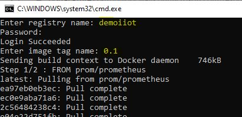

    - Navigate back to the **grafana** folder and run _buildimage.bat_ located in this folder. Enter the same information to push the **edgegrafana** image to ACR.

3. Now go to the portal and verify that the images are present, as shown in the image below.

   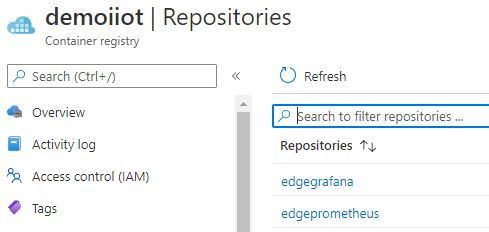

4. IoT Edge should now be configured to expose metrics. Navigate to the IoT Edge device to be used and perform the following steps:

    - Select **Set Modules** to update the configuration

    - Enter the registry information in the **Container Registry Credentials** so that it can authenticate with the Azure Container Registry.

     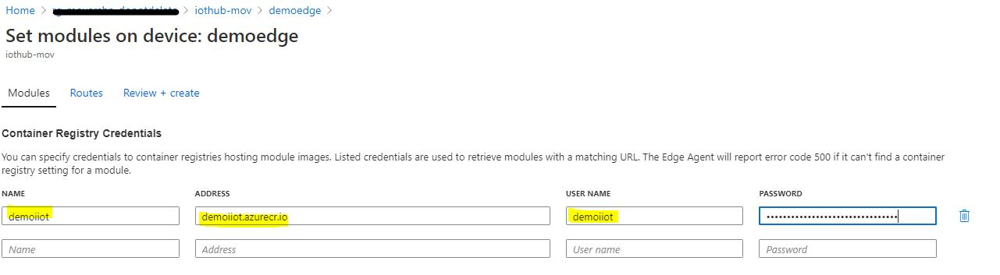

    - Optional: Enable metrics of _edgeHub_ (Note: As of release 1.0.10, metrics are automatically exposed by default on http port **9600** of the EdgeHub)

      - Select the **Runtime Settings** option and for the EdgeHub and Agent, make sure that the
        stable version is selected with version 1.0.9.4+

        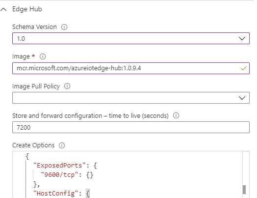

      - Adjust the EdgeHub **Create Options** to include the Exposed Ports directive as shown above.

      - Add the following environment variables to the EdgeHub. (Not needed for version 1.0.10+)

        **ExperimentalFeatures__Enabled         : true**

        **ExperimentalFeaturesEnable__Metrics   : true**

      - Save the dialog to complete the runtime adjustments.

    - Expose port on publisher module:

      - Navigate to the publisher and expose port **9702** to allow the metrics to be scraped, by adding the exposed ports option in the Container Create Options in the Azure portal.

        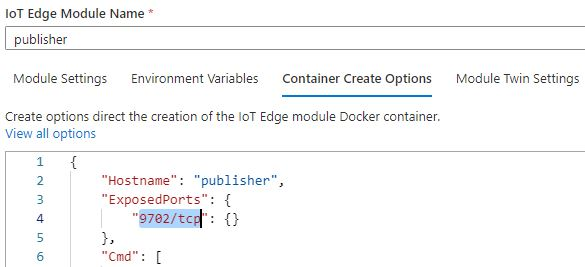

      - Select **Update** to complete the changes made to the OPC publisher module.

5. Now add new modules based on the Prometheus and Grafana images created previously.

    - Prometheus:

      - Add a new “IoT Edge Module” from the “+ Add” drop down list.

      - Add a module named **prometheus** with the image uploaded previously to the Azure Container Registry.

        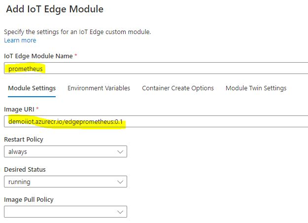

      - In the **Container Create Options** expose and bind the Prometheus port 9090.

        ```json
        {
            "Hostname": "prometheus",
            "ExposedPorts": {
                "9090/tcp": {}
            },
            "HostConfig": {
                "PortBindings": {
                    "9090/tcp": [
                        {
                            "HostPort": 9090
                        }
                    ]
                }
            }
        }
        ```

      - Click **Update** to complete the changes to the Prometheus module.

      - Select **Review and Create** and complete the deployment by choosing **Create**.

    - Grafana:

      - Add a new “IoT Edge Module” from the “+ Add” drop down list.

      - Add a module named **grafana** with the image uploaded previously to the Azure Container Registry.

        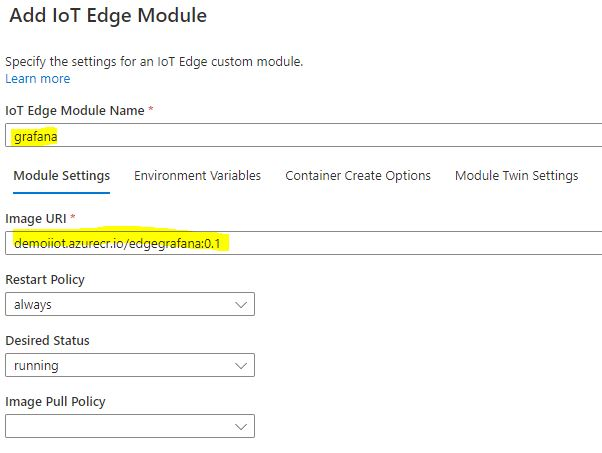

      - Update the environment variables to control access to the Grafana dashboard.

        - GF_SECURITY_ADMIN_USER - the user name you want to use

        - GF_SECURITY_ADMIN_PASSWORD - a password of your choice

        - GF_SERVER_ROOT_URL  - http://localhost:3000

          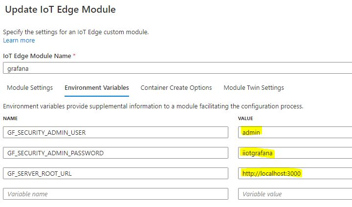

      - In the **Container Create Options** expose and bind the Grafana port 3000.

        ```json
        {
            "Hostname": "grafana",
            "ExposedPorts": {
                "3000/tcp": {}
            },
            "HostConfig": {
                "PortBindings": {
                    "3000/tcp": [
                        {
                            "HostPort": 3000
                        }
                    ]
                }
              }
         }
        ```

      - Click **Update** to complete the changes to the Grafana module.

      - Select **Review and Create** and complete the deployment by choosing **Create**.

    - Verify all the modules are running successfully:

      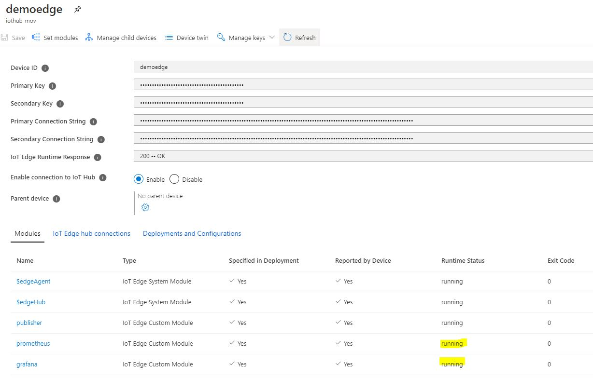

### View Prometheus dashboard

- Navigate to the Prometheus dashboard through a web browser on the IoT Edge’s host on port 9090.

  - <http://{edge> host IP or name}:9090/graph
  - **Note**: When using a VM, make sure to add an inbound rule for port 9090

- Check the target state by navigating to **/targets**

  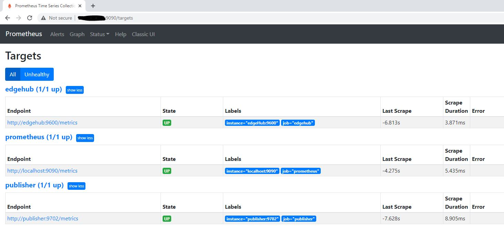

- Metrics can be viewed as shown:

  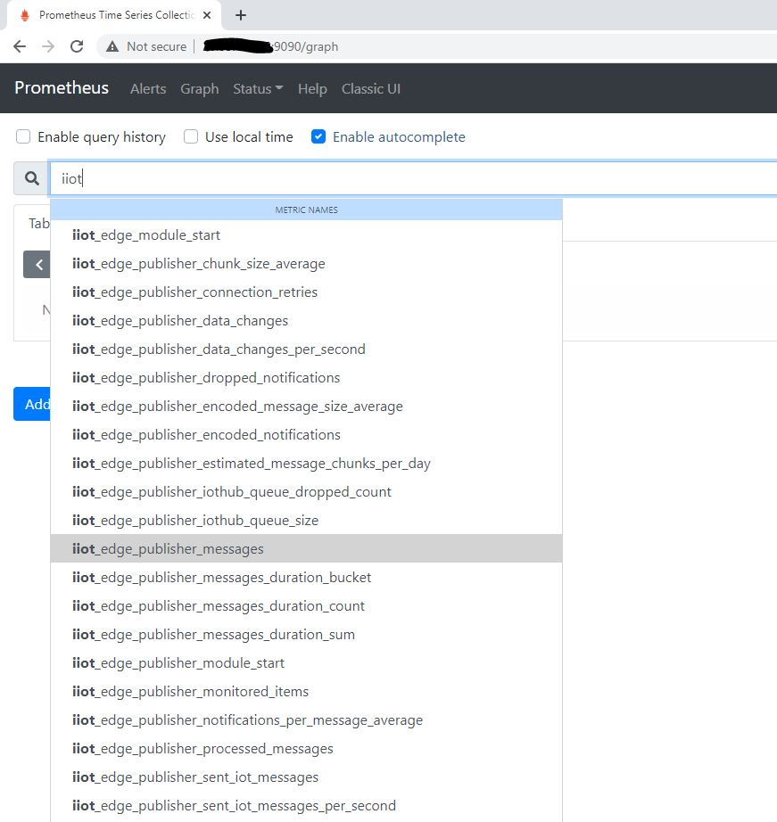

- 

### View Grafana dashboard

- Navigate to the Grafana dashboard through a web browser against the edge’s host on port 3000.
  - http://{edge host IP or name}:3000
  - When prompted for a user name and password enter the values entered in the environment variables
  - **Note**: When using a VM, make sure to add an inbound rule for port 3000

- Prometheus has already been configured as a data source and can now be directly accessed. Prometheus is scraping EdgeHub and OPC Publisher metrics.

- Select the dashboards option to view the available dashboards and select “Publisher” to view the pre-configured dashboard as shown below.

  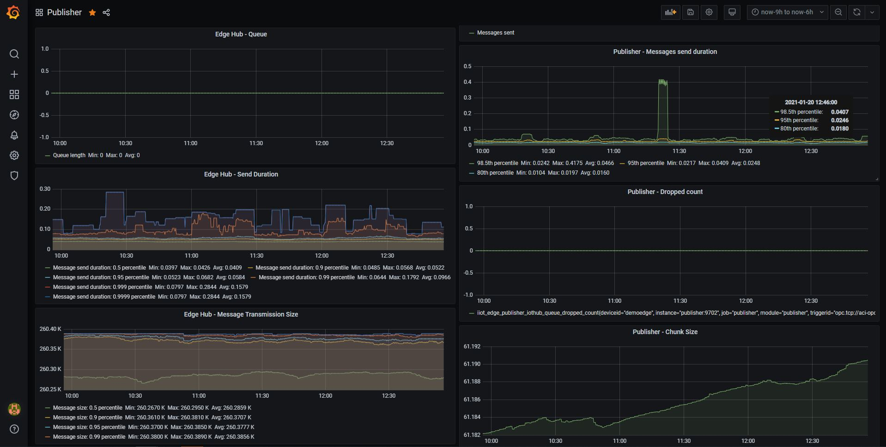

- One could easily add/remove more panels to this dashboard as per the needs.
