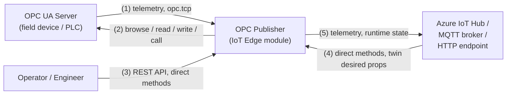
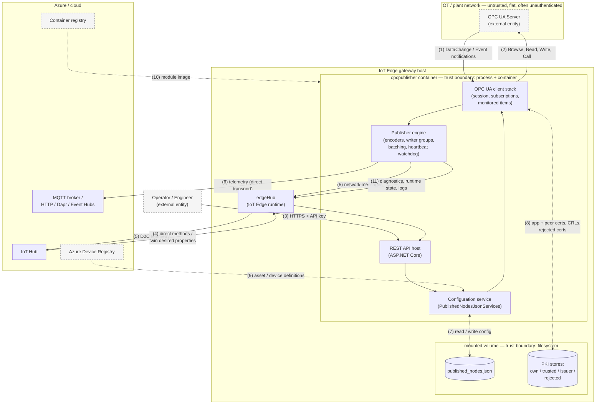
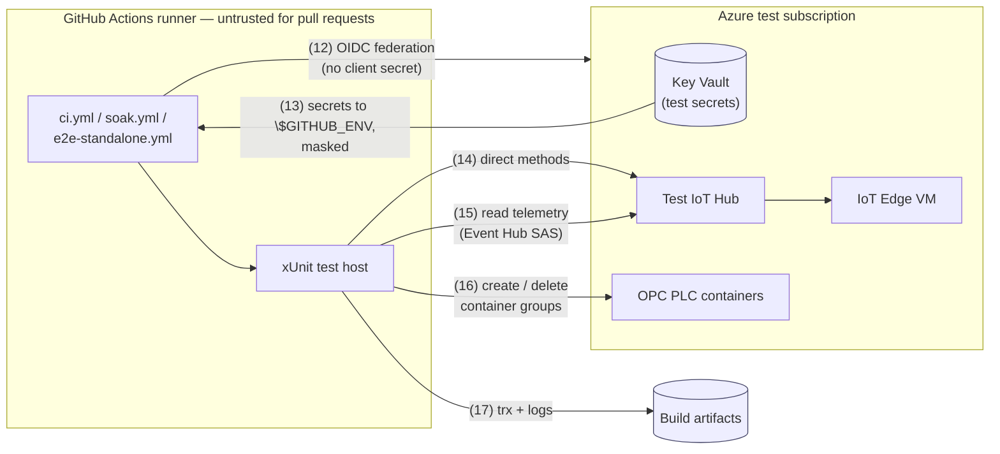

# OPC Publisher data flow diagram <!-- omit in toc -->

[Home](../readme.md) · [Security](../security.md) · [Threat model](./readme.md)

This is the data flow diagram (DFD) that backs
[`OpcPublisher.tm7`](./OpcPublisher.tm7). It is kept in Mermaid so that it is
reviewable in a pull request; the `.tm7` is the machine-readable form for the
Microsoft Threat Modeling Tool.

Numbers on the flows (`(1)`, `(2)`, …) match the `Flow #` column of the threat
table in [readme.md](./readme.md).

## Level 0 — context

## Level 1 — trust boundaries and stores

Trust boundaries are the dashed containers. Anything crossing one is a place
where authentication, authorisation, and input validation have to be argued
explicitly.

## Test and CI data flows

The end-to-end and soak test infrastructure creates its own, separate flows.
They do not exist in a customer deployment, but they do run against real Azure
resources with real credentials, so they are in scope for the threat model.

## Assumptions

These are the load-bearing assumptions. If one of them is false in a given
deployment, the corresponding threats in [readme.md](./readme.md) change
severity.

1. The OT network is **not** trusted. An OPC UA server may be malicious,
   compromised, or simply faulty, and can return hostile or malformed data.
2. The IoT Edge gateway host is trusted. An attacker with root on the host has
   already won: they can read the module's mounted volume, its PKI store and its
   module identity.
3. `published_nodes.json` and the PKI directory are on a mounted volume shared
   with the host. Their confidentiality and integrity are the host's
   responsibility, not the module's.
4. IoT Hub is trusted for authentication of direct methods; the module does not
   independently authenticate the caller of a direct method.
5. The REST API is reachable only from the edge network and is protected by the
   configured API key. It is not intended for exposure to the internet.
