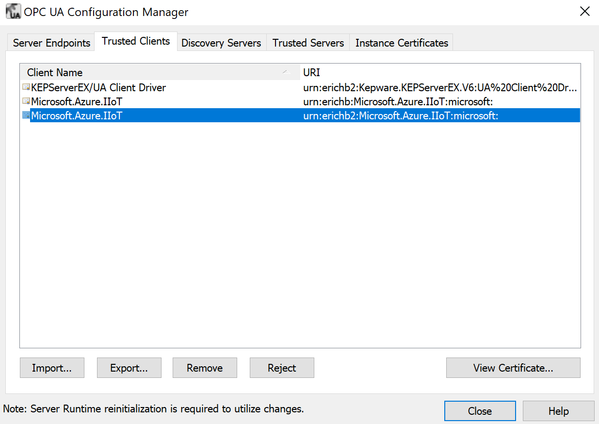
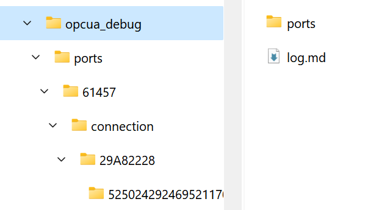

# Troubleshooting OPC Publisher <!-- omit in toc -->

[Home](./readme.md)

In this document you find information about

## Table Of Contents <!-- omit in toc -->

- [Debugging Telemetry data issues](#debugging-telemetry-data-issues)
  - [Check OPC UA server](#check-opc-ua-server)
  - [Check IoT Edge](#check-iot-edge)
  - [Check OPC Publisher](#check-opc-publisher)
    - [BadNodeIdUnknown](#badnodeidunknown)
  - [Check EdgeHub](#check-edgehub)
  - [Check data arriving in IoT Hub](#check-data-arriving-in-iot-hub)
    - [IoT Hub Metrics](#iot-hub-metrics)
      - [Use Azure IoT Explorer](#use-azure-iot-explorer)
- [Restart the module](#restart-the-module)
- [Analyzing network capture files](#analyzing-network-capture-files)
- [Limits and contributing factors](#limits-and-contributing-factors)
- [Debugging Discovery](#debugging-discovery)

## Debugging Telemetry data issues

Follow the data from the source and check where it stops:

1. Check the [OPC UA server](#check-opc-ua-server)
1. Check [IoT Edge](#check-iot-edge)
1. Check [OPC Publisher](#check-opc-publisher)
1. Check [EdgeHub](#check-edgehub)
1. Check data arriving in [IoT Hub](#check-data-arriving-in-iot-hub)
1. Finally check your application that is consuming from IoT Hub is running and operating correctly.

### Check OPC UA server

Microsoft OPC Publisher connects to OPC UA servers built into machines or industrial systems via OPC UA client/server. There is an OPC UA client built into the OPC Publisher Edge module. OPC UA Client/server uses an OPC UA Secure Channel to secure this connection. The OPC UA Secure Channel in turn uses X.509 certificates to establish trust between the client and the server. This is done through mutual authentication, i.e. the certificates must be "accepted" (or trusted) by both the client and the server. To simplify setup, the OPC Publisher Edge module has a setting enabled to automatically accept all server certificates ("--aa" in the case of the OPC Publisher, see example below).

However, the biggest hurdle most OT admins need to overcome when deploying OPC Publisher is to accept the module's X.509 certificate in the OPC UA server the platform tries to connect to. There is usually a configuration tool that comes with the built-in OPC UA server where certificates can be trusted. Here is a screenshot of this dialog from PTC’s KepServerEx industrial connectivity software configuration tool:



In the dialog above, it can be seen that the certificate **Microsoft.Azure.IIoT** is trusted by Kepware `KepServerEx`. This is only done once and then the data can be exchanged between the OPC UA server (in this case `KepServerEx`) and OPC Publisher Edge module.

The OPC UA certificate used by the OPC Publisher Edge module is a self-signed certificates generated when the modules start up when a certificate doesn’t exist. However, each time a Docker container starts up, all previous state of the container is removed. To avoid re-establishing trust by each OPC UA server on-premises after each restart the certificates can be persisted to the local filesystem of the host (where IoT Edge as well as the Docker containers `EdgeHub` and `EdgeAgent` and of course OPC Publisher module runs on). To do this, the filesystem directory within the container needs to be mapped to an existing filesystem directory on the host through a [bind mount](https://docs.docker.com/storage/bind-mounts). See [here](readme.md) for more information on how to accomplish this.

Another feature of OPC UA that is often turned off by OT administrators is user authentication. User authentication is another authentication layer on top of the client/server authentication described above. Most OPC UA servers only support anonymous user authentication but some support user authentication based on username and password. If this is the case, a username and password must be supplied to the OPC Publisher’s API or set in the `publishednodes.json` file (properties `OpcAuthenticationUsername` and `OpcAuthenticationPassword`).

### Check IoT Edge

To troubleshoot an IoT Edge device run the following commands in a terminal session on the IoT Edge device or over a remote SSH session:

- `sudo iotedge check` to check the state of the installation.
- `systemctl status iotedge` to view the status of the IoT Edge security manager.
- `systemctl restart iotedge` to restart the IoT Edge Security Daemon.
- `iotedge logs <publisher container name>` to check the logs.
- `iotedge restart <publisher container name>` to restart OPC Publisher.
- `iotedge restart edgeAgent && iotedge restart edgeHub` to restart the IoT Edge runtime containers.
- `docker stats` to retrieve statistics from the docker runtime.

For more detailed description on how to troubleshoot IoT Edge device, please refer to [here](https://docs.microsoft.com/azure/iot-edge/troubleshoot-common-errors) and [here](https://docs.microsoft.com/azure/iot-edge/troubleshoot).

For a complete overview of all production deployment settings for IoT Edge, see [here](https://docs.microsoft.com/azure/iot-edge/production-checklist).

### Check OPC Publisher

[Retrieve the logs](./observability.md) from publisher and examine.

If you disabled console output of the logs and are not monitoring metrics, enable diagnostics output to the console using the `--di` c[command line options](./commandline.md). Using the logs:

- Observe data throughput and make sure that the data changes over time are as you are expecting.
- Check whether all endpoints are connected. This can be seen during session establishment and in the periodic diagnostic logs.
- When OPC Publisher cannot subscribe to a node in the OPC UA server address space the number of failing nodes are logged in the metrics. To understand what happened you need to look at the logs that are emitted during connect.
- The diagnostic output and metrics include an indicator of how many publishing requests are in flight between publisher and the OPC UA server and how many of these were returned with errors which reflects the health of the session and subscriptions in the writer group.
- Observe the keep alive notification count in the periodic diagnostics output. If it counts up periodically it shows that while the connection and subscription is active, the server is not providing any data to OPC Publisher.  The keep alive is sent by the server after `(keep alive count) * (publishing interval of subscription)` time has past.
- Check how many data points were logged as dropped or whether data is queued up in the internal pipeline of the publisher (buffering, encoder, sending).

To log notifications received on a subscription to the log you can use the `--ln` switch.

To increase the log level and see debug logs use the `--ll Debug` switch.

To log informational an debug messages of the OPC UA stack to the log, use the `--sl` switch.

To diagnose throughput issues see the [limits and monitoring](#limits-and-contributing-factors) section.

#### BadNodeIdUnknown

A typical error shown in the log is `BadNodeIdUnknown` which means the server could not resolve the node id to a node in its address space to subscribe to.

Reasons why the node id specified in the configuration cannot be resolved inside the server during connect can be as follows:

- The Node Id string in the configuration is incorrect, e.g., escaping of characters, extra spaces, missing semicolon.
- Use an OPC UA Client like UA Expert or other to connect to the server with exactly the same security configuration (same user name, encryption settings, etc. that OPC Publisher uses, if you do not know, default to SecurityMode = none and anonymous user).  Find the node by browsing and copy the node id exactly from the tool.
- If it still does not work, please send the node id string.
- The namespace id in the node id has changed from last time.  Namespace ids are typically always static, but that is not guaranteed by the spec, quite the opposite. se the nsu= format of node id (expanded node id) to specify the namespace string instead of the id then.
- The node is a dynamic node and comes and goes. You can configure OPC Publisher to re-evaluate periodically.
- The node is only accessible to a particular user or user with role or on a particular endpoint with a special security profile.  If we know what that is, then I can make suggestion what to do next, but might require upgrading to 2.9

### Check EdgeHub

To verify that a module or device has connectivity with the IoT Hub service, Microsoft provides a tool that is described here: <https://docs.microsoft.com/azure/iot-hub/tutorial-connectivity#check-device-to-cloud-connectivity>

If the `edgeHub` module fails to start, you may see a message like this in the logs:

```bash
One or more errors occurred.

(Docker API responded with status code=InternalServerError, response=

{\\"message\\":\\"driver failed programming external connectivity on endpoint edgeHub (6a82e5e994bab5187939049684fb64efe07606d2bb8a4cc5655b2a9bad5f8c80):

Error starting userland proxy: Bind for 0.0.0.0:443 failed: port is already allocated\\"}\\n)
```

Or

```powershell
info: edgelet_docker::runtime -- Starting module edgeHub...

warn: edgelet_utils::logging -- Could not start module edgeHub

warn: edgelet_utils::logging -- caused by: failed to create endpoint edgeHub on network nat: hnsCall failed in Win32:

The process cannot access the file because it is being used by another process. (0x20)
```

To find the root cause and resolution, please refer [here](https://docs.microsoft.com/azure/iot-edge/troubleshoot-common-errors).

### Check data arriving in IoT Hub

#### IoT Hub Metrics

To verify that the data is arriving in IoT Hub the Metrics of the IoT Hub can be checked. Particularly, select Metrics from the pane on the left side of your Azure IoT Hub resource page in the Azure Portal and select the **Telemetry messages sent** from the **IoT Hub standard metrics** namespace. This page gives an overview on the number of IoT Hub messages that have been sent from the OPC Publisher and from other custom edge modules. Please keep in mind that each of those messages have a size of up to 256KB. If buffering is enabled for the OPC Publisher module, then each IoT Hub message may contain several batches of data changes, where each batch contains a set of OPC value changes.


Another option to troubleshoot the issues in IoT Hub is by checking the "_Diagnose and solve problems"_ section of the IoT Hub resource page on the Azure Portal as shown below:


Moreover, enabling the diagnostic settings provides more data to troubleshoot and how to choose where to store that data is shown below:


##### Use Azure IoT Explorer

As a next step the Azure IoT Explorer can be used to validate that messages for a particular Publisher job are delivered to IoT Hub. To install Azure IoT Explorer, please follow the steps here:

- [Install and use Azure IoT Explorer](https://docs.microsoft.com/azure/iot-pnp/howto-use-iot-explorer)

To view the telemetry of OPC Publisher in Azure IoT Explorer, go to its Telemetry and start monitoring telemetry from that publisher module of choice. If you do not receive any messages for that device after a long period since starting monitoring, then there is a problem which causes telemetry messages not to be delivered to IoT Hub.


## Restart the module

To restart a module, the `iotedge` command line utility can be used as well. The command is:

​```bash
iotedge restart <modulename>
​​```

The name of the module can be retrieved via

​```bash
iotedge list
​​```

You can also troubleshoot the OPC Publisher module remotely through the Azure Portal. Select the module inside the respective IoT Edge device in the IoT Edge blade and click on the Troubleshooting button to see logs and restart the module remotely.

## Analyzing network capture files

The issue might be between the OPC Publisher OPC UA client and the OPC UA server you are using. A network capture provides the definitive answer as to where the issue lies. To capture network traffic you can use [Wireshark](https://www.wireshark.org/) or [tshark](https://tshark.dev/setup/install/) (aka. command line wireshark) and capture a .pcap file for analysis.  An example of how to capture network traces in a docker environment can be found [here](../../deploy/docker/with-pcap-capture.yaml). To analyze OPC UA traffic, you must load the .pcap or .pcapng file you captured with Wireshark.

Follow [these instructions](https://opcconnect.opcfoundation.org/2017/02/analyzing-opc-ua-communications-with-wireshark/#:~:text=Wireshark%20has%20a%20built-in%20filter%20for%20OPC%20UA%2C,fairly%20easy%20to%20capture%20and%20analyze%20the%20conversation.) to visualize the OPC UA traffic between OPC Publisher and your OPC UA server.

If your connection to the OPC UA server is encrypted (using security) you must use Wireshark 4.3 (not the stable version!). You will also need to capture the client and server keys. You can start OPC Publisher with the `-ksf` [command line argument](./commandline.md), providing an optional folder path that can be accessed after running OPC Publisher (volume mount). The folder is structured like this:



You can open the `log.md` markdown file in the `opcua_debug` folder and find the connection and session you want to decrypt.


The log file shows the remote and local endpoints as well as a summary of the connection configuration that was used to connect OPC Publisher. Each keyset log can be found in a subfolder that starts with the port number, because the port number needs to be configured in the OPC UA protocol page in Wireshark.


Once you have found the right folder, load the `opcua_debug.txt` file in it using the protocol page, then save and Wireshark will be able to decrypt traffic.


> IMPORTANT: While the keys that are logged are scoped to the connection and cannot be re-used, it still presents a security risk, therefore, ensure to properly delete the `opcua_debug` folder and all its content when you are done. Do not use the feature in production.

## Limits and contributing factors

IoT Edge runs on various distributions of Linux and leverages Docker containers for all workloads, including the built-in IoT Edge modules `edgeAgent` and `edgeHub`. Docker has settings for the maximum host resources that each container can consume. These can be displayed by the Docker command "stats" (run "docker stats" from the terminal on the gateway host):


Furthermore, the speed at which OPC UA telemetry messages can be sent to the cloud is dependent on the network resources available between the IoT Edge gateway and the Azure cloud data center. Here is a high-level data flow diagram:


Customers often require "at least once" delivery of each telemetry message to the cloud, so Quality of Service - QoS must be enabled, in this case. As flow control is a big part of QoS, this significantly increases latency of each message delivered to the cloud. This is countered by packing as many telemetry "tags" as possible into a single message, called "batching." Using batching, between 300 to 475 telemetry tags can be packaged into a single IoT Hub message of maximum size (256KB). The reason for the range stems from the fact that each JSON encoded telemetry tag is not always the same length. It is dependent on tag names, the tag types and OPC UA server URI. Such an IoT Hub message takes about 150 ms to be delivered from Edge Hub to IoT Hub on a typical DSL connection and is much faster when Azure Express Route is leveraged. For a list of practical latency figures, please see [here](https://docs.microsoft.com/azure/expressroute/expressroute-troubleshooting-network-performance#latencybandwidth-results).

The calculation for the maximum end-to-end latency is:


For example, for 10,000 telemetry tags per second, the maximum latency allowed is 30 ms:


Latency limitations can be mitigated by deploying several parallel IoT Edge gateways, i.e. for a typical DSL Internet connection with 150 ms latency, **up to 5 (150/30) parallel IoT Edge gateways** must be deployed in order to achieve 10,000 telemetry tags per second.

Bandwidth is another important constraint, although usually more straightforward to address than latency.

The calculation for bandwidth is:


For example, for 10,000 telemetry tags per second, the minimum bandwidth required is 69.91 Mbps:


Bandwidth limitations can be mitigated through a larger Internet connection (or a dedicated line like Express Route).

Please also note that this ignores overhead of other consumers of bandwidth on the same connection and bandwidth fluctuations.

Increasing the number of telemetry tags sent in a single message can also be achieved through picking a binary or compressed telemetry encoding. This is possible by specifying a different telemetry format or encoding during deployment of the system. The open standard OPC UA PubSub telemetry format, which Azure Industrial IoT leverages, supports both JSON and binary encodings. JSON has the advantage that many cloud databases can parse the data directly without the need for a separate telemetry processor being hosted in front of the database (which needs to be built, deployed, and maintained). A telemetry processor translates the telemetry message back to JSON.

## Debugging Discovery

To be able to perform active network scanning on a network interface of the host device you must attach OPC Publisher to the host network using the docker create options. Make sure to validate the host network is available:

```bash
docker network ls
    NETWORK ID          NAME                DRIVER              SCOPE
    beceb3bd61c4        azure-iot-edge      bridge              local
    97eccb2b9f82        bridge              bridge              local
    758d949c5343        host                host                local
    72fb3597ef74        none                null                local
```

Update the create options to attach the OPC Publisher module to the host network:

```json

```
