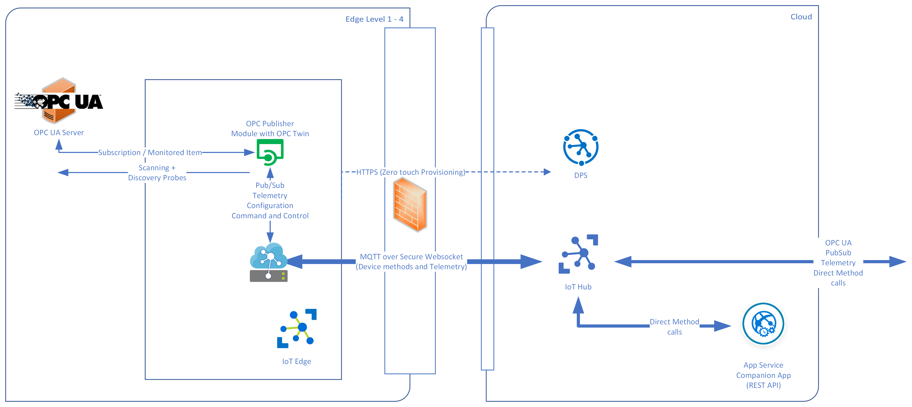

# Azure Industrial IoT <!-- omit in toc -->

> This documentation applies to version 2.9

## Table Of Contents <!-- omit in toc -->

- [Features](#features)
- [Use Cases](#use-cases)
- [What is OPC UA?](#what-is-opc-ua)
  - [Why did Microsoft choose OPC UA as Industrial IoT Protocol?](#why-did-microsoft-choose-opc-ua-as-industrial-iot-protocol)
  - [How can I learn more?](#how-can-i-learn-more)
- [Next steps](#next-steps)

## Features

Azure [OPC Publisher](./opc-publisher/readme.md) allows plant operators to discover [OPC UA](#what-is-opc-ua) enabled servers in a factory network and register them in Azure IoT Hub. Operations personnel can subscribe to and react to events on the factory floor from anywhere in the world. The APIs mirror the [OPC UA](#what-is-opc-ua) services and are secured through IoT Hub or optionally using OAUTH authentication and authorization backed by Azure Active Directory (AAD). This enables your applications to browse server address spaces or read/write variables and execute methods using IoT Hub, MQTT or HTTPS with simple JSON payloads.

The following diagram shows how the OPC Publisher and optional REST Api integrate with Azure IoT Hub, Azure IoT Edge and other Azure services:

The [OPC Publisher API](./opc-publisher/readme.md) can be used with any programming language through its exposed Open API specification (Swagger). This means when integrating OPC UA into cloud management solutions, developers are free to choose technology that matches their skills, interests, and architecture choices. For example, a full stack web developer who develops an application for an alarm and event dashboard can write logic to respond to events in JavaScript or TypeScript without ramping up on a OPC UA SDK, C, C++, Java or C#.

## Use Cases

OPC Publisher has fully embraced openness (an open platform, open source, open industrial standards and an open data model is used). Specifically, we leverage Azure's managed Platform as a Service (PaaS) offering, open-source software licensed via MIT license, open international standards for communication (OPC UA, AMQP, MQTT, HTTP) and interfaces (Open API) and open industrial data models (OPC UA) on the edge and in the cloud.

OPC Publisher covers industrial connectivity of shop floor assets (including discovery of OPC UA-enabled assets), normalizes their data into OPC UA format and transmits asset telemetry data to Azure in OPC UA PubSub format. There, it stores the telemetry data in a cloud database. In addition, the platform enables secure access to the shop floor assets via OPC UA from the cloud. Device management capabilities (including security configuration) is also built in. The OPC UA functionality has been built using Docker container technology for easy deployment and management. For non-OPC UA-enabled assets, we have partnered with the leading industrial connectivity providers and helped them port their OPC UA adapter software to Azure IoT Edge. These adapters are available in the [Azure Marketplace](https://azuremarketplace.microsoft.com/marketplace/apps/category/internet-of-things?page=1&subcategories=iot-edge-modules).

## What is OPC UA?

OPC Unified Architecture (UA), released in 2008, is a platform-independent, service-oriented interoperability standard. OPC UA is used by various industrial systems and devices such as industry PCs, PLCs, and sensors. OPC UA integrates the functionality of the OPC Classic specifications into one extensible framework with built-in security. It is a standard that is driven by the OPC Foundation.

The [OPC Foundation](https://opcfoundation.org/) is a not-for-profit organization with more than 440 members. The goal of the organization is to use OPC specifications to facilitate multi-vendor, multi-platform, secure and reliable interoperability through:

- Infrastructure
- Specifications
- Technology
- Processes

### Why did Microsoft choose OPC UA as Industrial IoT Protocol?

Microsoft chose OPC UA because it is an open, non-proprietary, platform independent, industry-recognized, and proven standard. It is a requirement for Industry 4.0 (RAMI4.0) reference architecture solutions ensuring interoperability between a broad set of manufacturing processes and equipment. Microsoft sees demand from its customers to build Industry 4.0 solutions.

Support for OPC UA helps lower the barrier for customers to achieve their goals and provides immediate business value to them.

### How can I learn more?

- Visit the OPC Foundation [Website](https://opcfoundation.org/).
- Browse version [1.04 of the OPC UA specification](https://reference.opcfoundation.org/v104/).

## Next steps

- [Learn more about OPC Publisher](./opc-publisher/readme.md)
- [Release announcements](./release-announcement.md)
