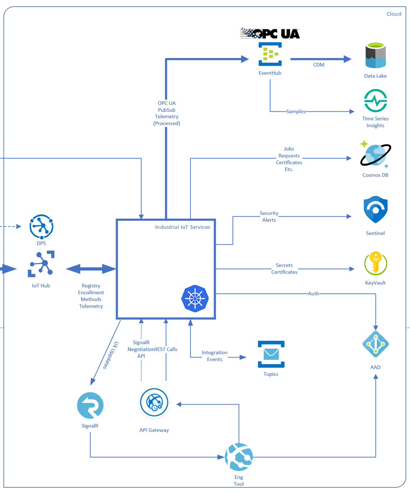
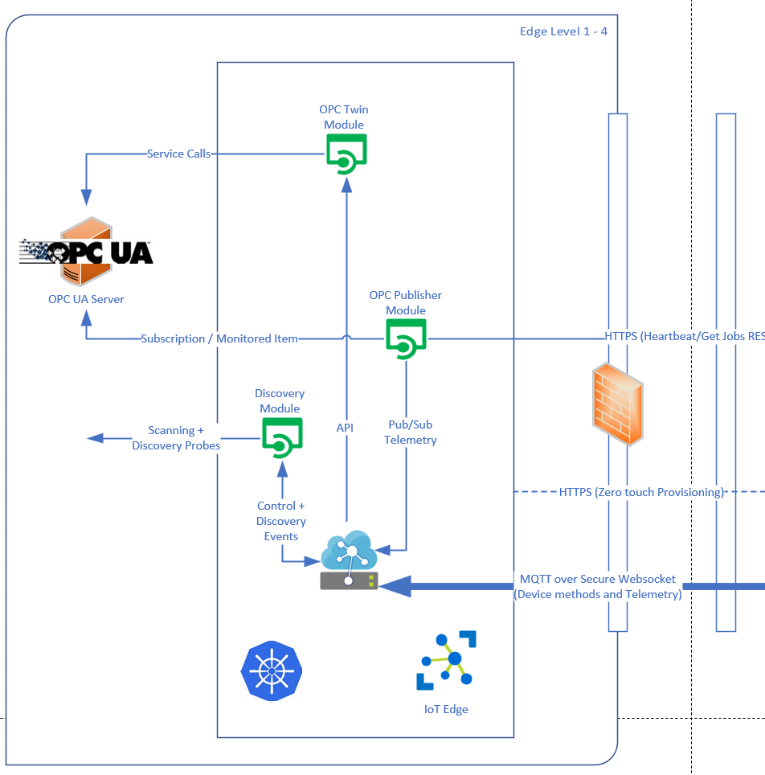

# Industrial IoT dependencies

[Home](../readme.md)

The Industrial IoT Microservices depend on several other services and technology:

## OPC UA Reference Stack

All OPC UA components use the [OPC Foundation](https://opcfoundation.org/)'s OPC UA [reference stack](https://github.com/OPCFoundation/UA-.NETStandard) as NuGet packages and therefore licensing of their NuGet packages apply. Visit https://opcfoundation.org/license/redistributables/1.3/ for the licensing terms.

## Azure Services

### Azure Kubernetes Service / Linux VM

The deployment tool deploys the Industrial IoT Microservices into a Linux [VM](https://azure.microsoft.com/en-us/services/virtual-machines/) or [Azure Kubernetes Cluster](https://azure.microsoft.com/en-us/services/kubernetes-service/) and creates the following required PaaS services:

### Azure IoT Hub

The [Azure IoT Hub](https://azure.microsoft.com/en-us/services/iot-hub/) is used as cloud broker for Edge to Cloud and Cloud to Edge messaging.   IoT Hub manages device and module identities, including OPC UA endpoints and applications.

### Azure Cosmos DB

[Azure Cosmos DB](https://azure.microsoft.com/en-us/services/cosmos-db/) is used as a universal database to store job data for publisher and twin, OPC UA address space model data, Certificate requests, and more.

### Azure Service Bus and Event Hub

Notification backplane is implemented on top of [Service Bus](https://azure.microsoft.com/en-us/services/service-bus/) to provide reliable delivery of updates and events between services.   A separate Azure [Event Hub](https://azure.microsoft.com/en-us/services/event-hubs/) is used to forward OPC Publisher telemetry to downstream consumers such as Azure Time Series Insights.

### Azure KeyVault

Azure [KeyVault](https://azure.microsoft.com/en-us/services/key-vault/) is used to store configuration secrets such as private keys and passwords securely.

### Azure SignalR Service

Azure SignalR service is used for scalable UI client notifications without the need of hosting a SignalR endpoint.

### Azure Storage

A [storage](https://azure.microsoft.com/en-us/services/storage/blobs/) account is used by the [onboarding](onboarding.md) Microservice to persist Azure IoT Hub Event Hub Endpoint read offsets and partition information to support partitioned and reliable access from multiple instances.

### Azure Active Directory

All Microservices are registered as Application in [Azure Active Directory](https://azure.microsoft.com/en-us/services/active-directory/) to integrate with Enterprise Authentication and Authorization policies.

## Azure IoT Edge

Edge modules are deployed through IoT Hub to [Azure IoT Edge](https://azure.microsoft.com/services/iot-edge/). to provide protocol translation and a local management plane.  Modules are simple Docker containers consumed from a docker registry, such as Microsoft Container Registry (MCR).  Edge components only need to open an outbound SSL connection to enable bidirectional services.

## Next steps

- [Deploy dependencies for local development](../deploy/howto-deploy-local.md)
- [Learn about Azure IoT Edge](https://azure.microsoft.com/services/iot-edge/).
