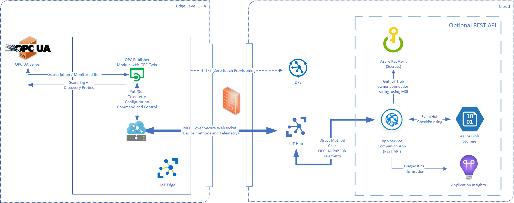

# OPC Twin Microservice

[Home](readme.md)

Namespace: Microsoft.Azure.IIoT.Services.OpcUa.Twin

## Overview

The following diagram shows the twin service in relationship to the other components.

OPC Twin Microservice in cloud exposes a [REST API](../api/twin/readme.md) to call the following [OPC UA](../opcua.md) services on activated endpoints in an OPC Twin edge module.

## Supported OPC UA Services

* **Read** and **Write** a “Value” on a Variable node
* **Call** a “Method Node”
* **Read** and **Write** Node “Attributes
* **History Read** and **Update** service calls to interact with Historians
* **Batching** of any of the above calls.
* **Browse** first / next (with and without reading the browsed target nodes)
* Get **meta data** of methods (to display input arguments to a user)

## Docker image

`docker pull mcr.microsoft.com/iot/opc-twin-service:latest`

## Next steps

* [Learn more about the OPC Twin module](../modules/twin.md)
* [Learn more about the overall Architecture](../architecture.md)
* [Explore the Twin Microservice REST API](../api/twin/readme.md)
