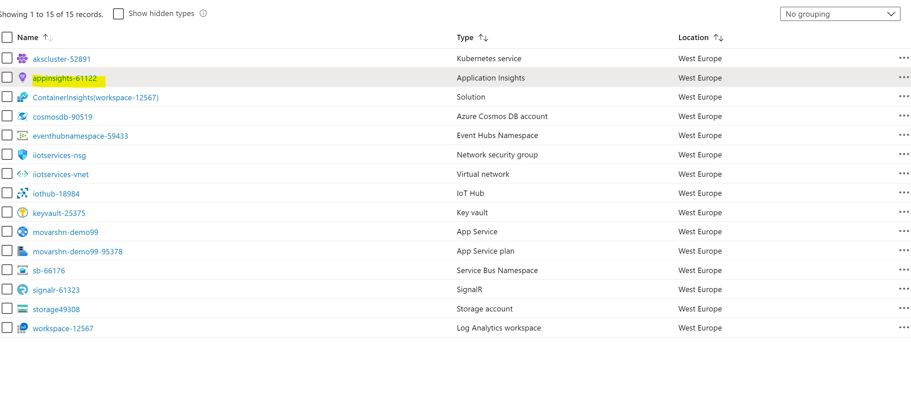
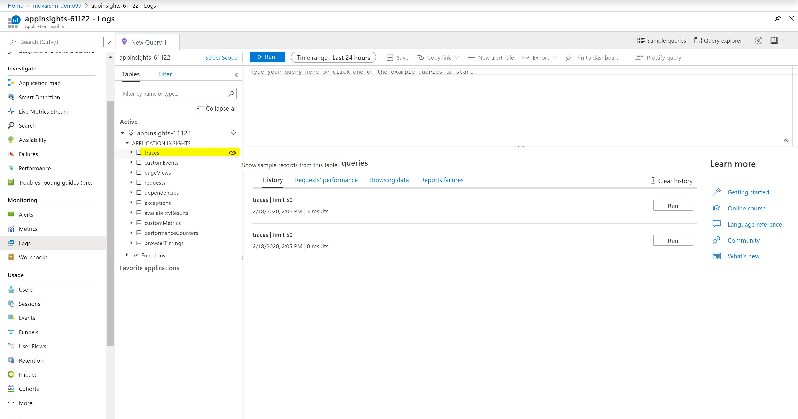
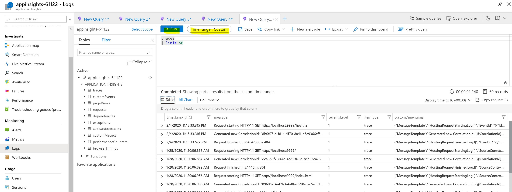
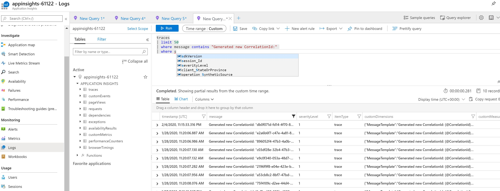
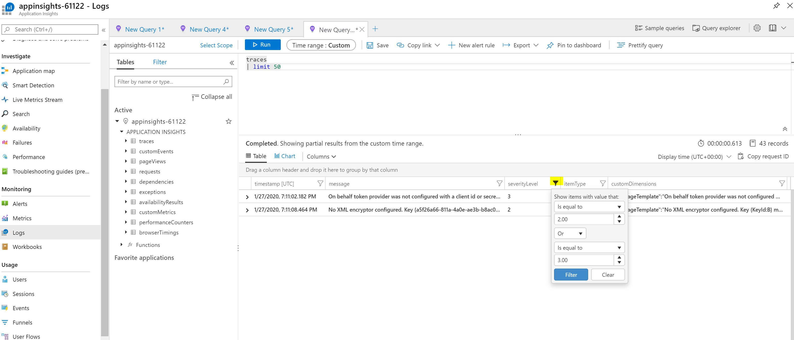
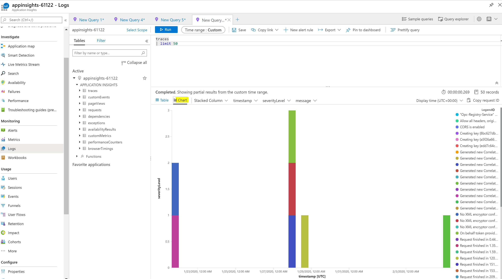
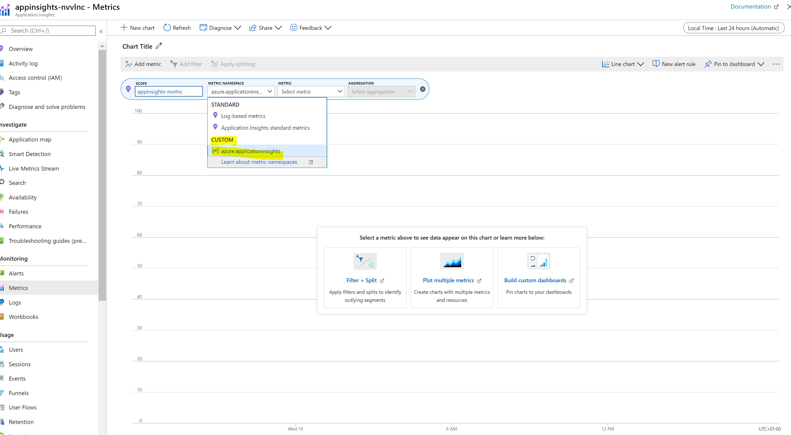
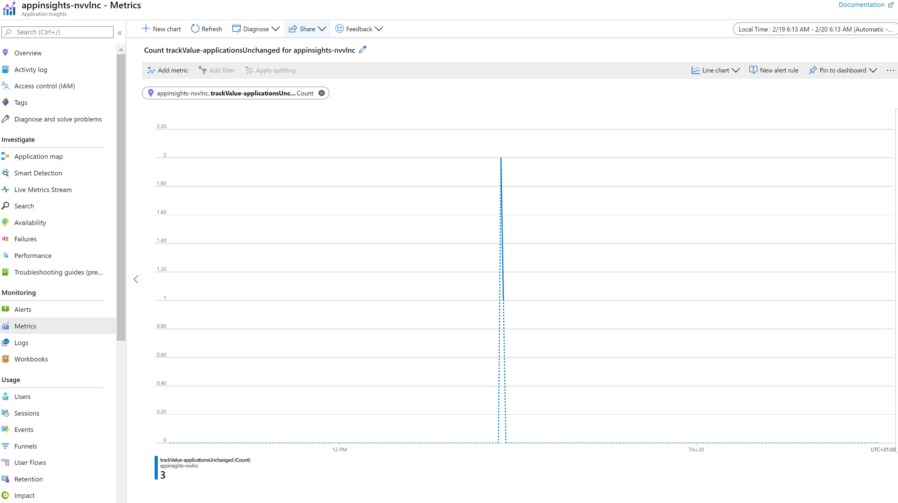

# How to view logs and metrics in Application Insights

[Home](readme.md)

Azure Industrial IoT Platform is instrumented with Application Insights logs and metrics.

To learn more about how to use Application Insights metrics in the code, please refer [here](../dev-guides/howto-use-applicationinsights-metrics.md).

This document describes how you could view your logs and metrics in Application Insights in the resource group on Azure portal.

### View logs in Application Insights 

1. Go to **Application Insights** resource in your resource group.

   

2. Go to **Logs** under **Monitoring** section. Click on **traces** eye button to get log traces.

   

   

3. Select Time Range and click Run.

   

   

4. Application Insights queries are based on Kusto Query Language(KQL). Search for the specific log traces by writing your log queries. Learn more about writing queries [here](<https://docs.microsoft.com/en-us/azure/azure-monitor/log-query/log-query-overview>).

   

   

5. It is possible to filter on the results of the query on any column.

   

   

6. You could also view the query results in chart format where you could choose from different types of charts in addition to choosing x-axis, y-axis, etc.

   

### View Metrics in Application Insights

1. Go to **Metrics** under **Monitoring** section.

   

   

2. Choose **CUSTOM** in Metrics Namespace.

   

   

3. Metrics would be shown in the chosen time frame. You could choose Sum, Average, Min, Max and Count from the Aggregation setion.

   

### Learn More

- If you want to create alerts based on metric values or log search entries, please refer [here](https://docs.microsoft.com/en-us/azure/azure-monitor/platform/alerts-overview?toc=%2Fazure%2Fazure-monitor%2Ftoc.json).
- Official documentation of Application Insights is [here](https://docs.microsoft.com/en-us/azure/azure-monitor/app/app-insights-overview).