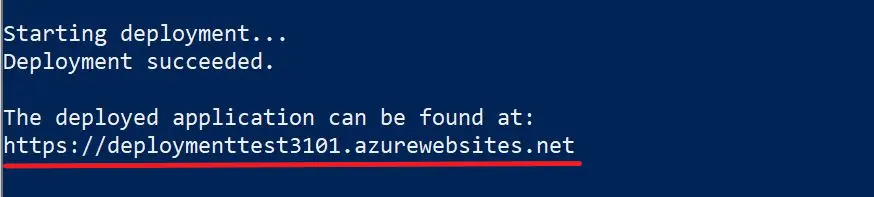
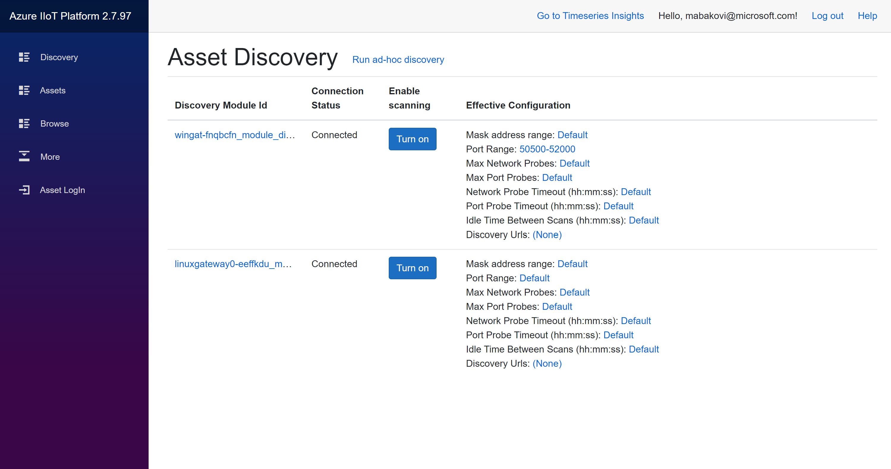
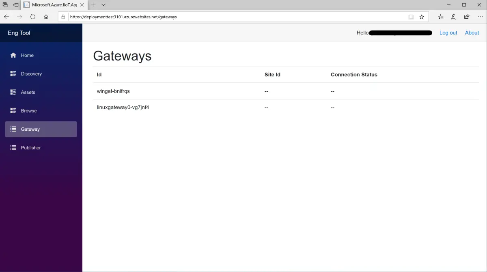
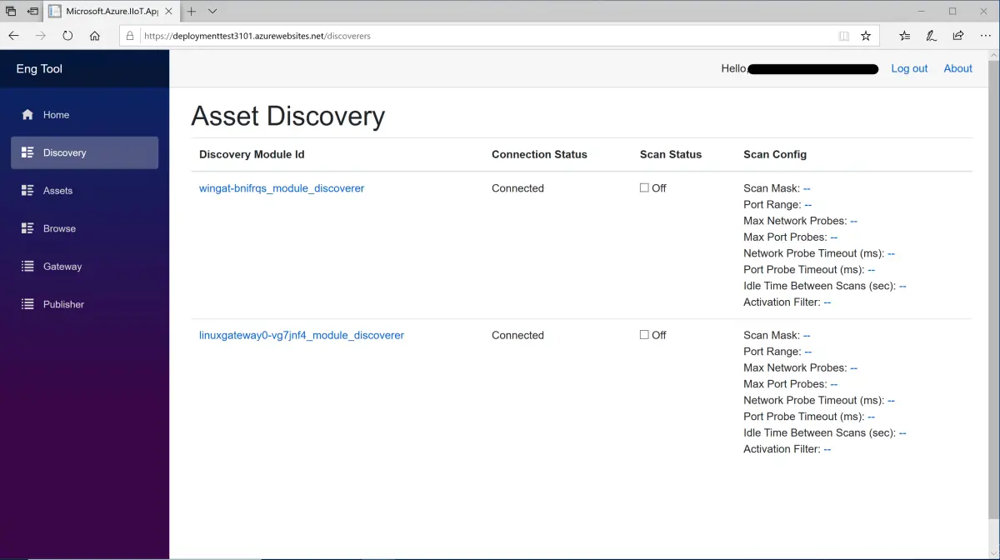
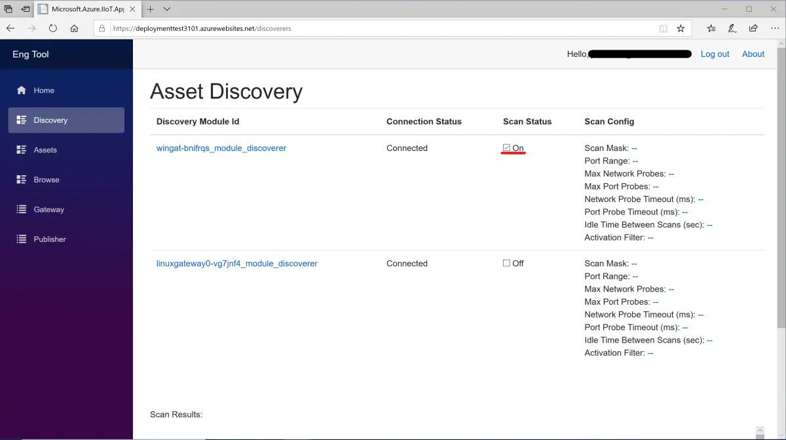
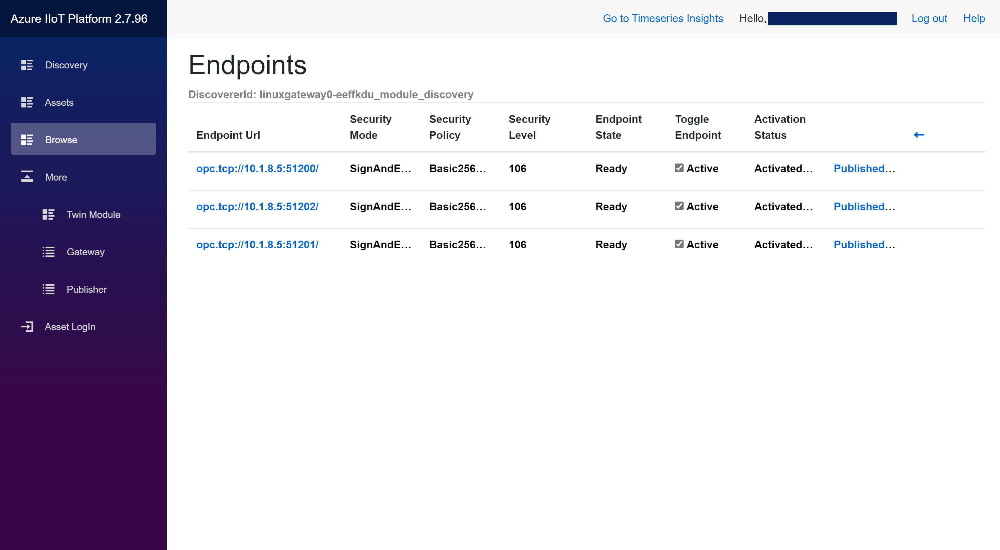
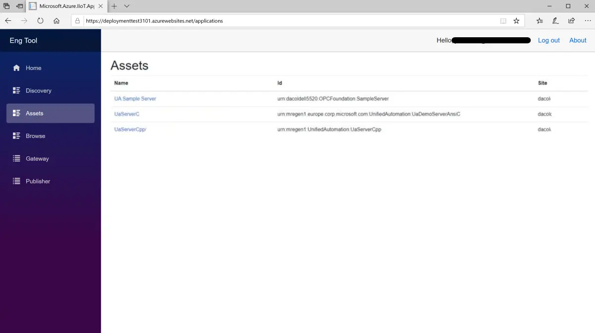
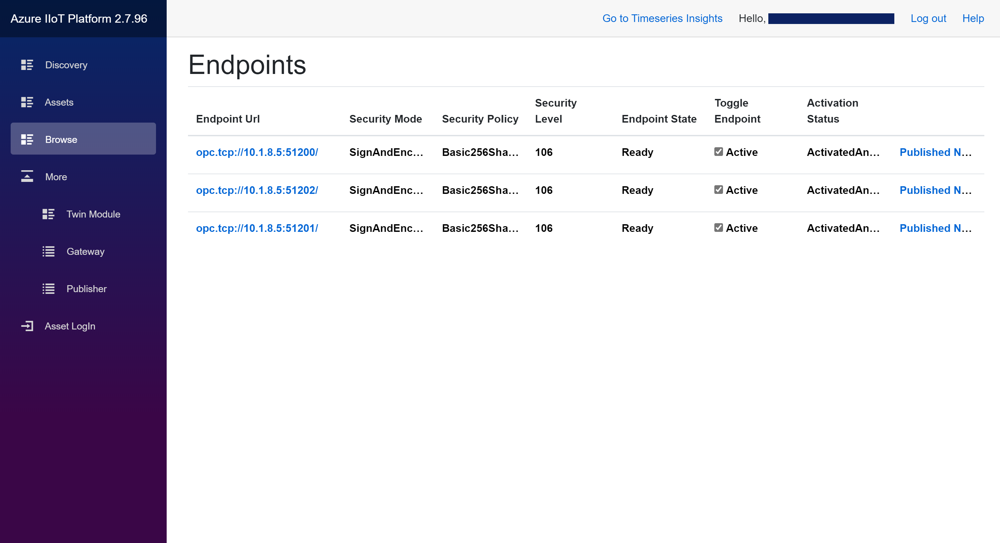

# How to discover your assets with the Engineering Tool

[Home](readme.md)

## Prerequisites

This tutorial makes use of the Industrial IoT [Engineering Tool](../services/engineeringtool.md).  In order to use the Engineering Tool, you must deploy the Azure Industrial IoT Platform using the [deployment script](../deploy/howto-deploy-all-in-one.md). Once the deployment succeeded, you can see in the output where the deployed application can be found online.

Copy the URL and open the engineering tool in the browser. You will see the following homepage.

When clicking on *Gateway* a list of all registered IoT Edge gateways will be shown. Further Information like the Gateway Id, the Site Id, and the connection status is available.  

The Gateway Id is the IoT Edge device id in IoT Hub.

## Discover Assets

To discover OPC UA server assets in the connected networks (factories, etc.) you will use the IoT Edge [discovery module](../modules/discovery.md) deployed into IoT Edge gateways.   The discovery module supports network scanning which will be used to find all OPC UA assets and upload the results to the [Onboarding Service](../services/onboarding.md) which creates the endpoint and asset identities in IoT Hub.

1. When clicking on **Discovery** a list opens, which shows all currently deployed discovery modules ("Discoverers"), their Connection Status, the Scan status, and the Scan configuration.

   

2. You can turn on and off network scanning, by clicking the checkbox next to the Scan Status (*On/Off*).  Choose the discoverer whose identifier starts with "win" and turn scanning on.

   

   When the scan completes you can click on the discoverer module (in this case "wingat-bnifrqs_module_discoverer) and see the Endpoints belonging to the discovered servers.

   

3. The *Assets* menu shows a list of **all discovered and registered** OPC Servers with their Name, their Id, and the site to which the OPC Server belongs to.

   

## Explore the OPC UA address space of the Asset

While clicking on one specific OPC Server Asset showed the Endpoints belonging to only that Asset, the Endpoints listed under *Browse* are all currently registered and available Endpoints.

Activate an endpoint of your choice using the Activate slider.   The endpoint link can now be used to explore the server address space.  You can navigate into nodes and out using the Breadcrumbs or the back arrow.

## Next steps

For visualization of your data explore:

- [Subscribe and publish data to Azure](tut-publish-data.md)
