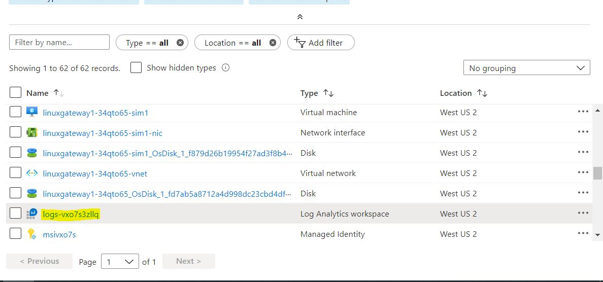
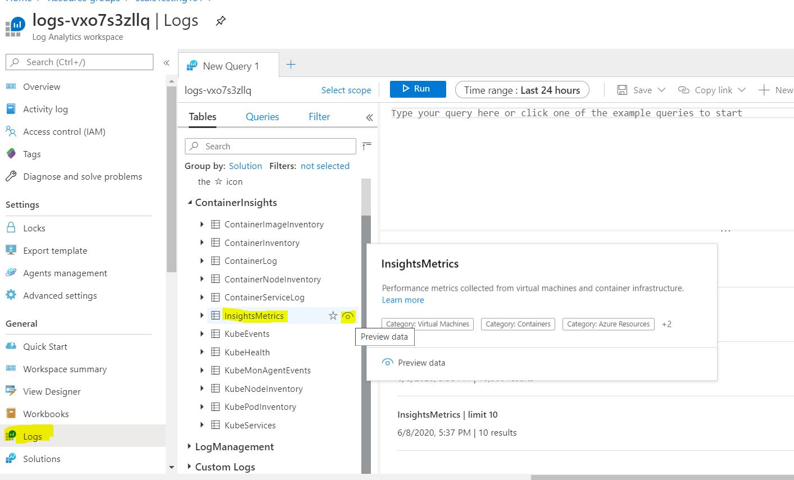
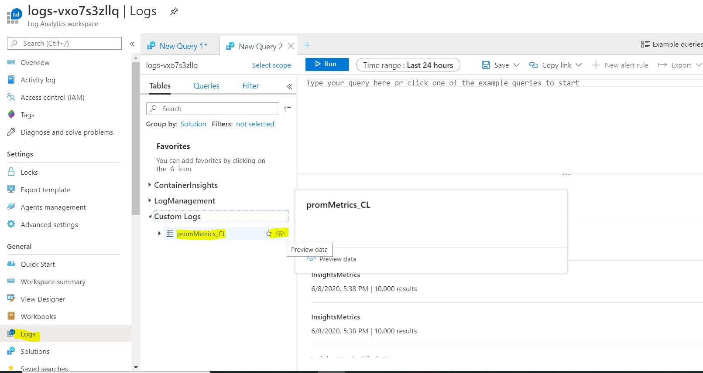
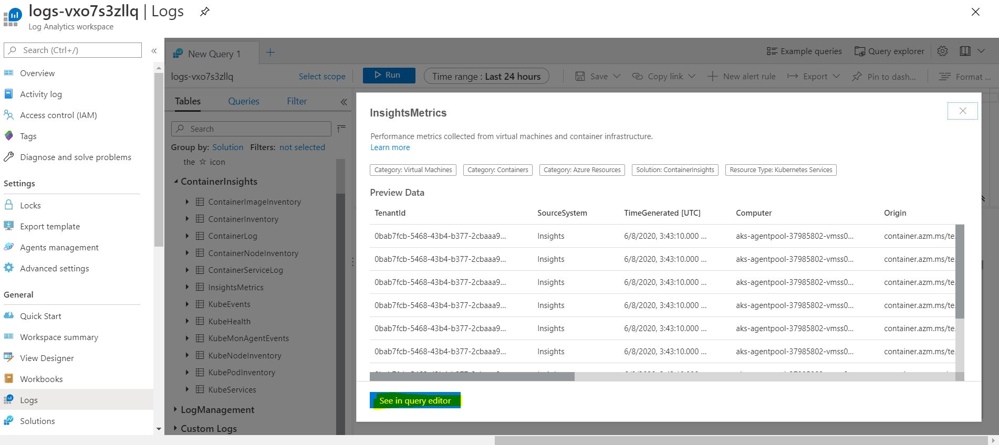
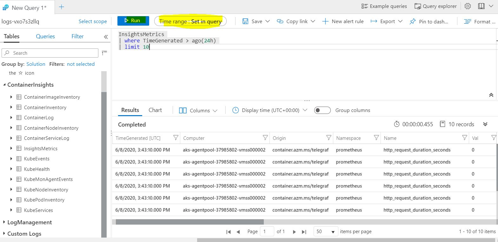
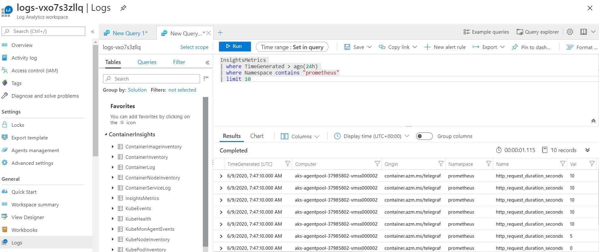
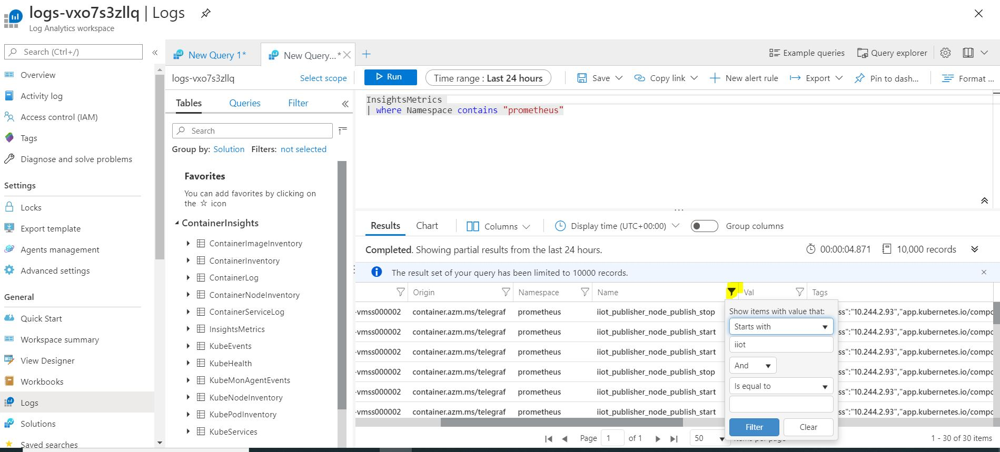
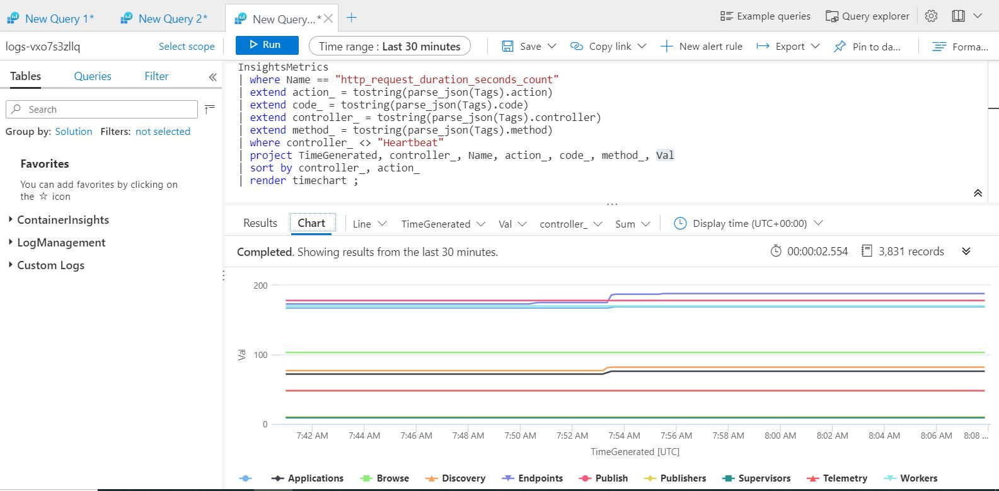

# How to view metrics in Log Analytics Workspace

[Home](readme.md)

Azure Industrial IoT Platform is instrumented with Prometheus metrics for Edge modules and Microservices hosted in AKS cluster.

To learn more about how to use Prometheus metrics in the code, please refer [here](../dev-guides/howto-use-prometheus-metrics.md).

This document describes how you could view your metrics in Log Analytics Workspace in the resource group on Azure portal.

### View metrics in Log Analytics Workspace

1. Go to **Log Analytics workspace** resource in your resource group.
   
   
   
   
2. Go to **Logs** under **General** section. 

   a. To check the metrics from microservices hosted in AKS cluster. Click on **InsightsMetrics** eye button under **ContainerInsights** table.

   

   

   b. To check the metrics from Edge modules, click on **promMetrics_CL** eye button under **Custom Logs** table.
   

   

3. Next, click on **See in query editor**.

   

   

4. Select Time Range and click Run.

5. Log Analytics Workspace and Application Insights queries are based on Kusto Query Language(KQL). Search for the specific log traces by writing your log queries. Learn more about writing queries [here](<https://docs.microsoft.com/en-us/azure/azure-monitor/log-query/log-query-overview>).

6. It is possible to filter on the results of the query on any column.

7. You could also view the query results in chart format where you could choose from different types of charts in addition to choosing x-axis, y-axis, etc.

### Learn More

- If you want to create alerts based on metric values or log search entries, please refer [here](https://docs.microsoft.com/en-us/azure/azure-monitor/platform/alerts-overview?toc=%2Fazure%2Fazure-monitor%2Ftoc.json).
- Official documentation of logs in Azure Monitor is [here](https://docs.microsoft.com/en-us/azure/azure-monitor/platform/data-platform-logs).