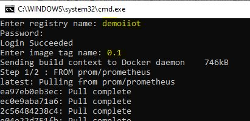
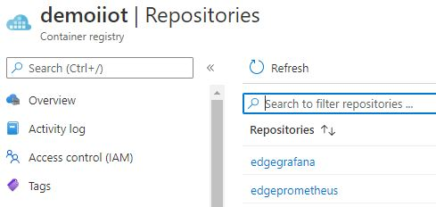
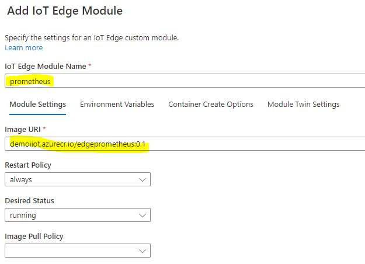
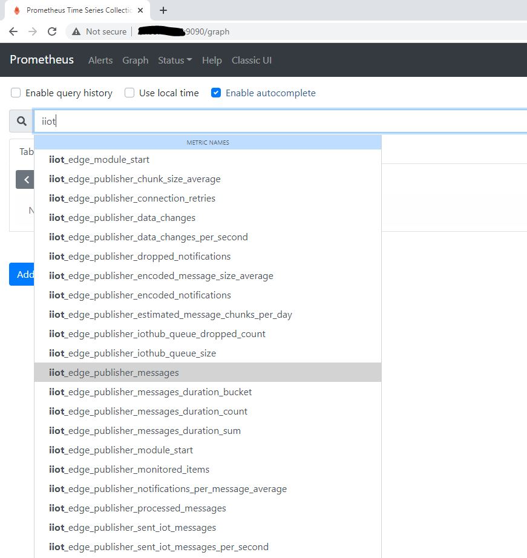

# Metrics Dashboard for OPC Publisher

**Please note: This feature is only available in OPC Publisher's version 2.7 and above.**

OPC Publisher is instrumented with Prometheus metrics. For troubleshooting and debugging, a local dashboard on Azure IoT Edge can be configured.
This tutorial guides through the complete setup of viewing a Grafana dashboard displaying OPC Publisher and EdgeHub metrics for bird's eye view to quickly drill down into the issues in case of failures. 
In a nutshell, two Docker images (Prometheus and Grafana) must be created and deployed as Azure IoT Edge Modules. The Prometheus Module scrapes the metrics from OPC Publisher and EdgeHub, while Grafana is used for visualization of metrics.

## Table of Contents

- [Setup Steps](#setup-steps)
  - [Create docker images](#create-docker-images)
  - [Create IoT Edge modules](#create-iot-edge-modules)
- [View Prometheus dashboard](#view-prometheus-dashboard)
- [View Grafana dashboard](#view-grafana-dashboard)


## Setup Steps

### Create docker images

1. Create and configure [Azure Container Registry](https://docs.microsoft.com/en-us/azure/container-registry/container-registry-get-started-portal) to have an admin account enabled.  **Registry name** and **password**  are needed for pushing the docker images of Prometheus and Grafana.

    

    

2. Create and push images to this ACR:

    - Download the zip (*metricsdashboard.zip*) located in this folder and extract it.

    - Navigate to **prometheus** folder as shown:
      
      
      
      
    
      
    - Edit *prometheus.yml* if needed. It defaults to scraping EdgeHub metrics at 9600 and OPC Publisher metrics at 9702. If only OPC Publisher metrics are needed, then remove the scraping config of EdgeHub.

    - Run *buildimage.bat* and enter the _registryname_ , _password_ and _tagname_ when prompted. It will push the **edgeprometheus** image to container registry.
      
      
      
      
      
      
      
    - Navigate back to the **grafana** folder and run *buildimage.bat* located in this folder. Enter the same information to push the **edgegrafana** image to ACR.

3. Now go to the portal and verify that the images are present, as shown in the image below. 

   

   


### Create IoT Edge modules


1. IoT Edge should now be configured to expose metrics. Navigate to the IoT Edge device to be used and perform the following steps:

    - Select **Set Modules** to update the configuration

    - Enter the registry information in the **Container Registry Credentials** so that it can authenticate with the Azure Container Registry.

      

      

      

    - Optional: Enable metrics of *edgeHub* (Note: As of release 1.0.10, metrics are automatically exposed by default on http port **9600** of the EdgeHub)

      - Select the **Runtime Settings** option and for the EdgeHub and Agent, make sure that the
        stable version is selected with version 1.0.9.4+

        

        
        
        
        
      - Adjust the EdgeHub **Create Options** to include the Exposed Ports directive as shown above.

      - Add the following environment variables to the EdgeHub. (Not needed for version 1.0.10+)

        **ExperimentalFeatures__Enabled               : true**
        **ExperimentalFeaturesEnable__Metrics   : true**

      - Save the dialog to complete the runtime adjustments.

    - Expose port on publisher module:

      - Navigate to the publisher and expose port **9702** to allow the metrics to be scraped, by adding the exposed ports option in the Container Create Options in the Azure portal.

        

        
      
        
      
      - Select **Update** to complete the changes made to the OPC publisher module.

2. Now add new modules based on the Prometheus and Grafana images created previously.

    - Prometheus: 

      - Add a new “IoT Edge Module” from the “+ Add” drop down list.

      - Add a module named **prometheus** with the image uploaded previously to the Azure Container Registry.

        

        

      - In the **Container Create Options** expose and bind the Prometheus port 9090.
    
        ```json
        {
            "Hostname": "prometheus",
            "ExposedPorts": {
                "9090/tcp": {}
            },
            "HostConfig": {
                "PortBindings": {
                    "9090/tcp": [
                        {
                            "HostPort": 9090
                        }
                    ]
                }
            }
        }
        ```

        

      - Click **Update** to complete the changes to the Prometheus module.

      - Select **Review and Create** and complete the deployment by choosing **Create**.

    - Grafana:

      - Add a new “IoT Edge Module” from the “+ Add” drop down list.

      - Add a module named **grafana** with the image uploaded previously to the Azure Container Registry.

        

        

      - Update the environment variables to control access to the Grafana dashboard.

        - GF_SECURITY_ADMIN_USER - admin

        - GF_SECURITY_ADMIN_PASSWORD - iiotgrafana

        - GF_SERVER_ROOT_URL  - http://localhost:3000

          
    
        
    
      - In the **Container Create Options** expose and bind the Grafana port 3000.
    
        ```json
        {
            "Hostname": "grafana",
            "ExposedPorts": {
                "3000/tcp": {}
            },
            "HostConfig": {
                "PortBindings": {
                    "3000/tcp": [
                        {
                            "HostPort": 3000
                        }
                    ]
                }
              }
         }
        ```

        
    
      - Click **Update** to complete the changes to the Grafana module.
    
      - Select **Review and Create** and complete the deployment by choosing **Create**.
    
      
    
    - Verify all the modules are running successfully:
      
      
      
      


## View Prometheus dashboard

- Navigate to the Prometheus dashboard through a web browser on the IoT Edge’s host on port 9090.

  - http://{edge host IP or name}:9090/graph
  - **Note**: When using a VM, make sure to add an inbound rule for port 9090

- Check the target state by navigating to **/targets** 

  

  

  

- Metrics can be viewed as shown:

  

  

- 


## View Grafana dashboard

- Navigate to the Grafana dashboard through a web browser against the edge’s host on port 3000.
  - http://{edge host IP or name}:3000
  - When prompted for a user name and password enter the values entered in the environment variables
  - **Note**: When using a VM, make sure to add an inbound rule for port 3000
  
- Prometheus has already been configured as a data source and can now be directly accessed. Prometheus is scraping EdgeHub and OPC Publisher metrics.

- Select the dashboards option to view the available dashboards and select “Publisher” to view the pre-configured dashboard as shown below. 

  

  

  

- One could easily add/remove more panels to this dashboard as per the needs.
