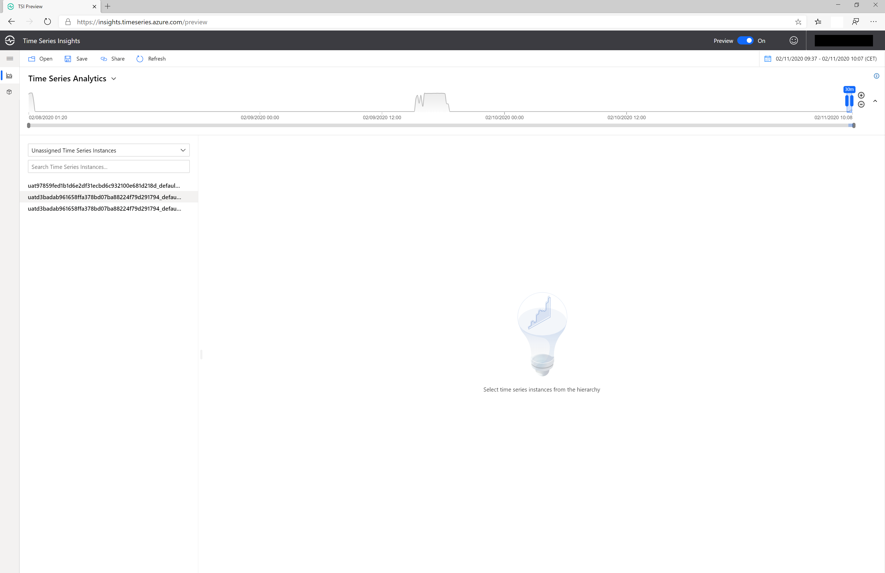
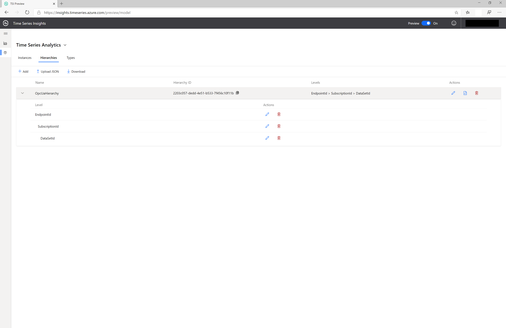
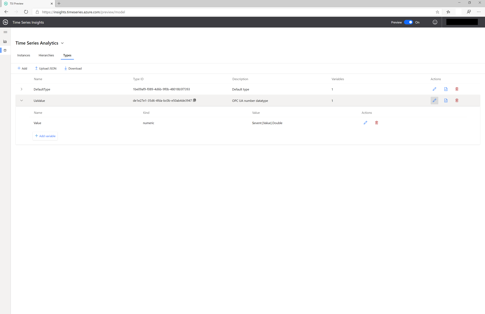
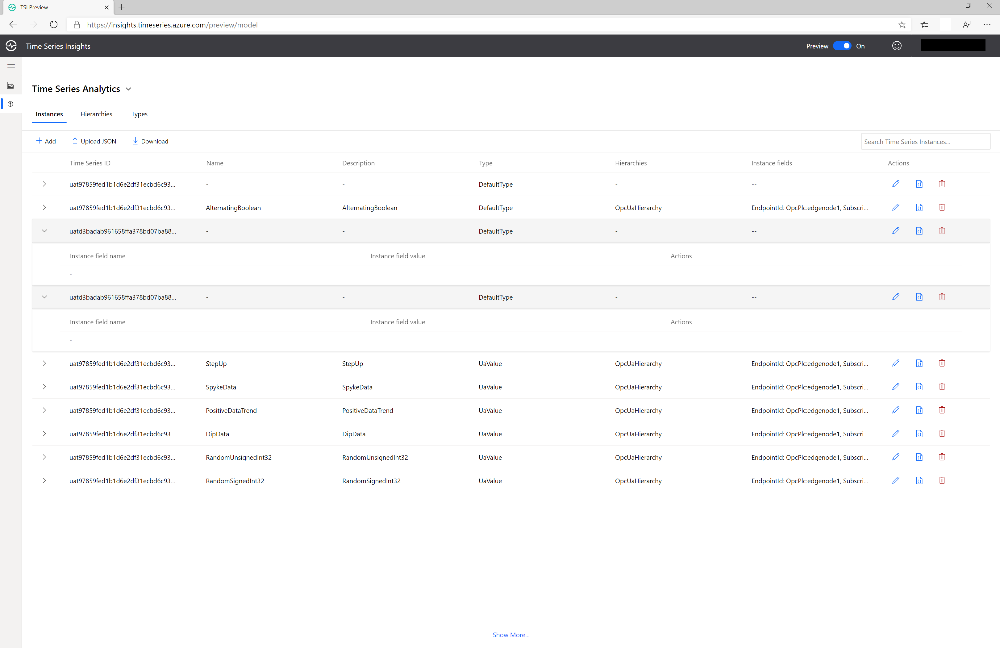
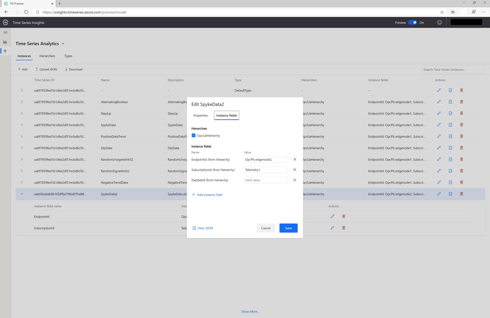
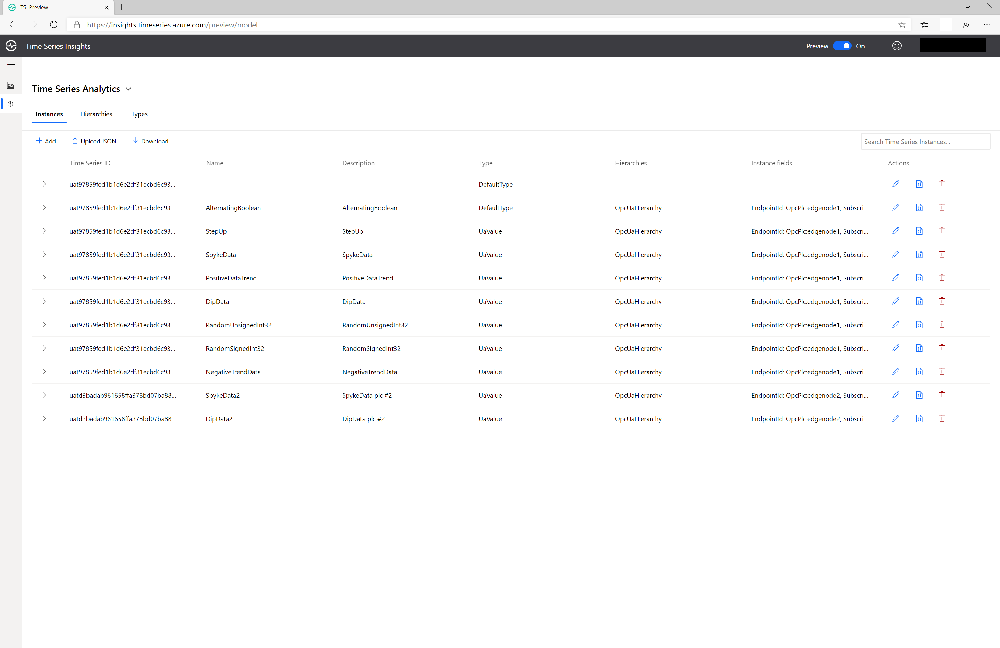
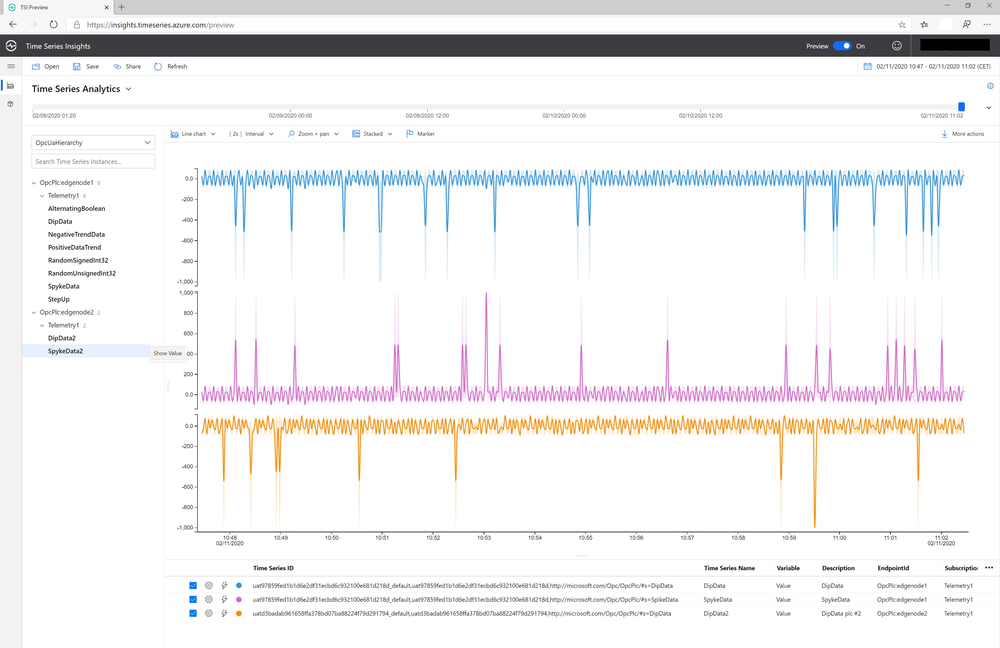

# Use Time Series Insights to visualize telemetry sent from OPC Publisher

[Home](readme.md)

## Prerequisites

Follow the instructions to [publish data to IoT Hub using the engineering tool](tut-publish-data.md).

## Overview

The OPC Publisher module connects to OPC UA servers and publishes data from these servers to IoT Hub.   The Telemetry processor in the Industrial IoT platform processes these events and forwards contextualized samples to TSI and other consumers.  

A Timeseries Insights Environment is automatically created as part of the [deployment](../deploy/howto-deploy-all-in-one.md) step run as prerequisite to the tutorials.

This how-to guide shows you how to visualize and analyze the OPC UA Telemetry using this Time Series Insights environment.

## Time Series Insights explorer

The Time Series Insights explorer is a web app you can use to visualize your telemetry. To retrieve the url of the application open the `.env` file saved as a result of the deployment.  Open a browser to the Url in the `PCS_TSI_URL` variable.  

In the TSI Explorer, please note the Unassigned Time Series Instances. A TSI Instance corresponds to the time/value serie for a speciffic datapoint originated from a published node in an opc server. The TSI Instance, respectively the OPC UA Data point, is uniquely identified by the EndpointId, SubscriptionId and NodeId. The TSI instances models are automatically detected and display in the explorer based on the telemetry data ingested from the IIoT platform telemetry processor's event hub.

   

The telemetry data can be visualized in the chart by right-clicking the TSI instance and selecting the Value. The time frame to be used in chart can be adjusted from the upper right corner. Value of multiple instances can bevisualized on the same time basis selection.

For more information, see [Quickstart: Explore the Azure Time Series Insights Preview](https://docs.microsoft.com/en-us/azure/time-series-insights/time-series-insights-update-quickstart)

## Define and apply a new Model

Since the telemetry instances are now just in raw format, they need to be contextualized with the appropriate 

For detailed information on TSI models see [Time Series Model in Azure Time Series Insights Preview](https://docs.microsoft.com/en-us/azure/time-series-insights/time-series-insights-update-tsm)

1. In the model tab of the Explorer, define a new hierarchy for the telemetry data ingested. A hierarchy is the logical tree structure meant to enable the user to insert the metainformation required for a more intuitive navigation through the tsi instances. a user can create/delete/modify hierarchy templates that can be later on instantiated for the varionus TSI instances.

   

2. Now define a new type for the values. In our example we only handle numeric datatypes

   

3. Select the new TSI instance that requires to be cathegorized in the previously defined hierarchy

   

4. Fill in the instances properties - name, description, data value, as well as the hierarchy fields in order to match the logical structure 

   

5. Repeat step 5 for all uncategorized TSI instances

   

6. Back in the TSI Explorer's main page, walk through the categorized instances hierarchy and select the values for the datapoints to be analyzed

   

## Connect Time Series Insights to Power BI

You can also connect connect the Time Series Insights environment to Power BI.  For more information, see [How to connect TSI to Power BI](https://docs.microsoft.com/en-us/azure/time-series-insights/how-to-connect-power-bi) and [Visualize data from TSI in Power BI](https://docs.microsoft.com/en-us/azure/time-series-insights/concepts-power-bi).

## Next Steps

- To learn more aboutthe Time Series Insights explorer, see [Azure Time Series Insights explorer](https://docs.microsoft.com/en-us/azure/time-series-insights/time-series-insights-update-explorer).
- [Visualize OPC UA Pub/Sub Telemtry in Power BI](tut-power-bi-cdm.md)
- [Deploy IoT Edge to discover and connect your own assets](../deploy/howto-install-iot-edge.md)
