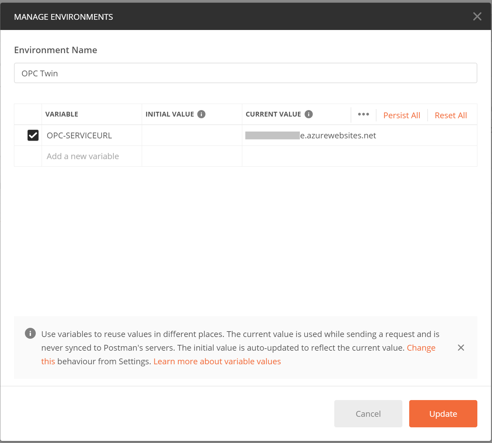
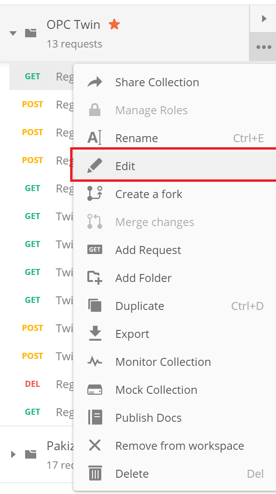
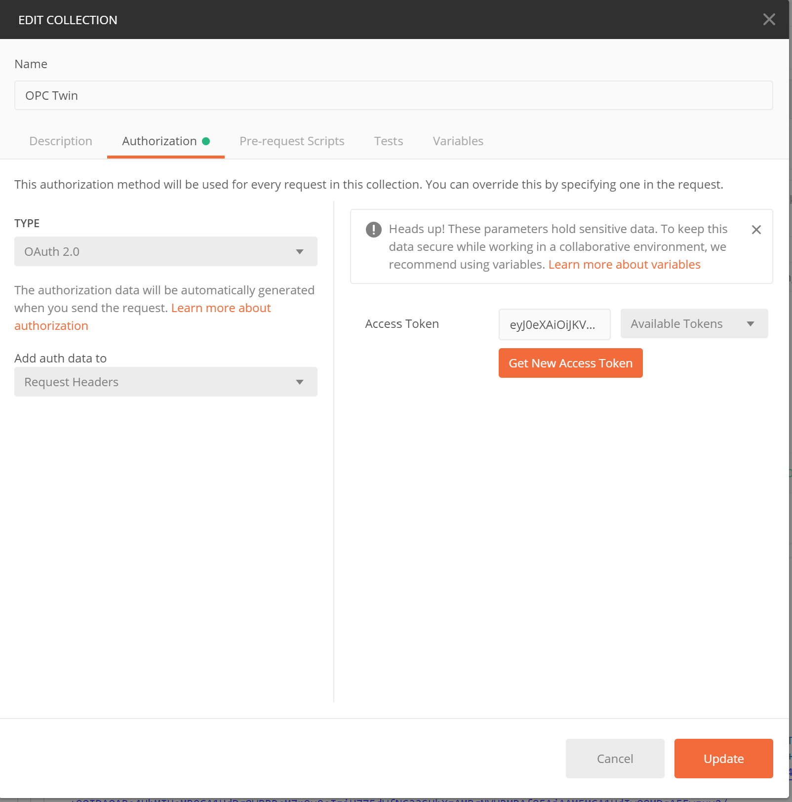
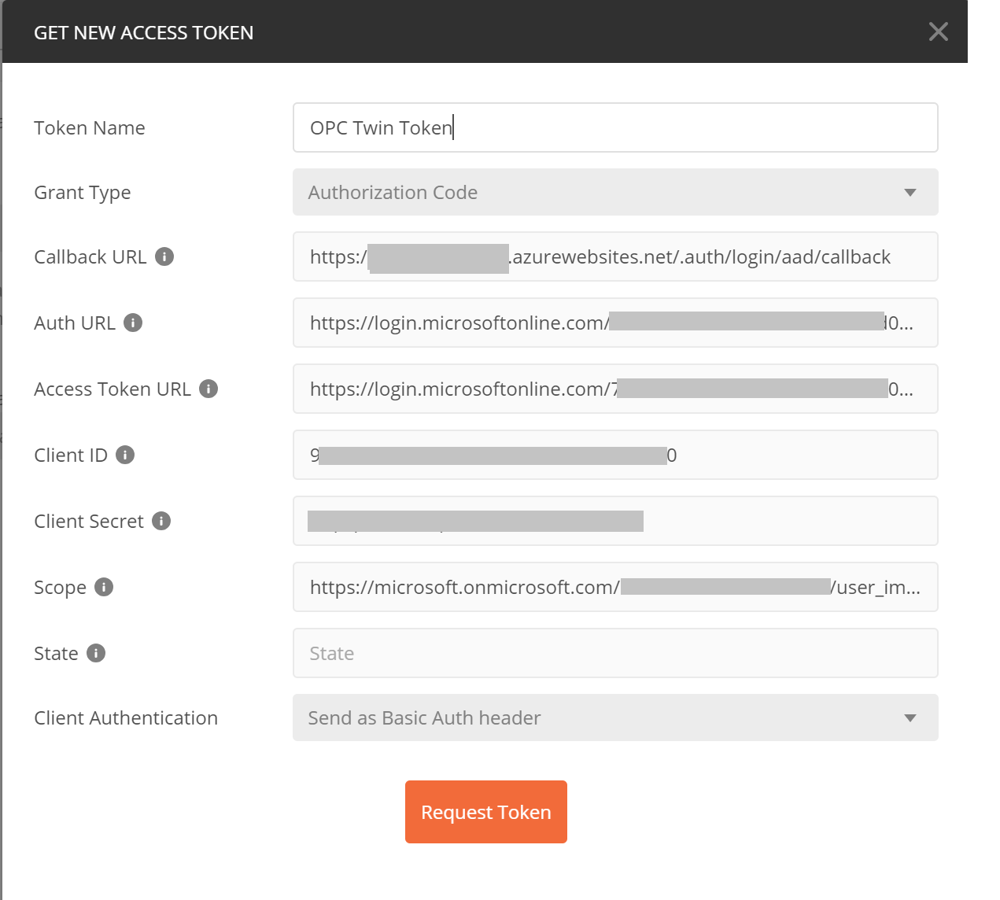
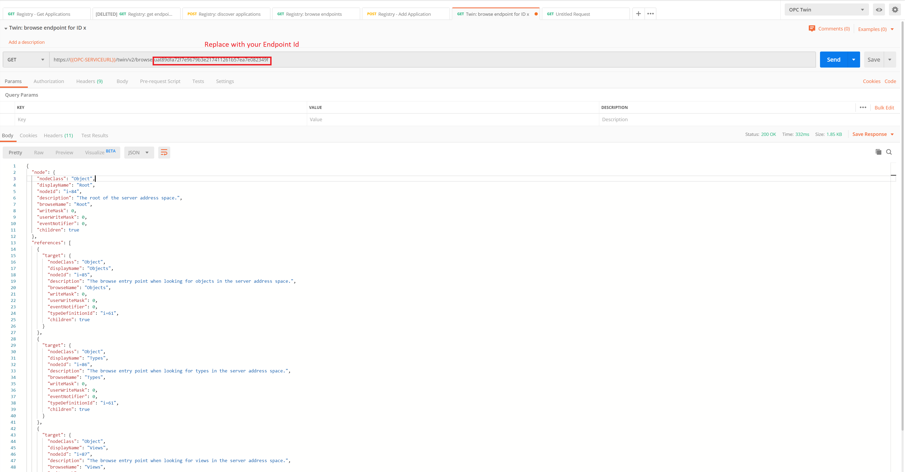
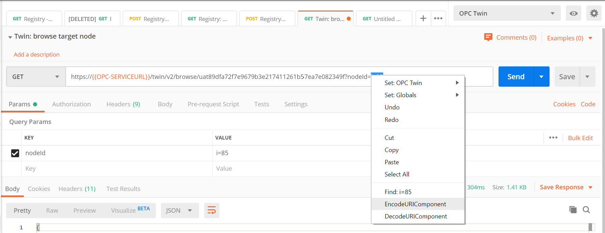

# Discover and register servers and browse their address space, read and publish nodes via REST API in Postman

[Home](readme.md)

This article will walk you through the steps to discover and register OPC UA servers, browse through endpoints, read node values and publish them using the [REST API](../api/readme.md) via Postman.

## Prerequisites

You should have already deployed all Microservices and at least one IoT Edge Gateway with the Industrial IoT Modules. If not, please follow these instructions:

1. [Deploy the Industrial IoT Microservices to Azure](../deploy/readme.md)

2. [Install Industrial IoT Edge](../deploy/howto-install-iot-edge.md)

   To run the demo OPC UA server you will also need Docker installed on a machine that is visible to the IoT Edge from a network point of view. If you don't have it, follow the instructions for [Linux](https://docs.docker.com/install/linux/docker-ce/ubuntu/), [Mac](https://docs.docker.com/docker-for-mac/install/), or [Windows](https://docs.docker.com/docker-for-windows/install/).

   Make sure you have Git installed on the same machine that will run the demo OPC UA server. Otherwise follow the instructions for [Linux, Mac](https://git-scm.com/book/en/v2/Getting-Started-Installing-Git) or [Windows](https://gitforwindows.org/) to install it.

3. [Have Postman installed](https://www.getpostman.com/)

## Start the demo OPC UA server

1. Open a terminal or command prompt and run

   ```bash
   hostname
   ```

   Note the hostname of the machine running the OPC server. You will need it to specify the discovery URL of the server.

2. Run

   ```bash
   docker run -it -p 50000:50000 mcr.microsoft.com/iotedge/opc-plc -aa
   ```

   to start the OPC PLC demo server. The server is instructed to accept all certificates.

## Configure Azure AD App permissions for later use with Postman

Note: The Postman requests will use an Authorization Code flow to authenticate to the service.

### Take note of AAD app information

1. Go into the Azure Portal > Azure Active Directory > App Registrations.
2. The deployment of the services creates the following application registrations:
   - [yourprefix]-client
   - [yourprefix]-service
3. Select the '-client' app registration. From the 'Overview' tab, copy the following:
   - Application (client) ID, later: [YOUR AAD CLIENT ID]
   - Directory (tenant) ID, later: [YOUR TENANT ID]
   - In the 'Authentication' tab, if  'Web' platform doesn't exist, then click 'Add a platform' > 'Web' > add a new 'Redirect URI': e.g. `https://[yourprefix].azurewebsites.net/.auth/login/aad/callback`.

      This redirect uri is later used as [YOUR CALLBACK URI]
   - In the 'Certificates & Secrets' tab, create a new secret and copy its 'Value', later [YOUR AAD CLIENT SECRET]
4. Go back to the list of app registrations and select '-service':
   - From the 'Expose an API' tab, copy the application id uri : [YOUR_APPLICATION_ID_URI]

      The default scope would be : `[YOUR_APPLICATION_ID_URI]/user_impersonation`, later [YOUR SCOPE URI]

## Download a sample set of API calls (Postman collection)

1. Download the collection as a [raw JSON file](../media/OPCTwin.postman_collection.1.0.json)
2. Import the collection by using the 'Import' button at the top left of Postman
3. At the top right, click Manage Environments and add a new Environment named OPC Twin
4. Add a new variable:
   - OPC-SERVICEURL: e.g. `[yourprefix].azurewebsites.net`
5. Click Add and close the screen. 

### Request a new OAuth 2.0 Token

1. In Postman, on the left you will see your collections, click the '...' (three dots) next to the OPC Twin collection and choose 'Edit'

2. Choose 'Authorization' 
3. Choose 'Get New Access Token'
4. Fill in the following fields:
   - Token Name: Some name
   - Grant type: Authorization Code
   - Callback URL: `[YOUR CALLBACK URI]`
   - Auth URL: `https://login.microsoftonline.com/[YOUR TENANT ID]/oauth2/v2.0/authorize`
   - Access Token URL: `https://login.microsoftonline.com/[YOUR TENANT ID]/oauth2/v2.0/token`
   - Client ID: `[YOUR AAD CLIENT ID]`
   - Client Secret: `[YOUR AAD CLIENT SECRET]`
   - Scope: `[YOUR SCOPE URI]`
   - Click 'Request Token'
   
   - Click 'Use Token', and then on 'Update'

5. Test your connectivity with the Microservices by running the request named `Registry: Get applications`
    - This should fire a GET request with the inherited auth token. It should return a 200 OK.

  > Note: Your token will expire regularly. If you get an authentication error during any of the calls, repeat the process to refresh the token. All requests in the Postman collection inherit the same auth configuration.

## Exercise 1

### Register the demo OPC UA server manually using its discovery URL

1. Execute the `Registry: Get applications` request. The result should be empty.
2. Locate the `Registry: Add application` request. Edit the request body to point to your hostname:

   ```json
   {
     "discoveryUrl": "opc.tcp://[yourhostname]:50000"
   }
   ```

3. Execute the `Registry: Get applications` request a few times until you see the application discovered and registered.

   Note all the information about the application that the IoT Edge added during the registration, including public certificate, product URI and more. Copy the `applicationId` for the entry that has `productUri` set to `https://github.com/azure-samples/iot-edge-opc-plc`.

### Browse all root nodes of endpoint

1. Execute the request `Registry: Browse endpoints` to see the application and its endpoints. Select the `id` from one of the registration objects.

2. Select the request `Registry: Activate endpoint`, replace the endpoint GUID in the URL with the `id` from above and execute it.

3. Run `Registry: Browse endpoints` again and you should see the endpoint as active, connected and ready. Since the request uses the device registry query, which caches state, switching to this view might take a couple of tries. A live view of the twin can be retrieved using `Registry: Get endpoint` with the endpoint's `id`.

   ``` json
     [ommitted]...
      "applicationId": "............................",
      "activationState": "ActivatedAndConnected",
      "endpointState": "Ready"
      ...
   ```

4. Select the request `Twin: Browse nodes`, replace the endpoint GUID in the URL with the `id` from above and execute it to browse the root node of the endpoint.

   > If you fail to browse a real OPC UA server, it is because the server does not trust the module client certificate. For now, please follow the server's manual to move the rejected certificate into the trust list and try again.

## Exercise 2

### Browse nodes and read telemetry value

1. Once you have an application and endpoints, execute `Registry: Get endpoints` to get your base endpoint ID for the OPC PLC. This will be one where the `endpointUrl` is on port 50000. Copy the `id` (endpoint id).
2. Execute the request `Twin: Browse nodes`, using the `id` in the URL.

3. Copy the `nodeId` of the objects (displayName: Objects) node. In our case this was `i=85`.
4. Execute the request `Twin: Browse target node`, replace the ID in the URL with the `id` from above, and add the node ID to the query parameter. If the node id includes special characters such as a '/' or ':' then you should URL Encode the parameter by right-clicking the selection and choosing the Postman option 'EncodeUriComponent'.

5. From the result, copy `nodeId` of the OpcPlc target node.
6. Execute the same request, but now use the above `nodeId` value in the request parameter. Remember to URI-encode.
7. From the result, copy the `nodeId` for Telemetry target node. Repeat the above with this `nodeId`. This should give you a set of target nodes with variables, their data and values.

### Read a node value

1. From the above last step, copy the `nodeId` of the variable `SpikeData`.
2. Execute the request `Twin: Read value`. Replace the ID in the URI with the `endpointId`.
3. You should see the current value of the variable.

### Publish a node (OPC Publisher)

1. This step is about remotely configuring the OPC Publisher.
2. Execute the request `Twin: Get published nodes`, replace the endpointId in the URL with your `applicationId`.
3. This will show an empty list if you have not yet published any nodes.
4. Execute the request `Twin: Publish node`, make sure the URI has your `applicationId`, and update the request's 'Body' to reflect the node you wish to publish.
5. Re-execute the request `Twin: Get published nodes`.

## Clean up

Note the `applicationId` by executing the request `Registry: Get applications`. Execute the request `Registry: Remove application`, make sure to change the applicaitonId in the URI.

Note: This step does not remove the published nodes from the OPC Publisher.

## Next steps

Try to run your own OPC UA server in the same network as your IoT Edge gateway and follow the instructions above with the relevant variations (e.g. discovery URL).

- See the [architectural flow diagrams](../architecture-flow.md) for more information.
- [Explore Microservices REST APIs](../api/readme.md)
