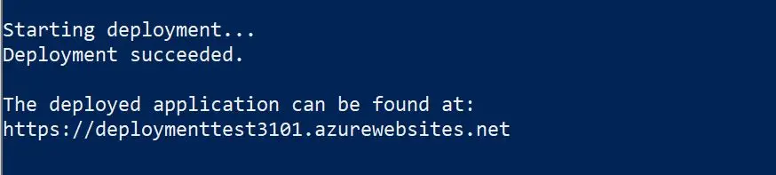
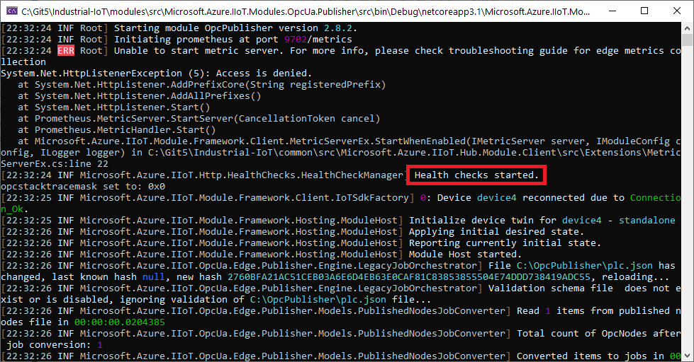
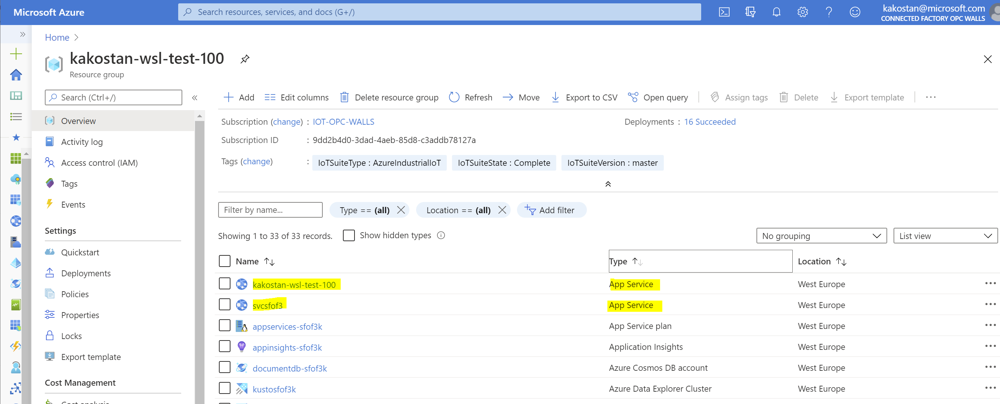
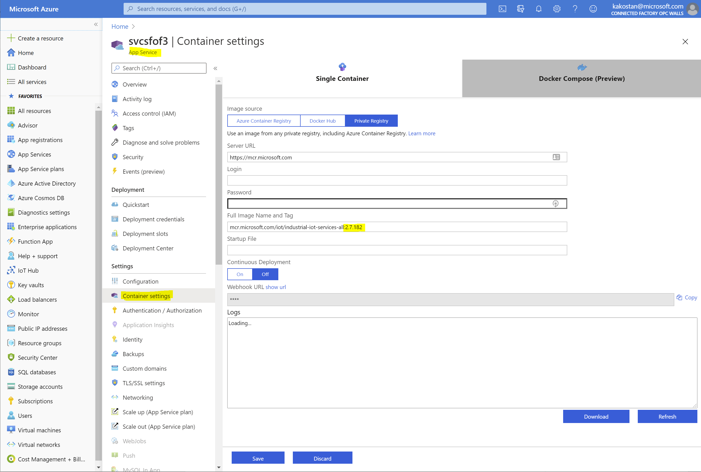
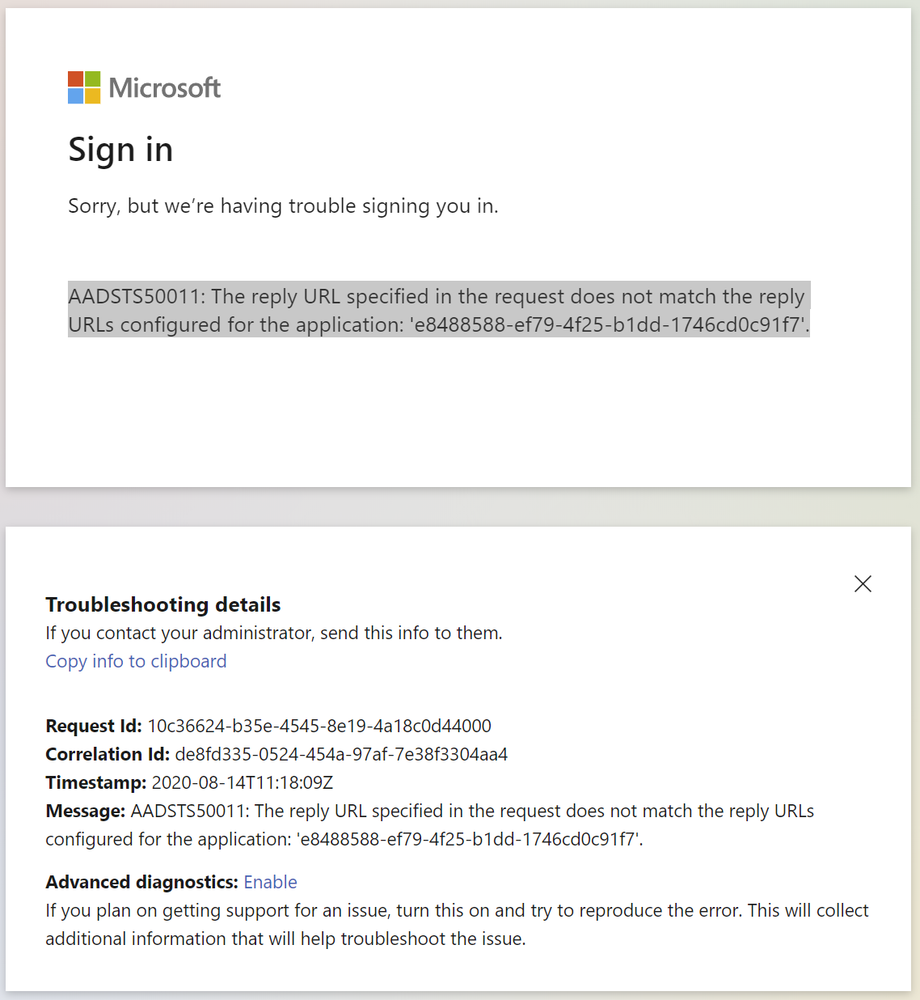
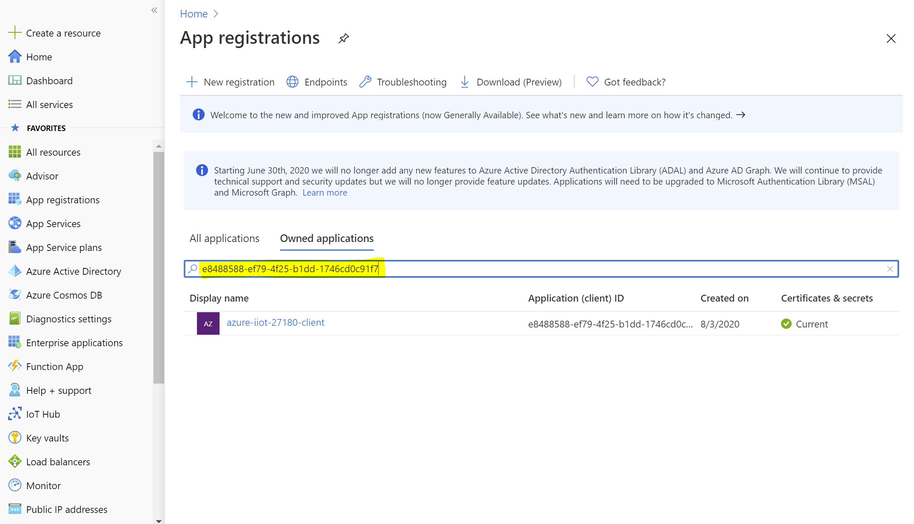
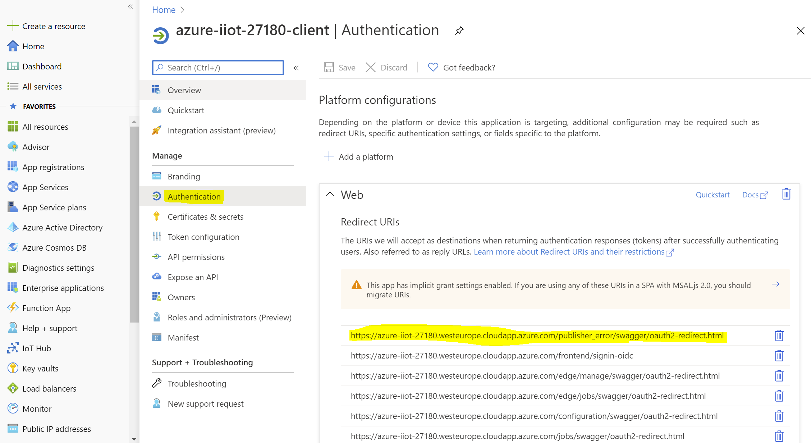

# Azure Industrial IoT Platform <!-- omit in toc -->

[Home](../readme.md)

> This documentation applies to version 2.9

The Azure Industrial IoT companion web (OPC Publisher Web API) service is an optional component included in this repo and provides cloud side APIs to configure and operate the OPC Publisher module.

## Table Of Contents <!-- omit in toc -->

- [Getting started](#getting-started)
  - [Deploy the Industrial IoT Platform](#deploy-the-industrial-iot-platform)
  - [Azure Active Directory application registrations](#azure-active-directory-application-registrations)
  - [Automatic deployment of OPC Publisher modules](#automatic-deployment-of-opc-publisher-modules)
    - [Module Versions](#module-versions)
- [APIs](#apis)
  - [Registry](#registry)
  - [Discovery](#discovery)
  - [Twin](#twin)
  - [Events](#events)
- [Operations](#operations)
  - [Health checks](#health-checks)
  - [How to use](#how-to-use)
  - [Format](#format)
- [Dependencies](#dependencies)
  - [Azure Account, Subscription](#azure-account-subscription)
  - [Azure Active Directory](#azure-active-directory)
  - [Azure AD Tenant](#azure-ad-tenant)
  - [Azure IoT Hub](#azure-iot-hub)
  - [Azure Storage Account](#azure-storage-account)
    - [Blob Storage](#blob-storage)
  - [Azure Key Vault](#azure-key-vault)
  - [Azure App Registrations](#azure-app-registrations)
- [Configuration Settings](#configuration-settings)
  - [Configuration Environment Variables](#configuration-environment-variables)
    - [OpenApi Configuration](#openapi-configuration)
    - [IoT Hub Configuration](#iot-hub-configuration)
    - [Container Registry Configuration](#container-registry-configuration)
  - [Scale Configuration](#scale-configuration)
    - [IoT Hub](#iot-hub)
    - [IoT Edge VM](#iot-edge-vm)
    - [App Service Plan](#app-service-plan)
- [Limits and Monitoring](#limits-and-monitoring)
  - [Azure PaaS Services](#azure-paas-services)
- [SLA, Disaster Recovery, Backup/Restore](#sla-disaster-recovery-backuprestore)
  - [SLA](#sla)
  - [Disaster Recovery](#disaster-recovery)
  - [Backup and Restore](#backup-and-restore)
- [Recommendations on Versions and Upgrading](#recommendations-on-versions-and-upgrading)
  - [Version upgrade for pinned versions](#version-upgrade-for-pinned-versions)
- [Troubleshooting deployment failures](#troubleshooting-deployment-failures)
  - [Execution Policy](#execution-policy)
  - [Security Warning](#security-warning)
  - [Resource group name](#resource-group-name)
  - [Website name already in use](#website-name-already-in-use)
  - [Azure Active Directory Permissions](#azure-active-directory-permissions)
  - [Missing Script dependencies](#missing-script-dependencies)
  - [Deploy from Linux other than Ubuntu](#deploy-from-linux-other-than-ubuntu)
- [Advanced topics](#advanced-topics)
  - [Deployment script options](#deployment-script-options)
  - [Running the Industrial IoT platform (OPC Publisher) Web service locally](#running-the-industrial-iot-platform-opc-publisher-web-service-locally)
  - [Redirect URIs](#redirect-uris)
- [Next steps](#next-steps)

## Getting started

The following components are deployed when you use the provided deployment scripts (Dependencies such as disks or network interfaces are not explicitly listed).

- Everything requires: IoT Hub
- **Common**: UI and web services require: Key Vault, Storage, Azure Active Directory (AAD) app registrations
- **Web services** require: App Service Plan, App Service
- **Simulation**: Virtual machine, Virtual network, IoT Edge,  Device Provisioning Service

You can find more information about the production dependencies [here](#dependencies).

The provided deployment script can deploy the following configurations (specified using the `-type` command line argument):

- Local: **Common** dependencies
- Services: Local + **Web Services**
- Simulation: Local + **simulation** components
- All (default): Web Services + **simulation**

### Deploy the Industrial IoT Platform

The simplest way to get started is to deploy the Azure Industrial IoT OPC Publisher, Services and Simulation demonstrator using the deployment script:

1. If you have not done so yet, clone the GitHub repository. To clone the repository you need git. If you do not have git installed on your system, follow the instructions for [Linux or Mac](https://git-scm.com/book/en/v2/Getting-Started-Installing-Git), or [Windows](https://gitforwindows.org/) to install it. Open a new command prompt or terminal and run:

   ```bash
   git clone https://github.com/Azure/Industrial-IoT
   cd Industrial-IoT
   ```

1. Open a command prompt or terminal to the repository root and start the guided deployment:

   - On Windows:

     ```pwsh
     .\deploy
     ```

   - On Linux:

     ```bash
     ./deploy.sh
     ```

   The deployment script allows to select which set of components to deploy using deployment types:

    - `local`: Just what is necessary to run the services locally
    - `services`: `local` and the service container
    - `simulation`: `local` and the simulation components
    - `all`: `services` and `simulation`

    Depending on the chosen deployment type the following services will be deployed:

    - Minimum dependencies:
      - 1 [IoT Hub](https://azure.microsoft.com/services/iot-hub/) to communicate with the edge and ingress raw OPC UA telemetry data
      - 1 [Key Vault](https://azure.microsoft.com/services/key-vault/), Premium SKU (to manage secrets and certificates)
      - 1 [Blob Storage](https://azure.microsoft.com/services/storage/) V2, Standard LRS SKU (for event hub checkpoints)
      - App Service Plan, 1 [App Service](https://azure.microsoft.com/services/app-service/), B1 SKU for hosting the web api service.
    - Simulation:
      - 1 [Device Provisioning Service](https://docs.microsoft.com/azure/iot-dps/), S1 SKU (used for deploying and provisioning the simulation gateways)
      - [Virtual machine](https://azure.microsoft.com/services/virtual-machines/), Virtual network, IoT Edge used for a factory simulation to show the capabilities of the platform and to generate sample telemetry. By default, 4 [Virtual Machines](https://azure.microsoft.com/services/virtual-machines/), 2 B2 SKU (1 Linux IoT Edge gateway and 1 Windows IoT Edge gateway) and 2 B1 SKU (factory simulation).

   > Additional supported parameters can be found [here](#deployment-script-options).

1. Follow the prompts to assign a name to the resource group of the deployment and a name to the website. The script deploys the Microservices and their Azure platform dependencies into the resource group in your Azure subscription. The script also registers an Application in your Azure Active Directory (AAD) tenant to support OAUTH based authentication.
   Deployment will take several minutes. An example of what you'd see once the solution is successfully deployed:

   

   The output includes the URL of the public endpoint.

   In case you run into issues please follow the steps [below](#troubleshooting-deployment-failures).

1. Once the script completes successfully, select whether you want to save the `.env` file. You need the `.env` environment file if you want to connect to the cloud endpoint using the CLI tool or for debugging a locally running version of the web-api.

### Azure Active Directory application registrations

The Azure Industrial IoT platform requires several App Registrations in your Azure Active Directory
(AAD) to run. Those App Registrations are responsible for:

- providing identity for back-end microservices to run
- defining authentication methods and details for client applications

The `deploy.ps1` script creates those App Registrations for you by default. But they both require that the user has the `Administrator` role in the AAD for deployment to succeed. In cases when the user does not have the `Administrator` role, the process of deployment can be separated into 2 distinct states:

- creation and setup of the App Registrations in AAD tenant
- creation of Azure resources and deployment of the Azure Industrial IoT platform components

With this separation, the first step can be performed by an Administrator of the AAD tenant. Deployments will output details of App Registrations which can then be passed to a user for running the second step.

`deploy.ps1` PowerShell script calls `aad-register.ps1` for creating the following App Registrations:

- `<application-name>-service`: used for providing identity for back-end microservices
- `<application-name>-client`: used for authentication of native clients, such as CLI tool
- `<application-name>-web`: used for authentication of Web clients, such as Swagger

Use the following command to run `aad-register.ps1` script for creation of the App Registrations.
Specify desired application name instead of the `<application-name>` and your tenant id.
Follow the script commands and provide additional details where needed.

> Note: `ReplyUrl` has the following format `https://<application-name>.azurewebsites.net/`, as we are using an instance of App Service to host the web api service.

```bash
cd deploy/scripts
./aad-register.ps1 -Name <application-name> -ReplyUrl https://<application-name>.azurewebsites.net/ -TenantId XXXXXXXX-XXXX-XXXX-XXXX-XXXXXXXXXXXX -Output aad.json
```

The output of the script is a JSON file containing the relevant information to be used as part of the
deployment and must be passed to the `deploy.ps1` script in the same folder using `-aadConfig` argument.

Use the following command to deploy the Azure Industrial IoT platform with pre-created App Registrations.
Follow the script commands and provide additional details where needed.

```bash
./deploy.ps1 -aadConfig aad.json -applicationName <application-name>
```

You can find all configuration options for `deploy.ps` [here](#deployment-script-options).

### Automatic deployment of OPC Publisher modules

The Azure Industrial IoT companion service creates IoT Edge Layered Deployments for OPC Publisher. These Layered Deployments will be automatically applied to any IoT Edge instance that contains the following Device Twin JSON tags.

1. Go to the [Azure Portal page](http://portal.azure.com) and select your IoT Hub

1. Open the Device Twin configuration JSON under IoT Edge -> [your IoT Edge device] -> Device Twin

1. Insert the following `tags`:

   - For Linux, set the "os" property to "Linux":

    ```json
    ...
    },
    "version": 1,
    "tags": {
        "__type__": "iiotedge",
        "os": "Linux"
    },
    "properties":
    ...
    ```

   - For Windows (EFLOW), set the "os" property to "Windows":

    ```json
    ...
    },
    "version": 1,
    "tags": {
        "__type__": "iiotedge",
        "os": "Windows"
    },
    "properties":
    ...
    ```

The tags can also be created as part of an Azure Device Provisioning (DPS) enrollment. An example of the latter can be found in `/deploy/scripts/dps-enroll.ps1`.

#### Module Versions

By default, the same Docker container image version tag from mcr.microsoft.com is deployed that corresponds to the corresponding micro-service's version.

If you need to point to a different Docker container registry or image version tag, you can configure the source using environment variables `PCS_DOCKER_SERVER`, `PCS_DOCKER_USER`, `PCS_DOCKER_PASSWORD`, `PCS_IMAGES_NAMESPACE` and `PCS_IMAGES_TAG`, for example in your .env file (which can also be set during deployment), then restart the edge management or all-in-one service.

## APIs

The optional Web service exposes API with enabling the following functionality:

- Start the publishing of values of an endpoint (a.k.a Publish services)
- Access the OPC UA services exposed by OPC Publisher (a.k.a [Twin](#twin) services)
- Discover OPC UA servers and endpoints (a.k.a [Discovery](#discovery) services)
- Manage the discovered entities (a.k.a [Registry](#registry) services)
- Receive updates through SignalR subscriptions (a.k.a [Event](#events) services)

### Registry

The role of the Registry component is to enable management of entities and identities in IoT Hub. These include:

- **Applications**. In OPC parlance, an "Application" can be a server or a client or both. It is also a grouping mechanism for Endpoints, i.e. Applications have Endpoints. An Application contains all server provided information, such as Discovery URLs, Application and Product URIs.

- **Endpoints**. Each endpoint represents the twin of an OPC UA Server application's endpoint. A server can have multiple endpoints with different configurations, including security properties.  Endpoint identities are used to invoke OPC UA services or retrieve endpoint specific information, such as certificates.

- **Gateways.** The gateway is an IoT Edge runtime that hosts discovery modules, OPC Twin and OPC publisher modules, all of which have their IoT Edge Module identities managed in the registry as well:

- **Publishers**. The publisher identity is the OPC Publisher module's identity. A publisher is the host of multiple publish job workers.

> NOTE: In 2.9 the previous concepts of "Supervisor" and "Discoverer" have been subsumed by the "Publisher" concept.

You can Read as well as **query** all of these identities' models in the Registry.
You can also create and delete Application identities ("resources").  There are 2 ways applications can be created:

- By **POST**ing of an Application Model. In this case the application will not have endpoints associated. This is useful to register client applications or reflect servers registered in another system.

- By the processing of discovery events emitted by the discovery edge module and processing of these events by the Onboarding Microservice. This typically happens either

  - as a result of a "Discover" API call (One time), or
  - a continuous (persistent) discovery job (configured in the discoverer identity twin), or
  - when registering applications via their OPC UA discovery Url.

- By calling the **RegisterEndpoint** API to register an endpoint. If successful this will also add the application descriptor of the endpoint to the registry.

A **DELETE** of an application will delete all associated endpoints.

To update items where supported, you must send a HTTP `PATCH` request containing the item's model (e.g. a `PublisherModel`).

Values in the model that are set to *null* are not updated.  However, missing values in the incoming payload are de-serialized as *null*.  This means, to remove a value, you must explicitly set the value in the model to its *default*, e.g. an empty string, or 0, etc.

### Discovery

The discovery component provides access to the OPC Publisher discovery API. The discovery API enables active scanning of networks for OPC UA servers as well as calling the local discovery services of OPC UA. Results of discovery process are sent to IoT Hub and processed by the Web service. The Web service creates a IoT Hub Device Twins for each server and server endpoint using the IoT Hub Device Twin Registry.

This involves the following tasks:

- Add new applications and their endpoints to the registry if they do not yet exist
- Update existing applications and endpoints to reflect what the server reported and re-enable them if they are disabled.
- Add the "Publisher ID" to any endpoint to claim the endpoint for the publisher that found it.
- Mark any applications and endpoints found or registered through the publisher at an earlier point in time and that were not found this time around.

Applications and their endpoints that have not been found for a while can be purged using the [REST API](./api.md).

### Twin

OPC Twin component of the Web API provides a [REST API](./api.md) to call the following [OPC UA](../readme.md#what-is-opc-ua) services using endpoint identifiers in the registry:

- **Read** and **Write** a “Value” on a Variable node
- **Call** a “Method Node”
- **Read** and **Write** Node “Attributes
- **History Read** and **Update** service calls to interact with Historians
- **Batching** of any of the above calls.
- **Browse** first / next (with and without reading the browsed target nodes)
- Get **meta data** of methods (to display input arguments to a user)

Before invoking any services you must inspect the endpoint certificate using the registry API.

> NOTE: After deleting of an endpoint in the registry access through the twin component is still possible for a while due to connection information caching.

### Events

The SignalR event component of the Web Service forwards ...

- Registry update events
- Discovery Progress
- OPC UA PubSub messages

over SignalR to subscribed clients and thus provides a reactive UX experience.

## Operations

### Health checks

The OPC Publisher exposes port `8045` as a health check endpoint. The health checks include a liveness and a readiness probe, you can read more about them [here](https://kubernetes.io/docs/tasks/configure-pod-container/configure-liveness-readiness-startup-probes/).

### How to use

The health check endpoint is enabled by default. You can verify that it has started by the logs output by the OPC Publisher.



You can use a browser or a command line to probe the health check endpoint: `http://localhost:8045/healthz`

### Format

A healthy response from the health check endpoint is an HTTP response with its status code 200, its `Content-Type` header set to "text/plain", and its body set to "OK". An unhealthy probe will not yield a response.

## Dependencies

Azure Industrial IoT companion web service requires several Azure managed resources to run. The main of them is Azure IoT Hub, which acts as a central messaging and device management hub that most of the cloud services build on.

We provide a PowerShell script to deploy all services using ARM templates. This will leverage the following:

### Azure Account, Subscription

First, an Azure Account with an active Subscription is needed. The subscription is going to host all Azure resources necessary for the platform.

Reference: [Subscriptions, licenses, accounts, and tenants for Microsoft's cloud offerings](https://docs.microsoft.com/microsoft-365/enterprise/subscriptions-licenses-accounts-and-tenants-for-microsoft-cloud-offerings?view=o365-worldwide)

### Azure Active Directory

Azure Active Directory (Azure AD or AAD) is Microsoft’s cloud-based identity and access management service, which helps your employees sign in and access resources in:

- External resources, such as Microsoft 365, the Azure portal, and thousands of other SaaS applications.

- Internal resources, such as apps on your corporate network and intranet, along with any cloud apps developed by your own organization.

Specifically, Azure Industrial IoT companion web service is using Azure AD as an identity provider which authenticates users and applications accessing the platform. Azure AD will be providing access tokens to authenticated users or applications which are then checked by the platform components to identify the identities of clients.

We are lso going to use Azure AD to register app entities and setup authentication flows for components of the platform.

Reference: [Azure Active Directory overview](https://docs.microsoft.com/azure/active-directory/fundamentals/active-directory-whatis)

### Azure AD Tenant

An Azure AD tenant is a specific instance of Azure AD containing accounts and groups. Paid or trial subscriptions of Microsoft 365 or Dynamics 365 include a free Azure AD tenant. This Azure AD tenant does not include other Azure services and is not the same as an Azure trial or paid subscription.

Reference: [Subscriptions, licenses, accounts, and tenants for Microsoft's cloud offerings](https://docs.microsoft.com/microsoft-365/enterprise/subscriptions-licenses-accounts-and-tenants-for-microsoft-cloud-offerings?view=o365-worldwide)

### Azure IoT Hub

Azure IoT Hub is a managed service, hosted in the cloud, that acts as a central message hub for bi-directional communication between IoT applications and the devices that they manage. One can use Azure IoT Hub to build IoT solutions with reliable and secure communications between millions of IoT devices and a cloud-hosted solution backend.

Azure IoT Hub supports communications both from the device to the cloud and from the cloud to the device. IoT Hub supports multiple messaging patterns such as device-to-cloud telemetry, file upload from devices, and request-response to control your devices from the cloud. IoT Hub monitoring helps to maintain the health of your solution by tracking events such as device creation, device failures, and device connections.

IoT Hub's capabilities help build scalable, full-featured IoT solutions such as managing industrial equipment used in manufacturing, tracking valuable assets in healthcare, and monitoring office building usage.

Azure IoT Hub is a cornerstone of Azure Industrial IoT companion web service, that uses it for all communications between the IoT Edge modules and cloud services. Apart from that Azure IoT Hub is also used for:

- Managing entities and identities such as Applications, Endpoints and Gateways.

- Managing IoT Edge devices.

- Managing IoT Edge module deployment definitions and rules for applying them.

- Calling device methods on IoT Edge modules.

- Consume telemetry and events from built-in Event Hub of IoT Hub.

Reference: [Azure IoT Hub overview](https://docs.microsoft.com/azure/iot-hub/about-iot-hub)

### Azure Storage Account

The Azure Storage platform is Microsoft's cloud storage solution for modern data storage scenarios. Core storage services offer a massively scalable object store for data objects, disk storage for Azure virtual machines (VMs), a file system service for the cloud, a messaging store for reliable messaging, and a NoSQL store. The services are:

- **Durable and highly available**. Redundancy ensures that your data is safe in the event of transient hardware failures. One can also opt to replicate data across data centers or geographical regions for additional protection from local catastrophe or natural disaster. Data replicated in this way remains highly available in the event of an unexpected outage.

- **Secure**. All data written to an Azure storage account is encrypted by the service. Azure Storage provides one with fine-grained control over who has access to your data.

- **Scalable**. Azure Storage is designed to be massively scalable to meet the data storage and performance needs of today's applications.

- **Managed**. Azure handles hardware maintenance, updates, and critical issues.

- **Accessible**. Data in Azure Storage is accessible from anywhere in the world over HTTP or HTTPS. Microsoft provides client libraries for Azure Storage in a variety of languages, including .NET, Java, Node.js, Python, PHP, Ruby, Go, and others, as well as a mature REST API. Azure Storage supports scripting in Azure PowerShell or Azure CLI. And the Azure portal and Azure Storage Explorer offer easy visual solutions for working with your data.

#### Blob Storage

Azure Blob storage is Microsoft's object storage solution for the cloud. Blob storage is optimized for storing massive amounts of unstructured data, such as text or binary data.

Blob storage is ideal for:

- Serving images or documents directly to a browser.

- Storing files for distributed access.

- Streaming video and audio.

- Storing data for backup and restore, disaster recovery, and archiving.

- Storing data for analysis by an on-premises or Azure-hosted service.

Objects in Blob storage can be accessed from anywhere in the world via HTTP or HTTPS. Users or client applications can access blobs via URLs, the Azure Storage REST API, Azure PowerShell, Azure CLI, or an Azure Storage client library. The storage client libraries are available for multiple languages, including .NET, Java, Node.js, Python, PHP, and Ruby.

Cloud services of Azure Industrial IoT use Azure Blob Storage for Event Hub consumer offset checkpoints.

References:

- [Azure Blob storage overview](https://docs.microsoft.com/azure/storage/blobs/storage-blobs-overview)

- [Introduction to the core Azure Storage services](https://docs.microsoft.com/azure/storage/common/storage-introduction)

### Azure Key Vault

Azure Key Vault is a tool for securely storing and accessing secrets. A secret is anything that one wants to tightly control access to, such as API keys, passwords, or certificates.

Azure Key Vault helps solve the following problems:

- **Secrets Management** - Azure Key Vault can be used to Securely store and tightly control access to tokens, passwords, certificates, API keys, and other secrets.

- **Key Management** - Azure Key Vault can also be used as a Key Management solution. Azure Key Vault makes it easy to create and control the encryption keys used to encrypt your data.

- **Certificate Management** - Azure Key Vault is also a service that lets one easily provision, manage, and deploy public and private Transport Layer Security/Secure Sockets Layer (TLS/SSL) certificates for use with Azure and your internal connected resources.

- **Store secrets backed by Hardware Security Modules** - The secrets and keys can be protected either by software or FIPS 140-2 Level 2 validated HSMs.

We mainly use Azure Key Vault as a centralized store of application secrets. We store information about whole deployment environment such as Azure resource details, their connections strings, as well as application configuration in Key Vault.

References:

- [About Azure Key Vault](https://docs.microsoft.com/azure/key-vault/general/overview)

- [About keys, secrets and certificates](https://docs.microsoft.com/azure/key-vault/general/about-keys-secrets-certificates)

- [ASP.NET Core Data Protection](https://docs.microsoft.com/aspnet/core/security/data-protection/introduction?view=aspnetcore-3.1)

### Azure App Registrations

To delegate Identity and Access Management functions to Azure AD, an application must be registered with an Azure AD tenant. When one registers the application with Azure AD, one is creating an identity configuration for your application that allows it to integrate with Azure AD. When one registers an app, one can choose whether it's a single tenant (only accessible in your tenant) or multi-tenant (accessible to in other tenants) and can optionally set a redirect URI (where the access token is sent to).

When one completes the app registration, one has a globally unique instance of the app (the application object) which lives within your home tenant or directory. One also has a globally unique ID for your app (the app or client ID). One can then add secrets or certificates and scopes to make your app work, customize the branding of your app in the sign-in dialog, and more.

The application object describes three aspects of an application:

- how the service can issue tokens to access the application

- resources that the application might need to access.

- the actions that the application can take.

Deployment of Azure Industrial IoT companion web service requires Azure AD app registrations to enable authentication for the components. With authentication enabled, every call to APIs of Azure Industrial IoT components will require an Access Token to authenticate and authorize the caller. The authentication will happen against Azure AD using details of app registration. So, we generally require two apps to be registered in your AAD:

- one which will define identity and permissions of Azure Industrial IoT components, we refer to this one as **ServicesApp**

- one for clients accessing APIs of Azure Industrial IoT components, we refer to this as **ClientsApp**.

Based on your setup, one might decide to split **ClientsApp** into two app registrations for client applications instead of one, one for web clients and one for native clients, such as CLI applications.

References:

- [Microsoft identity platform overview](https://docs.microsoft.com/azure/active-directory/develop/v2-overview)

- [Application and service principal objects in Azure Active Directory](https://docs.microsoft.com/azure/active-directory/develop/app-objects-and-service-principals)

- [Azure AAD App Registration](../../deploy/helm/azure-industrial-iot/README.md#azure-aad-app-registration)

## Configuration Settings

The deployment script automatically configures all components to work with each other using default values. Here are some of the more relevant customization settings for the components:

- `IoT Hub`

  - `Networking -> Public access`: Configure Internet access, e.g., IP filters.

  - `Networking -> Private endpoint connections`: Create an endpoint that is not accessible through the Internet and can be consumed internally by other Azure services or on-premises devices (e.g., through a VPN connection)

  - `IoT Edge`: Manage the configuration of the edge devices that are connected to the OPC UA servers
    - Manage the identities of the IoT Edge devices that may access the hub, configure which modules are installed and which configuration they use, e.g. encoding parameters for the OPC Publisher

- `Key Vault`

  - Secrets: Manage platform settings

  - Access policies: Manage which applications and users may access the data in the Key Vault and which operations (e.g. read, write, list, delete) are they allowed to perform

  - Networking: Firewall, Vnet and private endpoints

- `Azure Active Directory (AAD) -> App registrations`

  - `<APP_NAME>-web -> Authentication`: Manage reply URIs, which is the list of URIs that can be used as landing pages after authentication succeeds. The deployment script may be unable to configure this automatically under certain scenarios, such as lack of AAD admin rights; one may want to add or modify URIs when changing the hostname of the Web app, e.g. the port number used by the localhost for debugging

- `App Service`

  - Configuration: Manage the environment variables that control the services or UI

- `Virtual machine`
  - Networking: Configure supported networks and firewall rules

  - Serial console: SSH access to get insights or for debugging, get the credentials from the output of deployment script or reset the password

### Configuration Environment Variables

In the following sections, one can find the configuration environment variables to configure the different services. The values can be changed by setting environment variables (that are defined in the second column). For legacy reasons, multiple environment variables exist for one value. They overwrite each other from top to bottom (last one wins).

#### OpenApi Configuration

Configuration for OpenApi/Swagger.

<table><thead><tr class="header"><th>Environment Variable Names</th><th>Modality</th><th>Default Value</th><th>Description</th></tr></thead><tbody><tr class="odd"><td>OpenApi:Enabled<br />
PCS_OPENAPI_ENABLED</td><td>required</td><td>false</td><td>Whether OpenApi should be enabled</td></tr><tr class="even"><td>Auth:Required<br />
PCS_AUTH_REQUIRED</td><td>required</td><td>false</td><td>Whether authentication should be added to OpenAPI UI.</td></tr><tr class="odd"><td>OpenApi:UseV2<br />
PCS_OPENAPI_USE_V2<br />
PCS_SWAGGER_V2</td><td>optional</td><td>true</td><td>Create v2 open api json</td></tr><tr class="even"><td><p>OpenApi:AppId<br />
PCS_OPENAPI_APPID<br />
PCS_AAD_CONFIDENTIAL_CLIENT_APPID</p><p>PCS_AAD_CONFIDENTIAL_CLIENT_APPID</p></td><td>optional</td><td>(empty)</td><td>The Application id for the OpenAPI UI client.</td></tr><tr class="odd"><td>OpenApi:AppSecret<br />
PCS_OPENAPI_APP_SECRET<br />
PCS_AAD_CONFIDENTIAL_CLIENT_SECRET<br />
PCS_APPLICATION_SECRET</td><td>optional</td><td>(empty)</td><td>Application Secret</td></tr><tr class="even"><td>OpenApi:AuthorizationUrl</td><td>optional</td><td>(empty)</td><td>Authorization URL</td></tr><tr class="odd"><td>OpenApi:ServerHost<br />
PCS_OPENAPI_SERVER_HOST</td><td>optional</td><td>(empty)</td><td>Server host for OpenAPI</td></tr></tbody></table>

#### IoT Hub Configuration

<table><thead><tr class="header"><th>Environment Variable Names</th><th>Modality</th><th>Default Value</th><th>Description</th></tr></thead><tbody><tr class="odd"><td>IoTHubConnectionString<br />
PCS_IOTHUB_CONNSTRING<br />
_HUB_CS</td><td>required</td><td>null</td><td>IoT hub connection string</td></tr></tbody></table>

#### Container Registry Configuration

<table><thead><tr class="header"><th>Environment Variable Names</th><th>Modality</th><th>Default Value</th><th>Description</th></tr></thead><tbody><tr class="odd"><td>Docker:Server<br />
PCS_DOCKER_SERVER</td><td>required</td><td>null</td><td>URL of the server</td></tr><tr class="even"><td>Docker:User<br />
PCS_DOCKER_USER</td><td>required</td><td>null</td><td>Username</td></tr><tr class="odd"><td>Docker:Password<br />
PCS_DOCKER_PASSWORD</td><td>required</td><td>null</td><td>Password</td></tr><tr class="even"><td>Docker:ImagesNamespace<br />
PCS_IMAGES_NAMESPACE</td><td>required</td><td>null</td><td>The namespace of the images</td></tr><tr class="odd"><td>Docker:ImagesTag<br />
PCS_IMAGES_TAG</td><td>required</td><td>null</td><td>The tag of the images</td></tr></tbody></table>

### Scale Configuration

The scale configuration options are described below:

#### IoT Hub

Pricing and scale: A hub can be configured in terms of size (S1, S2, S3) and the number of units of each. Both size and number of units add capabilities and processing capacity.

The important difference is the number of messages that can be sent from a device to the cloud per day. When the limit is reached, messages get rejected until the daily reset at 0:00 UTC.

There are also throttling limits to consider that increase with the size and number of units, see the reference for more information.

The diagnostic information of the OPC Publisher helps estimate the size and cost of the required IoT Hub, see the tutorial below for further details.

For more information see:

- [Azure IoT Hub pricing](https://azure.microsoft.com/pricing/details/iot-hub/)
- [Azure IoT Hub pricing information](https://docs.microsoft.com/azure/iot-hub/iot-hub-devguide-pricing)
- [IoT Hub quotas and throttling](https://docs.microsoft.com/azure/iot-hub/iot-hub-devguide-quotas-throttling)
- [IoT Hub limits](https://docs.microsoft.com/azure/azure-resource-manager/management/azure-subscription-service-limits#iot-hub-limits)

#### IoT Edge VM

Size: Manage the size if heavily under- or overused

#### App Service Plan

Overview: Shows CPU, memory, and network usage

Scale up: If the above metrics show heavy usage of the services or UI, the App Service Plan (host VM) can be scaled to a more performant machine.

## Limits and Monitoring

### Azure PaaS Services

The limits and quotas for Azure Subscription can be found under [Azure Subscription service limits](https://docs.microsoft.com/azure/azure-resource-manager/management/azure-subscription-service-limits).

The limits and quotas for Azure AD can be found under [Active Directory service limits and restrictions](https://docs.microsoft.com/azure/active-directory/users-groups-roles/directory-service-limits-restrictions).

The limits and quotas for Azure IoT Hub can be found under [IoTHub DevGuide Quotas Throttling](https://docs.microsoft.com/azure/iot-hub/iot-hub-devguide-quotas-throttling).

The limits and quotas for Blob Storage can be found under [Storage scalability targets](https://docs.microsoft.com/azure/storage/common/scalability-targets-standard-account).

The limits and quotas for Key Vault can be found under [Key Vault service-limits](https://docs.microsoft.com/azure/key-vault/general/service-limits).

## SLA, Disaster Recovery, Backup/Restore

### SLA

The Azure Industrial IoT companion web service is offered as a freely available codebase; therefore, it does not have a financially backed SLA. These components are built on top of several Azure PaaS Services; the table below lists their SLAs.

| Service                  | SLA                                                                                             |
|--------------------------|-------------------------------------------------------------------------------------------------|
| Azure Active Directory   | SLA can be found [here](https://azure.microsoft.com/support/legal/sla/active-directory/v1_0/)   |
| Azure IoT Hub            | SLA can be found [here](https://azure.microsoft.com/support/legal/sla/iot-hub/v1_2/)            |
| Azure Event Hub          | SLA can be found [here](https://azure.microsoft.com/support/legal/sla/event-hubs/v1_1/)         |
| Azure Cosmos DB          | SLA can be found [here](https://azure.microsoft.com/support/legal/sla/cosmos-db/v1_3/)          |
| Azure Service Bus        | SLA can be found [here](https://azure.microsoft.com/support/legal/sla/service-bus/v1_1/)        |
| Azure Storage Account    | SLA can be found [here](https://azure.microsoft.com/support/legal/sla/storage/v1_5/)            |
| Azure Key Vault          | SLA can be found [here](https://azure.microsoft.com/support/legal/sla/key-vault/v1_0/)          |
| Azure Monitor            | SLA can be found [here](https://azure.microsoft.com/support/legal/sla/monitor/v1_3/)            |
| Azure Kubernetes Service | SLA can be found [here](https://azure.microsoft.com/support/legal/sla/kubernetes-service/v1_1/) |
| Azure IoT Edge           | SLA can be found [here](https://azure.microsoft.com/support/legal/sla/iot-edge/v1_0/)           |

### Disaster Recovery

We rely on the underlying Azure PaaS services’ support for disaster recovery mechanisms.

For the operator using the Azure Industrial IoT web service, the [Azure Business Continuity Technical Guidance](https://docs.microsoft.com/azure/architecture/framework/resiliency/backup-and-recovery) can give guidance how to address Disaster Recovery in their solutions architecture.

| Service                  | DR Options                                                                                                                          |
|--------------------------|-------------------------------------------------------------------------------------------------------------------------------------|
| Azure Active Directory   | DR options can be found [here](https://azure.microsoft.com/blog/setting-up-active-directory-for-a-disaster-recovery-environment-2/) |
| Azure IoT Hub            | DR options can be found [here](https://docs.microsoft.com/azure/iot-hub/iot-hub-ha-dr)                                              |
| Azure Event Hub          | DR options can be found [here](https://docs.microsoft.com/azure/event-hubs/event-hubs-geo-dr)                                       |
| Azure Storage Account    | DR options can be found [here](https://docs.microsoft.com/azure/storage/common/storage-disaster-recovery-guidance)                  |
| Azure Key Vault          | DR options can be found [here](https://docs.microsoft.com/azure/key-vault/general/disaster-recovery-guidance)                       |
| Azure IoT Edge           | Azure IoT Edge does not have documented DR options                     |

### Backup and Restore

Please refer to documentation here for guidance on Azure PaaS services’ backup/restore support: <https://docs.microsoft.com/azure/architecture/framework/resiliency/backup-and-recovery>

## Recommendations on Versions and Upgrading

In the context of the Azure Industrial IoT companion web service, version upgrade relates to upgrading cloud services to newer versions through change of Docker image tag that is hosted in App Service.

> Our strong recommendation is to run the same version of components together across the deployment to eliminate any potential compatibility issues.

It is recommended to use a floating version tag ("2.9") when deploying the web api container.

If instead you want to pin your deployment to a patch version you need to update the version manually every time you want to upgrade to a new patch version.

### Version upgrade for pinned versions

Updating the web service is done by specifying a new tag for the docker images for of the App Service Instances and restarting the app service.Find the instance of the App Service resource in the resource group of the deployment.

For example here are resources of a sample deployment:



Go to the resource in Azure Portal, then to Container Settings under Settings on left pane. Change tag of the image specified in "Full Image Name and Tag" to the version that is desired, let’s say `2.9.9`, and then click on Save.



Now go to Overview of the App Service resource and click on Stop on top. After service is stopped, start it by clicking on Start on top. This restart of the service will force the image to be updated to the desired version.

## Troubleshooting deployment failures

### Execution Policy

If you receive a message that the execution policy not being set you can set the execution policy when starting the PowerShell session:

```pwsh
pwsh -ExecutionPolicy Unrestricted
```

To set the execution policy on your machine:

1. Search for Windows PowerShell in Start
2. Right click on result Windows PowerShell and choose Run as Administrator
3. In PowerShell (Administrator) run:

```pwsh
Set-ExecutionPolicy -ExecutionPolicy Unrestricted -Force
```

### Security Warning

If you see a message in PowerShell

`Security warning
Run only scripts that you trust. While scripts from the internet can be useful, this script can potentially harm your computer. If you trust this script, use the Unblock-File cmdlet to allow the script to run without this warning message. Do you want to run <...> deploy.ps1?
[D] Do not run [R] Run once [S] Suspend [?] Help (default is "D"):
Do you want to run this script?`

Choose R to run once.

### Resource group name

Ensure you use a short and simple resource group name. The name is used also to name resources as such it must comply with resource naming requirements.

### Website name already in use

It is possible that the name of the website is already in use. If you run into this error, you need to use a different application name.

### Azure Active Directory Permissions

The deployment script tries to [register three AAD applications](#azure-active-directory-application-registrations) representing the web app, the client and the platform (service). This requires [Global Administrator, Application Administrator or Cloud Application Administrator](https://docs.microsoft.com/azure/active-directory/manage-apps/grant-admin-consent) rights.

If the deployment fails or if you see the following error when trying to sign-in, see further below for options:

> **Need admin approval**
> \<APPLICATION\> needs permission to access resources in your organization that only an admin can grant. Please ask an admin to grant permission to this app before you can use it.

**Option 1** (recommended for production): Ask your AAD admin to grant tenant-wide admin consent for your application, there might be a process or tool for this in your enterprise environment.

**Option 2** (recommended for production): An AAD admin can create the AAD applications for you. The `deploy/scripts` folder contains the `aad-register.ps1` script to perform the AAD registration separately from the deployment. The output of the script is a file containing the relevant information to be used as part of deployment and must be passed to the `deploy.ps1` script in the same folder using the `-aadConfig` argument.

   ```pwsh
   cd deploy/scripts
   ./aad-register.ps1 -Name <application-name> -ReplyUrl https://<application-name>.azurewebsites.net/ -Output aad.json
   ./deploy.ps1 -aadConfig aad.json
   ```

If you need additional reply URLs, you may add them manually as this does not require AAD admin rights. The script `aad-register.ps1` also supports the parameter `-TenantId`, which can be used to explicitly select an AAD tenant, and can be executed from the [Cloud Shell](https://docs.microsoft.com/azure/cloud-shell/overview).

**Option 3** (recommended as PoC): Create your [own AAD tenant](https://docs.microsoft.com/azure/active-directory/develop/quickstart-create-new-tenant), in which you are the admin

- Azure Portal: Create a resource -> Azure Active Directory
- After about 1 min, click the link to manage the directory, or click on your account profile at the top right of the Azure Portal -> Switch directory, then select it from *All Directories*
- Copy the Tenant ID

Start the deployment with as many details about the environment as you can provide. You can use the following template to provide targeted details about how you would like the deployment to occur, supplying at least the `-authTenantID` parameter ...

   ```pwsh
   ./deploy.cmd -authTenantId {tenant_id_for_custom_AAD_instance} -subscriptionName {subscription_name} -tenantId {subscription_tenant_id} -SubscriptionId {subscription_id} -type {e.g. 'all'} -version {e.g. 'latest'} -applicationName {application_name} -resourceGroupName {resource_group_name} -resourceGroupLocation {resource_group_location} 
   ```

### Missing Script dependencies

On **Windows**, the script uses Powershell, which comes with Windows. The deploy batch file uses it to install all required modules.

In case you run into issues, e.g. because you want to use powershell Core (pscore/pwsh), run the following two commands in PowerShell as Administrator. See more information about [AzureAD and Az modules](https://docs.microsoft.com/powershell/azure/install-az-ps).

   ```pwsh
   Install-Module -Name Az -AllowClobber
   Install-Module -Name Microsoft.Graph -AllowClobber
   ```

On non - **Ubuntu** Linux or in case you run into issues follow the guidance in the next section.

### Deploy from Linux other than Ubuntu

To install all necessary requirements on other Linux distributions, follow these steps:

1. First [install PowerShell](https://docs.microsoft.com/powershell/scripting/install/installing-powershell-core-on-linux?view=powershell-7). Follow the instructions for your Linux distribution.

2. Open PowerShell using `sudo pwsh`.

3. Install the required Azure Az Powershell module:

   ```pwsh
   Set-psrepository -Name PSGallery -InstallationPolicy Trusted
   Install-Module -Repository PSGallery -Name Az -AllowClobber
   ```

4. To also have the installation script create AAD Application registrations (aad-register.ps1) install the Microsoft.Graph module:

   ```pwsh
   Set-psrepository -Name PSGallery -InstallationPolicy Trusted
   Install-Module -Repository PSGallery -Name Microsoft.Graph -AllowClobber
   ```

5. `exit`

## Advanced topics

### Deployment script options

Using the `deploy/scripts/deploy.ps1` script you can deploy several configurations including deploying images from a private Azure Container Registry (ACR).

To support these scenarios, the `deploy.ps1` takes the following parameters:

```pwsh
 .SYNOPSIS
    Deploys Industrial IoT services to Azure.

 .DESCRIPTION
    Deploys the Industrial IoT services and dependencies on
    Azure.

 .PARAMETER type
    The type of deployment (local, services, simulation, all),
    defaults to all.

 .PARAMETER version
    Set to mcr image tag to deploy - if not set and version can
    not be parsed from branch name will deploy "latest".

 .PARAMETER branchName
    The branch name where to find the deployment templates - if
    not set, will try to use git.

 .PARAMETER repo
    The repository to find the deployment templates in - if not
    set will try to use git or set default.

 .PARAMETER resourceGroupName
    Can be the name of an existing or new resource group.

 .PARAMETER resourceGroupLocation
    Optional, a resource group location. If specified, will try
     to create a new resource group in this location.

 .PARAMETER subscriptionId
    Optional, the subscription id where resources will be deployed.

 .PARAMETER subscriptionName
    Or alternatively the subscription name.

 .PARAMETER tenantId
    The Azure Active Directory tenant tied to the subscription(s)
     that should be listed as options.

 .PARAMETER authTenantId
    Specifies an Azure Active Directory tenant for authentication
    that is different from the one tied to the subscription.

 .PARAMETER accountName
    The account name to use if not to use default.

 .PARAMETER applicationName
    The name of the application, if not local deployment.

 .PARAMETER aadConfig
    The aad configuration object (use aad-register.ps1 to create
    object). If not provided, calls aad-register.ps1.

 .PARAMETER context
    A previously created az context to be used for authentication.

 .PARAMETER aadApplicationName
    The application name to use when registering aad application.
    If not set, uses applicationName.

 .PARAMETER containerRegistryServer
    The container registry server to use to pull images

 .PARAMETER containerRegistryUsername
    The user name to use to pull images

 .PARAMETER containerRegistryPassword
    The password to use to pull images

 .PARAMETER imageNamespace
    Override the automatically determined namespace of the
    container images

 .PARAMETER acrRegistryName
    An optional name of an Azure container registry to deploy
    containers from.

 .PARAMETER acrSubscriptionName
    The subscription of the container registry, if different
    from the specified subscription.

 .PARAMETER acrTenantId
    The tenant where the container registry resides. If not
    provided uses all.

 .PARAMETER environmentName
    The cloud environment to use, defaults to AzureCloud.

 .PARAMETER simulationProfile
    If you are deploying a simulation, the simulation profile
    to use, if not default.

 .PARAMETER numberOfSimulationsPerEdge
    Number of simulations to deploy per edge.

 .PARAMETER numberOfLinuxGateways
    Number of Linux gateways to deploy into the simulation.

 .PARAMETER numberOfWindowsGateways
    Number of Windows gateways to deploy into the simulation.

 .PARAMETER gatewayVmSku
    Virtual machine SKU size that hosts simulated edge gateway.
    Suggestion: use VM with at least 2 cores and 8 GB of memory.
    Must Support Generation 1.

 .PARAMETER opcPlcVmSku
    Virtual machine SKU size that hosts simulated OPC UA PLC.
    Suggestion: use VM with at least 1 core and 2 GB of memory.
    Must Support Generation 1.

 .PARAMETER credentials
    Use these credentials to log in. If not provided you are
    prompted to provide credentials

 .PARAMETER isServicePrincipal
    The credentials provided are service principal credentials.

 .PARAMETER whatIfDeployment
    Create everything but run the deployment as what-if then
    exit.
 .PARAMETER verboseDeployment
    Show verbose progress of the deployment step.
```

### Running the Industrial IoT platform (OPC Publisher) Web service locally

The OPC Publisher web service contained in this repository provides a RESTful API exposing the Azure Industrial IoT platform capabilities. This section explains how to build, run and debug the web service on your local machine.

If not done yet, clone this GitHub repository. To clone it, you need git. If you don't have git, follow the instructions for [Linux, Mac](https://git-scm.com/book/en/v2/Getting-Started-Installing-Git), or [Windows](https://gitforwindows.org/) to install it.

To clone the repository, open a command prompt or terminal and run:

```bash
git clone https://github.com/Azure/Industrial-IoT
cd Industrial-IoT
```

Run the deployment script with the `local` deployment option.

Build and run the Industrial IoT Microservices with Visual Studio or VS Code

1. First, make sure your development tool chain is setup to build the Microservices. If not, [install .NET Core 3.1+](https://dotnet.microsoft.com/download/dotnet-core/3.1) and
   - [Visual Studio 2019 16.4+ for Windows](https://visualstudio.microsoft.com/vs/), [Visual Studio for MacOS 8.3+](https://visualstudio.microsoft.com/vs/mac/).
   - Or latest version of [Visual Studio Code](https://code.visualstudio.com/).
1. Ensure that the `.env` file previously generated by the deployment script is located in the repository's root.
1. Open the `Industrial-IoT.sln` solution file in Visual Studio or VS Code.
1. Right-click on the solution in the solution viewer and select `Properties`.
1. Set the startup project to be  `Azure.IIoT.OpcUa.Services.WebApi`.
1. Log into Azure using the Az CLI (az login) or Visual Studio using the credentials used to deploy the infrastructure.
1. Start debugging by pressing the "Start" button or hitting F5.

To ensure the service is running, open a browser to ```http://localhost:9080/swagger```, which will show you the service's swagger UI. If the service exits immediately after start, check that the `.env` file exists in the root of the repository.

All configuration is stored in Azure Key vault during deployment. Key vault also is used to provide scale out data protection. When running inside Azure Cloud, the platform uses a Managed Service Identity to access the Key vault and pull this information in a secure way. When you run outside of Azure, you need to log in using `az login` or Visual Studio Service Authentication (Tools -> Options -> Azure Service Authentication).

Double check the following if you encounter any Key vault access issues during startup.

- If you deployed yourself, make sure that your own user account has Key and Secret access rights to the deployed Key vault.
- If you did not, or you do not see your user account configured in the Key vault, add your identity and give it all Key and Secret management rights.
- Sometimes your token has expired. Re-add your account in Visual Studio, or use az login to login again.

### Redirect URIs

For authentication against Azure AD it is required that the App Registration in Azure AD has the correct Redirect URIs set for authentication. The result of an incorrect setup would be an error message indicating an invalid reply URL when someone tries to authenticate.

As an example, let’s see how that will look like when somebody wants to use the Swagger UI of the OPC Publisher cloud services. When somebody tries to authenticate in the Swagger UI, the authentication is performed against the Azure AD endpoint of their tenant and the following error page comes up:



When greeted with this page, it is useful to check the URL when this error page comes up as it contains the reply URL that did not match. In this case the URL is:

<https://login.microsoftonline.com/6e660ce4-d51a-4585-80c6-58035e212354/oauth2/authorize?response_type=token&client_id=e8488588-ef79-4f25-b1dd-1746cd0c91f7&redirect_uri=https%3A%2F%2Fazure-iiot-27180.westeurope.cloudapp.azure.com%2Fpublisher%2Fswagger%2Foauth2-redirect.html&state=XXXXXXXXXXXXXXXXXXXXXXXXXXXXXXXXXXXXXXXXXXXXXXXXXXXXXXXXXXXXXXXXXXXXXXXXXXXXXXXXXXXXXXXX&resource=https%3A%2F%2F6e660ce4-d51a-4585-80c6-58035e212354%2Fazure-iiot-27180-service>

Interesting part of that is:

`redirect_uri=https%3A%2F%2Fazure-iiot-27180.westeurope.cloudapp.azure.com%2Fpublisher%2Fswagger%2Foauth2-redirect.html`

Which when decoded from [percent-encoding](https://en.wikipedia.org/wiki/Percent-encoding) with any URL decoder translates to:

`redirect_uri=https://azure-iiot-27180.westeurope.cloudapp.azure.com/publisher/swagger/oauth2-redirect.html`

To resolve this error, check the App Registration with the given id to see if this is a registered Redirect URI for that application. To get to the App registration page check the **Azure Portal**, then **App Registrations** and enter the id.



Click on this App Registration and go to its Authentication page:



The App registration page reveals that there is a mismatch between the Redirect URI that the authentication request provided and from what is expected based on the App Registration settings. To resolve this issue the erroneous link should be fixed, or a new entry can be added. In this case, the first entry has been set incorrectly and has to be fixed by removing the_error part.

References:

- [Configure your App Service or Azure Functions app to use Azure AD login](https://docs.microsoft.com/azure/app-service/configure-authentication-provider-aad)

- [Redirect URI (reply URL) restrictions and limitations](https://docs.microsoft.com/azure/active-directory/develop/reply-url)

## Next steps

- [Explore the REST API](./api.md)
