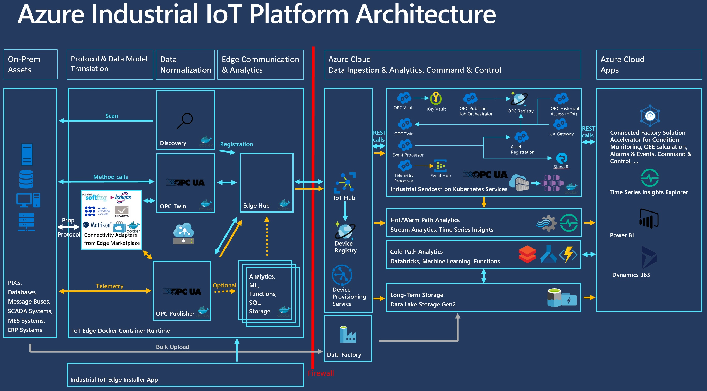

# Azure Industrial IoT Platform

 

## Discover, register and manage your industrial assets with Azure

The Azure Industrial IoT Platform allows you to discover industrial assets on-site and automatically registers them in the cloud for easy access there. It leverages managed Azure PaaS services. On top of the Azure PaaS services, we have built a number of edge and cloud micro-services that must be used together, leveraging OPC UA as the data model. This is also the first cloud platform to leverage the OPC UA PubSub telemetry format (both JSON and binary, on top of MQTT). If your assets don't support OPC UA as an interface, we have worked with our large partner network to support all types of industrial interfaces through the use of adapters, fully integrated with our platform. Please check out the [Azure IoT Edge Marketplace](https://azuremarketplace.microsoft.com/marketplace/apps/category/internet-of-things?page=1&subcategories=iot-edge-modules). So far, we support modules from Softing and CopaData.

An overview architecture is depicted below:

The edge services are implemented as Azure IoT Edge modules and run on on-premises. The cloud services are implemented as ASP.NET micro-services with a REST interface and run on managed Azure Kubernetes Services or stand-alone on Azure App Service. For both edge and cloud services, we have provided pre-built Docker containers in the Microsoft Container Registry (MCR), so you don't have to build them yourself. The edge and cloud services are leveraging each other and must be used together. We have also provided easy-to-use deployment scripts that allow you to deploy the entire platform in a step-by-step fashion.

We have also built an application running on Azure that lets you access the services through a simple UI.

## Getting started

### OPC Publisher - Standalone

To learn how to use OPC Publisher outside the context of Industrial IoT Platform (as container or IoT Edge module) please have a look [here](docs/modules/publisher.md).

### Industrial IoT Platform

Follow instructions to [deploy the Azure Industrial IoT Platform](docs/deploy/readme.md) using the released deployment tool (IAI).

For detailed documentation of Azure Industrial IoT Platform, please refer to [Operations Manual](docs/manual/readme.md).

### Learn more

* [Documentation and tutorials](https://azure.github.io/Industrial-IoT/).
* [Releases of the platform](https://github.com/Azure/Industrial-IoT/releases).

## Mitigations for known vulnerabilities

To mitigate known vulnerabilities external to the Industrial-IoT Platform please review [this](docs/security/readme.md) documentation.

## Get support

Please report any security related issues by following our [security process](security.md).

If you are an Azure customer, please create an Azure Support Request. More information can be found [here](https://azure.microsoft.com/en-us/support/create-ticket/). (Azure Support SLA apply).

Otherwise, please report bugs, feature requests, or suggestions as [GitHub issues](https://github.com/Azure/Industrial-IoT/issues). (No SLA available).

## Supported releases and support policy

Our releases are tagged following semantic versioning (“semver”) conventions. Minor and patch releases do not break backwards compatibility. Minor releases and patch releases address customer reported issues and receive security updates. Minor releases are either regular releases or LTS (Long term support) releases. Currently only the 2.8 release is receiving long-term support (2 years of support after release, only security fixes in the second year). Regular (non-LTS) releases are supported for 6 months after the subsequent major.minor release, or for 1 year after its release whichever comes first. This is reflected in the following table. Releases not shown in the table (e.g., 2.3, 2.4, or 2.6) are out of support already.

| Release (tag)                               | Latest patch release (tag) | End of support | Successor (tag)      | Update instructions                                       |
|---------------------------------------------|----------------------------|----------------|----------------------|-----------------------------------------------------------|
| 2.5                                         | 2.5.5                      | 12/1/2021      | 2.8 (LTS) (>= 2.8.2) | [Migration Path](docs/modules/publisher-migrationpath.md) |
| 2.7                                         | 2.7.206                    | 1/15/2022      | 2.8 (LTS) (>= 2.8.0) | N/A                                                       |
| 2.8 (LTS)                                   | 2.8.4                      | 7/15/2023      | TBA                  | N/A                                                       |

We only support the latest patch version of a release which per semantic versioning convention is identified by the 3rd part of the version string. If you are using a container image with a major.minor version tag that is supported per above table, but a patch version lower than the latest patch version, you need to update your images to the latest version to ensure secure operation and take advantage of the latest fixes. If you unexpectedly encounter bugs and require help, please ensure you are running the latest patch release as we might already have addressed the issue you are seeing. If you are not, please update first and try to reproduce the issue on the latest patch version.

Security-critical updates are made to the last patch version of the major.minor release containing the vulnerability. Bug fixes that are not security related are made only to the main branch and to the last supported release. The version the fix will be in can be found in the version.json file of the respective branch.  

Our [official Microsoft support](https://azure.microsoft.com/en-us/support/create-ticket/) and any related SLA only covers officially released docker containers obtained from MCR (Microsoft Container Registry) and deployed to Azure and hosted by Azure Kubernetes Service (AKS) or IoT Edge (in case of OPC Twin, OPC Publisher and OPC Discovery module images) using the documentation and IAI tool provided as part of the latest release. Also, all Azure services deployed, the installed IoT Edge runtime, as well as Operating System and other middleware and combinations thereof must be officially supported as per their published support policy and SLA.

Otherwise, support is provided on a best effort basis through [GitHub issues](https://github.com/Azure/Industrial-IoT/issues). We aim to release patch releases on a regular cadence (approximately every 3 months), so if you are blocked, and you can suggest or contribute fixes, the chances of getting it into the next patch release are high.

## Contribute

This project has adopted the [Microsoft Open Source Code of Conduct](https://opensource.microsoft.com/codeofconduct). For more information see the [Code of Conduct FAQ](https://opensource.microsoft.com/codeofconduct/faq) or contact [opencode@microsoft.com](mailto:opencode@microsoft.com) with any additional questions or comments.

If you want/plan to contribute, we ask you to sign a [CLA](https://cla.microsoft.com/) (Contribution License Agreement) and follow the project 's [code submission guidelines](contributing.md). A friendly bot will remind you about it when you submit a pull-request.

## License

Copyright (c) Microsoft Corporation. All rights reserved.
Licensed under the [MIT](LICENSE) License.  
