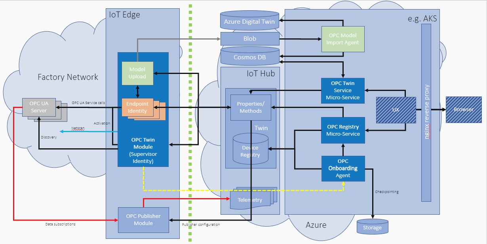

| Branch                    | Build Status                                                 |
| ------------------------- | ------------------------------------------------------------ |
| **master** (Release)      |  |
| **develop** (Pre-release) |  |

# Azure Industrial IoT Components

### Industrial IoT
The Industrial Iot or Iiot connects machines and devices in industries. This connectivity allows for data collection, exchange and analysis, potentially  improving productivity and efficiency.
Watch a [demo](https://azure.microsoft.com/en-us/features/iot-accelerators/connected-factory/) about improving industrial efficiencies with a connected factory. Connected Factory is basically an implementation of Azure Industrial IoT reference architecture, packaged as on open-source solution.

### Industrial Iot Components
The major components which come into play are:
1. **Device** or **machine** - which has OPC UA Server
2. **IoT Edge device** - comprised of Edge Runtime and Edge modules. Edge modules are docker containers which are the smallest unit of computation e.g. OPC Publisher and OPC Twin in our case. Edge device is used to deploy such modules which act as mediator between OPC UA server and IoT Hub in cloud. More information about IoT Edge is [here](https://docs.microsoft.com/en-us/azure/iot-edge/about-iot-edge).
3. **IoT Hub** - acts as a central message hub for bi-directional communication between IoT application and the devices it manages. This is an open and flexible cloud platform as a service that supports open-source SDKs and multiple protocols. Read more about IoT Hub [here](https://azure.microsoft.com/en-us/services/iot-hub/).
4. **Micro-Services in the cloud** - 
* OPC UA Device Management: These services provide discovery, registration, and remote control of industrial devices. 
* OPC UA Certificate Management: services enable secure communication among OPC UA enabled devices and the cloud.  

The complete architecture of Industrial IoT Components is shown below:

## IoT Edge Modules

##### OPC Publisher

This module is deployed as docker container on IoT Edge and sends telemetry data to cloud in publisher subscriber pattern. OPC Publisher can be deployed and configured from the cloud. The data tags to be published can be selected from cloud (via OPC Twin). It supports publishing of static data in addition to dynamic data. Moreover, it supports OPC UA Data Access and Alarms and Events. It batches messages to reduce network load. 

##### OPC Twin
OPC Twin is part of OPC UA Device Management which consists of two parts. OPC Twin micro-service in cloud and OPC Twin module deployed as docker container in IoT Edge device. It supports OPC UA browse, read, write method calls. It supports publishing of OPC UA nodes as time-series telemetry data to the cloud. 

## Microservices

#####  Device Management

*Discover, register and manage your Industrial Assets in Azure* : OPC UA Device Management services allow plant operators to discover OPC UA servers in a factory network and register them in Azure IoT Hub.  

*Analyze, react to events, and control equipment from anywhere* : OPC UA Device Management allows operations personnel to subscribe to and react to events on the factory floor from anywhere in the world.  The services' REST APIs mirror the OPC UA services edge-side and are secured using OAUTH authentication and authorization backed by Azure Active Directory (AAD).  This enables your cloud applications to browse server address spaces or read/write variables and execute methods using HTTPS and simple OPC UA JSON payloads.  

#####  Certificate Management

*Provision certificates and trust groups* : OPC UA Certificate Management enables OT and IT to manage OPC UA Application Certificates and Trust Lists.  Certificates secure client to server communication. Trust Lists determine which client is allowed to talk to which server.  Certificates and private keys can be issued and continuously renewed to keep your OPC UA server endpoints secure.  OPC UA Certificate Management  is built on Azure Key Vault which guards your private keys in a secure hardware location.

### APIs

Simple developer experience - The [REST API](docs/api/readme.md) can be used with any programming language through its exposed Open API specification (Swagger). This means when integrating OPC UA into cloud management solutions, developers are free to choose technology that matches their skills, interests, and architecture choices.  For example, a full stack web developer who develops an application for an alarm and event dashboard can write logic to respond to events in JavaScript or TypeScript without ramping up on a OPC UA SDK, C, C++, Java or C#.

### Codebase
The repository (azure-iiot-components) includes all Azure Industrial IoT component repositories as its submodules which are:

- Components and protocol stacks including 
  - [OPC Unified Architecture (OPC UA)](https://github.com/Azure/azure-iiot-opc-ua)
- IoT Edge modules
  - [OPC Publisher module](https://github.com/Azure/iot-edge-opc-publisher)
  - [OPC Twin module](https://github.com/Azure/azure-iiot-opc-twin-module)
- [Micro services](https://github.com/Azure/azure-iiot-services)
  - [OPC Unified Architecture (OPC UA) Device Management Services](docs/twin/readme.md)  and the complete architecture is [here](https://github.com/Azure/azure-iiot-components/blob/develop/docs/twin/architecture.md) 
      - [Registry Service](docs/twin/registry.md), [OPC Twin Service](docs/twin/twin.md), [OPC Onboarding Agent](docs/twin/onboarding.md), [OPC Gateway (preview)](docs/twin/gateway.md), OPC Historic Access Service
  - [OPC Unified Architecture (OPC UA) Certificate Management Services](https://github.com/Azure/azure-iiot-opc-vault-service) 
- [API](docs/api/readme.md)

### Learn more 

* [Deploy Azure Industrial IoT](docs/readme.md)
* [Deploy the services](docs/howto-deploy-services.md)
* Explore the samples
  * [OPC Unified Architecture (OPC UA) Certificate Management Dashboard](https://github.com/Azure/azure-iiot-opc-vault-service/tree/master/app)
  * [OPC Unified Architecture (OPC UA) Device Management Browser](https://github.com/Azure/azure-iiot-opc-twin-webui)

### Give Feedback

Please enter issues, bugs, or suggestions for any of the components and services as GitHub Issues [here](https://github.com/Azure/azure-iiot-components/issues).

### Contribute

This project has adopted the [Microsoft Open Source Code of Conduct](https://opensource.microsoft.com/codeofconduct).  For more information see the [Code of Conduct FAQ](https://opensource.microsoft.com/codeofconduct/faq) or contact [opencode@microsoft.com](mailto:opencode@microsoft.com) with any additional questions or comments.

If you want/plan to contribute, we ask you to sign a [CLA](https://cla.microsoft.com/) (Contribution License Agreement) and follow the project 's [code submission guidelines](docs/contributing.md). A friendly bot will remind you about it when you submit a pull-request. ? 

## License

Copyright (c) Microsoft Corporation. All rights reserved.
Licensed under the [MIT](LICENSE) License.  
